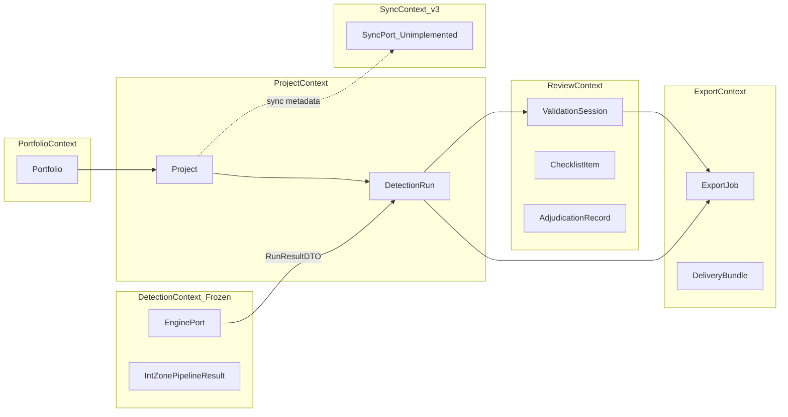
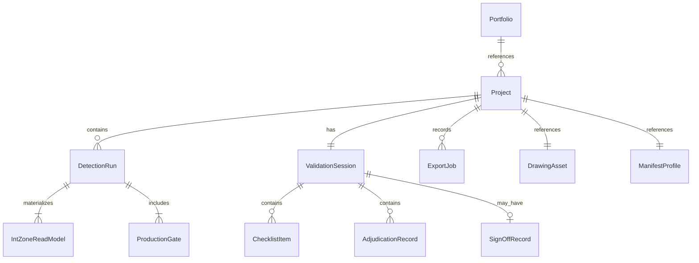
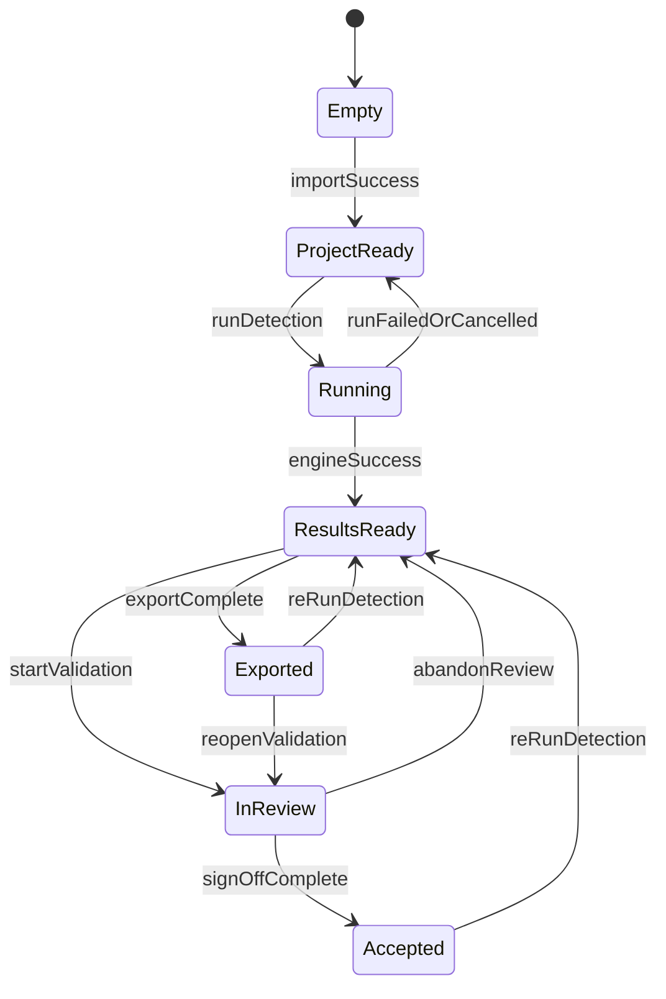
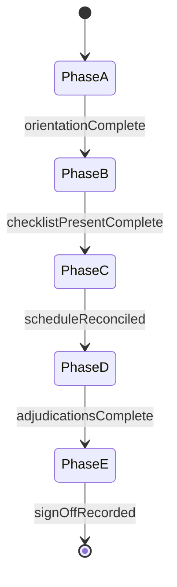

# Domain Model
## INT Zone Studio — Windows Desktop Application

| Field | Value |
| --- | --- |
| **Document title** | INT Zone Studio — Domain Model |
| **Version** | 1.0 |
| **Status** | Approved for implementation |
| **Date** | 6 June 2026 |
| **Classification** | Internal / Confidential |
| **Platform** | Windows 10/11 x64 |
| **Parent documents** | [PRD_Desktop_Application.md](PRD_Desktop_Application.md), [ARCHITECTURE_DESKTOP_APPLICATION.md](ARCHITECTURE_DESKTOP_APPLICATION.md), [03_Backend_Schema.md](03_Backend_Schema.md), [UIUX_Specification_Desktop.md](UIUX_Specification_Desktop.md) |

---

## Document purpose

This document defines the **application domain model** for INT Zone Studio: aggregates, value objects, invariants, state machines, domain events, and mapping to the frozen detection engine. It is the authoritative source for business rules that must not be duplicated ad hoc in UI components or services.

**In scope:** Project lifecycle, detection run snapshots, validation and acceptance, export orchestration, portfolio rollups, audit events, sync-ready metadata.

**Out of scope:** Detection algorithms, gap heuristics, threshold tuning, and any logic inside `src/` beyond the **EnginePort** adapter boundary.

**Engine baseline:** Frozen at 2026-06-06. Pipeline entry point: [`build_int_zone_pipeline`](src/zone_engine/int_zone_pipeline.py) returning [`IntZonePipelineResult`](src/zone_engine/models.py).

---

## 1. Layering and responsibility

| Layer | Responsibility | May import engine types? |
| --- | --- | --- |
| **Presentation** (React) | Render state; dispatch commands | No |
| **Application** | Orchestrate use cases; transactions; IPC | No (DTOs only) |
| **Domain** | Rules, aggregates, policies, events | No |
| **Integration** | EnginePort, FileProjectRepository, AuditLog | Sidecar only (Python) |
| **Frozen engine** (`src/`) | Detection, export functions | N/A — black box |

The desktop app **never** imports `src/` from TypeScript. Python sidecar is the sole adapter.

---

## 2. Ubiquitous language

| Term | Definition |
| --- | --- |
| **INT zone** | Pour partition label (`INT-1` … `INT-N`) used in structural schedules |
| **Micro-face** | Stage 1 closed polygon from wall geometry; many faces roll up to one INT zone |
| **Manifest** | YAML defining expected zone count and reference areas per INT |
| **Gate** | Production readiness check with status `PASS`, `REVIEW`, `FAIL`, or `SKIP` |
| **Detection run** | Immutable snapshot of one engine execution against a drawing |
| **Validation session** | Engineer workflow: checklist, adjudication, questionnaire, sign-off |
| **Delivery bundle** | Folder of DXF, Excel, PDF, and report files per [DELIVERY_MANIFEST.md](output/client_delivery/DELIVERY_MANIFEST.md) |
| **Portfolio** | Multi-drawing container (e.g. J33A + J33B + S111_A = 65 zones) |
| **Adjudication** | Formal disposition of a known area or labelling variance |
| **Blocking** | Finding that prevents `Accepted` acceptance status until resolved |
| **EnginePort** | Integration boundary invoking frozen sidecar methods |

---

## 3. Bounded contexts

### 3.1 Context map



### 3.2 Context relationships

| Upstream | Downstream | Relationship | Notes |
| --- | --- | --- | --- |
| Detection (frozen) | Project | Conformist | App accepts engine DTO shape; no fork |
| Project | Review | Customer / supplier | Run snapshot feeds validation |
| Review | Export | Customer / supplier | Acceptance gates export policy |
| Project | Export | Customer / supplier | Active run required |
| Portfolio | Project | Aggregation | Child projects by reference |
| Sync (future) | All | ACL | v1: metadata only; no network |

---

## 4. Aggregates

### 4.1 Aggregate overview



---

### 4.2 Project (aggregate root)

**Identity:** `projectId` (UUID v4)

**Purpose:** Root container for one drawing workflow (single-drawing project). Owns references to input drawing, manifest, run history, validation session, and export history.

| Entity / VO | Description |
| --- | --- |
| `DrawingAsset` | Source DWG/DXF path, content hash, converted DXF cache path, units, layer/entity counts |
| `ManifestProfile` | Preset id or custom YAML path, expected zone count |
| `ProjectSettings` | Slab thickness, output root (user-overridable) |
| `EngineBinding` | Pinned engine version, config hash (read-only) |
| `DetectionRun[]` | Ordered run history; append-only |
| `activeRunId` | Pointer to current run for UI and export |
| `ValidationSession` | Single session per project (see §4.4) |
| `ExportJob[]` | Export history records |
| `SyncMetadata` | schemaVersion, contentHash, lastModifiedAt, syncState |

**Persistence:** [`project.izproj`](ARCHITECTURE_DESKTOP_APPLICATION.md) — references only; zone metrics live in `runs/{runId}/result.json`.

**Invariants:**

1. Source drawing path is **read-only**; app never writes to source DWG/DXF.
2. `activeRunId` must reference a run with `status = success` or be null.
3. New runs append; existing runs are never mutated or deleted (audit requirement NFR-08).
4. `contentHash` recomputed on any mutable field change.

---

### 4.3 DetectionRun (entity within Project)

**Identity:** `runId` (ISO8601 compact timestamp recommended, e.g. `20260606T104500Z`)

**Purpose:** Immutable snapshot of one engine execution.

| Field | Source |
| --- | --- |
| `status` | `queued` \| `running` \| `success` \| `failed` \| `cancelled` |
| `startedAt`, `completedAt` | Application |
| `inputSha256` | Hash of source drawing at run time |
| `manifestPath`, `manifestVersion` | Project manifest ref |
| `engineVersion`, `configHash` | Sidecar `engine.getInfo` |
| `resultPath` | `runs/{runId}/result.json` |
| `scenePath` | `runs/{runId}/scene.json` |
| `logPath` | `runs/{runId}/run.log` |
| `gateSummary` | Denormalized cache: `{ pass, review, fail, skip }` |
| `stagingPath` | `runs/{runId}/.staging/` during run; promoted atomically |

**Invariants:**

1. After `status` transitions to `success` or `failed`, run artifacts are **immutable**.
2. `result.json` is the **source of truth** for zones, gates, manifest reconciliation.
3. `gateSummary` in `project.izproj` is a cache; on conflict, reload from `result.json`.
4. Failed/cancelled runs do not become `activeRunId` unless user explicitly selects prior run.

**Staging protocol:**

```
runs/{runId}/.staging/  → write result, scene, log
on success: rename .staging → final paths OR move files + delete .staging
on failure: preserve .staging for diagnostics; do not promote
```

---

### 4.4 ValidationSession (aggregate root — logically part of Project)

**Identity:** `validationSessionId` (UUID; 1:1 with Project in v1)

**Purpose:** Capture engineer review per [01_REVIEW_WORKFLOW_GUIDE.md](output/client_delivery/acceptance_review_kit/01_REVIEW_WORKFLOW_GUIDE.md) Phases A–E.

| Entity | Description |
| --- | --- |
| `AcceptanceStatus` | `not_started` \| `in_review` \| `accepted` \| `accepted_with_conditions` \| `rejected` |
| `ReviewPhase` | `A` \| `B` \| `C` \| `D` \| `E` |
| `Reviewers` | Optional lead, QA, PM names |
| `orientationComplete` | Phase A checkbox |
| `ChecklistItem[]` | Per-INT tick-off (T5) |
| `AdjudicationRecord[]` | Exception dispositions (INT-8 worksheet fields) |
| `QuestionnaireResponse[]` | Nine kit questions |
| `SignOffRecord` | Final disposition + signatures metadata |

**Persistence:**

| File | Content |
| --- | --- |
| `validation/checklist.json` | ChecklistItem[] |
| `validation/adjudications.json` | AdjudicationRecord[] |
| `validation/questionnaire.json` | QuestionnaireResponse[] |
| `validation/signoff.json` | SignOffRecord |

**Invariants:**

1. Cannot set `accepted` or `accepted_with_conditions` while **blocking** FAIL gates unresolved and no adjudication.
2. Cannot set `accepted` while checklist has FAIL rows without disposition.
3. `rejected` requires sign-off notes.
4. Adjudication `reject` disposition blocks `accepted` until drawing re-run or override by PM (logged in audit).

---

### 4.5 ExportJob (entity)

**Identity:** `exportJobId` (UUID)

| Field | Description |
| --- | --- |
| `runId` | Run used for export |
| `formats` | Selected artifact flags |
| `outputDir` | Destination path |
| `acceptanceStatusAtExport` | Snapshot of acceptance status |
| `files[]` | `{ artifact, path, sha256, rows? }` |
| `verification` | `{ headersOk, rowCountsOk }` |
| `completedAt` | Timestamp |

**Invariants:**

1. Delivery bundle export requires `activeRun.status = success`.
2. Engine-produced artifacts must pass parity verification before job marked complete.
3. UI-generated sign-off PDF is **additive**; never replaces CLI artifacts.

---

### 4.6 Portfolio (aggregate root)

**Identity:** `portfolioId` (UUID)

| Field | Description |
| --- | --- |
| `name` | e.g. "Client Portfolio Q2 2026" |
| `childProjectPaths[]` | Absolute paths to child `project.izproj` files |
| `rollupPolicy` | `worst_gate` (default) \| `all_must_pass` |
| `sharedValidationSession` | Optional portfolio-level acceptance (v1.1) |
| `SyncMetadata` | Same as Project |

**Rollup rules (computed on read, not stored):**

| Metric | Rule |
| --- | --- |
| Total zones | Sum of `expectedZoneCount` from child manifests |
| Computed zones | Sum of zone counts from each child's active run |
| Gate counts | Sum REVIEW/FAIL across children |
| Acceptance status | Worst child status unless PM sets portfolio override with audit event |

**Invariants:**

1. Child projects remain independent aggregates; portfolio does not duplicate run artifacts.
2. Deleting a child project removes it from portfolio refs only; does not delete child files.

---

## 5. Value objects

### 5.1 IntLabel

```
Pattern: INT-{n} where n is positive integer
Comparison: numeric on n (INT-2 < INT-10)
Display: monospace, never "Room N"
```

### 5.2 GateStatus

```
Enum: PASS | REVIEW | FAIL | SKIP
Maps 1:1 to ProductionReadinessGate.status in engine
```

### 5.3 ProductionGate

| Field | Type |
| --- | --- |
| `name` | One of: `zone_count`, `orphan_faces`, `zone_face_coverage`, `union_vs_clipped_bay`, `face_sum_vs_union`, `manifest_area` |
| `status` | GateStatus |
| `detail` | string (human-readable, from engine) |
| `affectedZoneLabels` | IntLabel[] (derived in app layer for drill-down, not from engine) |

### 5.4 AreaMeasure

| Field | Type | Rules |
| --- | --- | --- |
| `value` | number | Square metres |
| `displayDecimals` | 2–4 | Never round away variance > 0.05% |
| `unit` | `"m²"` \| `"CUM"` | Always show unit in UI |

### 5.5 ContentHash

```
Algorithm: SHA-256 hex lowercase
Applied to: source drawing, result.json, export files
```

### 5.6 EngineVersion

```
Format: date-stamped e.g. 2026.06.06
Immutable per install; displayed on About screen
```

### 5.7 ValidatedFilePath

```
Rules: absolute path, exists for read, parent writable for export
Reject: path traversal, non-.exe for ODA spawn
```

### 5.8 ExceptionClassification

```
Enum: blocking | review | known_variance | informational
Maps from gate name + UIUX decision matrix §7.5
```

---

## 6. Read models (from DetectionRun)

These are **not** aggregate roots; they are materialized from `result.json` for UI binding.

### 6.1 IntZoneReadModel

Maps from [`IntZoneData`](src/zone_engine/models.py):

| Domain field | Engine field | UI table |
| --- | --- | --- |
| `label` | `label` | T1 Pour No. |
| `unionAreaSqm` | `area_m2` | T1 Union (m²) |
| `volumeCum` | `volume_m3` | T1 Concrete Volume |
| `faceCount` | `face_count` | T1 Face Count |
| `gridRef` | `grid_ref` | T1 Grid Ref |
| `bayCoveragePct` | `bay_coverage_pct` | T1 Union/Bay Coverage % |
| `faceSumAreaSqm` | `face_sum_area_m2` | T2 Face sum |
| `clippedBayAreaSqm` | `clipped_bay_area_m2` | T2 Clipped bay |
| `detectionTier` | `detection_tier` | Export Excel |
| `profile` | `profile` | Internal |
| `polygonGeoJson` | `polygon` (serialized) | Map viewer |
| `centroid` | polygon centroid × scale | Export Excel |
| `gateStatus` | derived from gates affecting zone | T1 Status chip |

### 6.2 ManifestReconciliationReadModel

Maps from [`ManifestReconciliation`](src/zone_engine/models.py) → UI T3.

### 6.3 FaceAssignmentReadModel

Maps from [`FaceAssignmentSummary`](src/zone_engine/models.py):

| Field | UI use |
| --- | --- |
| `orphanCount` | orphan_faces gate, report orphan table |
| `assignedCount` | Report summary |
| `orphans[]` | Report drill-down |

---

## 7. Domain policies

Policies are pure functions in the domain layer; application services invoke them.

### 7.1 AcceptanceEligibilityPolicy

```typescript
// Conceptual signature
canSetAcceptanceStatus(
  target: AcceptanceStatus,
  gates: ProductionGate[],
  checklist: ChecklistItem[],
  adjudications: AdjudicationRecord[]
): { allowed: boolean; reasons: string[] }
```

| Target status | Conditions |
| --- | --- |
| `in_review` | Always allowed if active run exists |
| `accepted` | No blocking FAIL gates; no checklist FAIL without adjudication; Phase E questionnaire complete |
| `accepted_with_conditions` | Same as accepted; requires sign-off notes describing conditions |
| `rejected` | Requires sign-off notes |

**Blocking gate mapping (UIUX §7.5):**

| Gate / finding | Classification |
| --- | --- |
| `orphan_faces` FAIL | Blocking |
| `manifest_area` FAIL | Blocking (unless adjudicated) |
| `zone_count` REVIEW | Non-blocking — checklist confirm |
| `zone_face_coverage` REVIEW | Non-blocking unless engineer marks FAIL |
| `union_vs_clipped_bay` REVIEW | Informational / checklist |
| `face_sum_vs_union` REVIEW | Informational / checklist |
| Known INT-8 variance | Known variance — Phase D adjudication |

### 7.2 ExportEligibilityPolicy

| Export type | Allowed when |
| --- | --- |
| Single format (DXF/XLSX/PDF/MD) | Active successful run |
| Full delivery bundle | Active successful run; optional amber banner if not `accepted` |
| Sign-off PDF | Questionnaire complete; acceptance status set |

Blocking FAIL gates: bundle allowed with banner (PRD §8.1); `Accepted` status blocked.

### 7.3 RunCancellationPolicy

- Cancel only while `status = running`.
- Prior successful run remains `activeRunId`.
- Cancelled run stored with `status = cancelled`; not promoted from staging.

---

## 8. State machines

### 8.1 Project lifecycle

Mirrors [PRD §7.1](PRD_Desktop_Application.md):



| State | Domain flags |
| --- | --- |
| ProjectReady | `activeRunId = null` |
| Running | active run `status = running` |
| ResultsReady | active run `status = success` |
| InReview | `acceptanceStatus = in_review` |
| Accepted | `acceptanceStatus in (accepted, accepted_with_conditions)` |
| Exported | latest ExportJob complete |

### 8.2 ValidationSession phases



Phase advancement is **automatic** when exit criteria met (UIUX §7.2); manual override allowed with audit event.

### 8.3 ExportJob lifecycle

```
pending → preflight → invoking_engine → verifying → completed | failed
```

---

## 9. Domain events

Append to `audit/events.jsonl` (see [ARCHITECTURE_DESKTOP_APPLICATION.md](ARCHITECTURE_DESKTOP_APPLICATION.md) §5).

| Event type | Payload | Trigger |
| --- | --- | --- |
| `ProjectCreated` | projectId, drawingPath | Wizard complete |
| `DrawingReimported` | projectId, newSha256 | J5 re-import |
| `DetectionRunStarted` | projectId, runId, inputSha256 | Run button |
| `DetectionRunCompleted` | runId, gateSummary, resultPath | Engine success |
| `DetectionRunFailed` | runId, errorCode, logPath | Engine failure |
| `DetectionRunCancelled` | runId | User cancel |
| `ChecklistItemUpdated` | intLabel, fields | S11 edit |
| `AdjudicationRecorded` | intLabel, disposition | S10 save |
| `AcceptanceStatusChanged` | old, new, actor | Sign-off |
| `ReviewPhaseAdvanced` | from, to | Phase tracker |
| `ExportCompleted` | exportJobId, files[], runId | S12 success |
| `PortfolioChildLinked` | portfolioId, childPath | Portfolio edit |

**Event envelope:**

```json
{
  "eventId": "uuid",
  "timestamp": "2026-06-06T11:30:00Z",
  "eventType": "AdjudicationRecorded",
  "projectId": "uuid",
  "runId": "20260606T104500Z",
  "actor": "DOMAIN\\rajesh",
  "payload": {}
}
```

---

## 10. EnginePort contract (domain view)

Application layer depends on this port; sidecar implements it.

| Method | Domain use case |
| --- | --- |
| `getInfo()` | About screen, config hash display |
| `inspectDrawing(path, odaPath)` | S02 wizard metadata |
| `runDetection(params)` | J1, J4, J5 |
| `buildViewerScene(runId)` | S06 map (may be auto at end of run) |
| `exportArtifacts(params)` | S12 — **ExportGateway only** |
| `cancelRun(runId)` | S05 cancel |

**User-visible progress stages** (never expose internal P2.x names):

1. Loading drawing  
2. Detecting zones  
3. Building schedule  
4. Validating  

Transport: Windows named pipe (primary); stdio (dev fallback). See [06_IMPLEMENTATION_PLAN.md](06_IMPLEMENTATION_PLAN.md) AD-01.

---

## 11. Mapping: Engine → DTO → Domain → UI

### 11.1 IntZonePipelineResult → result.json

Sidecar serializes [`IntZonePipelineResult`](src/zone_engine/models.py):

| JSON path | Engine source |
| --- | --- |
| `zones[]` | `IntZoneData` (+ GeoJSON polygon) |
| `gates[]` | `readiness` (`ProductionReadinessGate`) |
| `manifestReconciliation` | `manifest` |
| `assignment` | `FaceAssignmentSummary` (counts, orphan list) |
| `summary.zoneCount` | `len(zones)` |
| `summary.orphanFaces` | `assignment.orphan_count` |
| `warnings[]` | `warnings` |

### 11.2 result.json → UI tables

| UI table | Domain read model |
| --- | --- |
| T1 Zone List | `IntZoneReadModel[]` + gate-derived status |
| T2 Report table | Same + face sum / clipped bay columns |
| T3 Manifest | `ManifestReconciliationReadModel.comparisons[]` |
| T4 Exception inbox | Derived from gates + manifest deltas + classification |
| T5 Checklist | `ChecklistItem[]` merged with run zone metrics |

### 11.3 Export column parity

Excel headers must match [`INT_EXCEL_COLUMNS`](src/zone_engine/int_schedule_export.py):

```
Pour No., Concrete Area (SQM), Concrete Volume (CUM), Face Count,
Grid Ref, Detection Tier, Centroid X (m), Centroid Y (m), Union/Bay Coverage %
```

---

## 12. Sync-ready metadata (v3 extension — not implemented in v1)

**SyncPort interface (documentation only):**

```typescript
interface SyncPort {
  pushProject(projectPath: string): Promise<SyncResult>;
  pullProject(remoteId: string, localPath: string): Promise<SyncResult>;
  resolveConflict(local: ContentHash, remote: ContentHash, policy: ConflictPolicy): Promise<Resolution>;
}
```

| Aggregate | Sync unit | Conflict surface |
| --- | --- | --- |
| DetectionRun | Immutable snapshot | None — append-only |
| ValidationSession | Mutable JSON | Field-level merge (v3) |
| project.izproj | Metadata | Last-writer-wins with hash check |

Every aggregate root includes:

```json
{
  "syncMetadata": {
    "schemaVersion": 1,
    "contentHash": "sha256:...",
    "lastModifiedAt": "ISO8601",
    "syncState": "local"
  }
}
```

`syncState`: `local` | `pending` | `conflict` — default `local` in v1. **No network code in v1.**

---

## 13. Anti-corruption layer

The sidecar **Anti-Corruption Layer** (ACL):

1. Loads frozen `config.yaml` from install dir — user cannot change gap/threshold/tier via UI.
2. Calls `build_int_zone_pipeline` with allowed overrides only: `slab_thickness`, `manifest_path`, `output_run_dir`, `zone_profile`.
3. Converts Shapely geometries to GeoJSON for IPC.
4. Maps engine exceptions to `EngineError` codes (`ODA_NOT_CONFIGURED`, `ENGINE_RUN_FAILED`, etc.).

**Forbidden:** Reimplementing pipeline stages in `desktop/engine_sidecar/` beyond IPC, serialization, scene building, and export orchestration.

---

## 14. Traceability

| PRD FR | Domain aggregate / policy |
| --- | --- |
| FR-01–FR-06 | Project, DrawingAsset, ManifestProfile |
| FR-08–FR-13 | DetectionRun, EnginePort |
| FR-14–FR-20 | IntZoneReadModel, scene read model |
| FR-21–FR-25 | ProductionGate, ManifestReconciliationReadModel |
| FR-26–FR-32 | ValidationSession, policies §7.1 |
| FR-33–FR-41 | ExportJob, ExportEligibilityPolicy |
| FR-42–FR-44 | Portfolio |
| NFR-08 | DetectionRun immutability, audit events |

---

## 15. References

| Document | Use |
| --- | --- |
| [PRD_Desktop_Application.md](PRD_Desktop_Application.md) | FR, acceptance workflow |
| [ARCHITECTURE_DESKTOP_APPLICATION.md](ARCHITECTURE_DESKTOP_APPLICATION.md) | Persistence paths, IPC |
| [03_Backend_Schema.md](03_Backend_Schema.md) | Engine dataclass reference |
| [UIUX_Specification_Desktop.md](UIUX_Specification_Desktop.md) | Tables T1–T7, phases A–E |
| [client_validation_package.md](client_validation_package.md) | Engine freeze baseline |
| [06_IMPLEMENTATION_PLAN.md](06_IMPLEMENTATION_PLAN.md) | Build phases |
| [07_TEST_STRATEGY.md](07_TEST_STRATEGY.md) | Policy and mapping tests |
| [08_DESIGN_SYSTEM_SPEC.md](08_DESIGN_SYSTEM_SPEC.md) | UI build contract |
| [01_Software_Flow.md](01_Software_Flow.md) | Pipeline stages (note: §8–14 stale; use `build_int_zone_pipeline`) |

---

*END OF DOMAIN MODEL*  
*INT Zone Studio — Desktop Application | v1.0 | June 2026*
