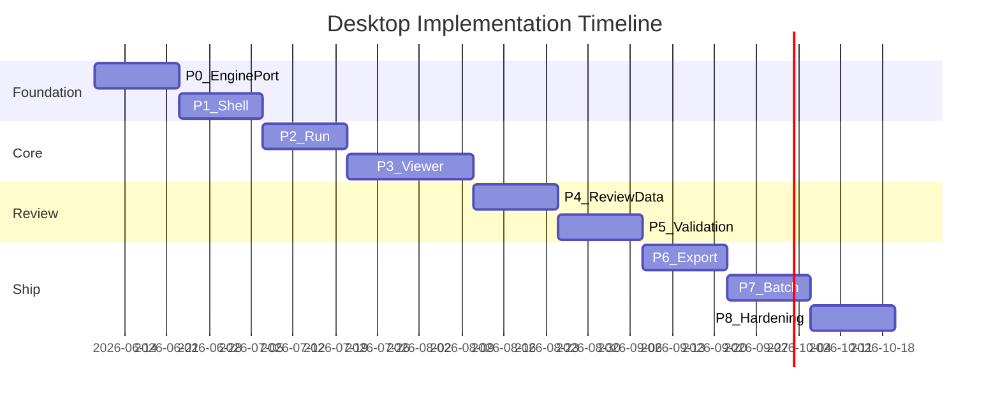
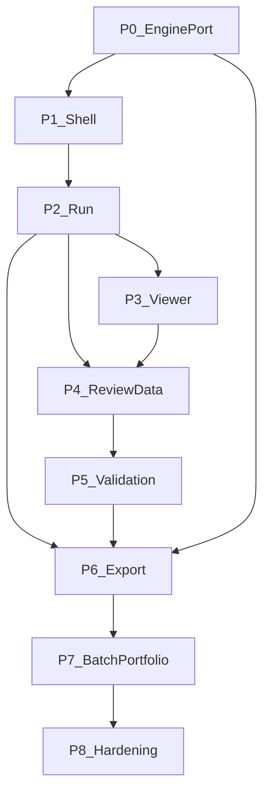
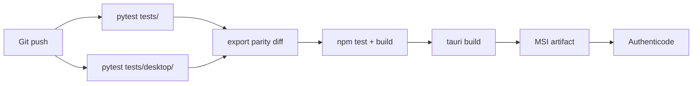

# Implementation Plan
## INT Zone Studio — Windows Desktop Application

| Field | Value |
| --- | --- |
| **Document title** | INT Zone Studio — Desktop Implementation Plan |
| **Version** | 1.0 |
| **Status** | Approved for execution |
| **Date** | 6 June 2026 |
| **Classification** | Internal / Confidential |
| **Platform** | Windows 10/11 x64 |
| **Duration** | 19 weeks (≈ 4.5 months) |
| **Parent documents** | [PRD_Desktop_Application.md](PRD_Desktop_Application.md), [ARCHITECTURE_DESKTOP_APPLICATION.md](ARCHITECTURE_DESKTOP_APPLICATION.md), [04_DOMAIN_MODEL.md](04_DOMAIN_MODEL.md), [07_TEST_STRATEGY.md](07_TEST_STRATEGY.md), [03_Backend_Schema.md](03_Backend_Schema.md), [UIUX_Specification_Desktop.md](UIUX_Specification_Desktop.md) |

---

## Document purpose

This plan defines **how to build** INT Zone Studio v1.0: phased delivery, work packages, dependencies, ADRs, and exit criteria. It is distinct from [04_Implementation_Plan.md](04_Implementation_Plan.md), which covers the **frozen detection engine** only.

**Constraints preserved:**

- Frozen engine at 2026-06-06 baseline — no algorithm changes via UI
- Export byte-compatibility with CLI delivery bundle
- Local-first; no cloud sync in v1
- All PRD Must requirements shipped before v1.0 release

---

## 1. Executive summary

| Item | Detail |
| --- | --- |
| **Stack** | Tauri 2 + React 18 + TypeScript + Python 3.10 sidecar (PyInstaller) |
| **Team assumption** | 2 full-stack engineers + 1 QA (part-time from P4) |
| **Parallel work** | Engine frozen; desktop track does not modify `src/` except approved sidecar ACL |
| **Release artifact** | Signed MSI + bundled engine sidecar + manifest presets |
| **Critical path** | P0 EnginePort → P2 Run → P3 Viewer → P6 Export parity |

---

## 2. Prerequisites (Week 0)

| # | Prerequisite | Owner | Done when |
| --- | --- | --- | --- |
| P-01 | Engine baseline tagged `2026.06.06`; `pytest tests/` green | Engine | CI pass |
| P-02 | Golden CLI outputs captured for S111_A, J33A, J33B, S111_J | QA | Hashes in `tests/desktop/fixtures/` |
| P-03 | OQ-01 resolved: Tauri 2 + React 18 spike | Engineering | Hello-world Tauri app runs |
| P-04 | Code signing certificate procured (OQ-04) | PM | Cert in secure store |
| P-05 | Sample DWGs/DXFs in `reference/` accessible | QA | Import smoke |
| P-06 | [04_DOMAIN_MODEL.md](04_DOMAIN_MODEL.md) reviewed | Architecture | Sign-off |

**Golden baseline command:**

```powershell
python scripts/run_int_zone_pipeline.py --input reference/S111_A.dxf --manifest reference/s111_a_zones_manifest.yaml
# Capture output hashes → tests/desktop/fixtures/s111_a/
```

---

## 3. Repository layout

Monorepo atop existing engine ([ARCHITECTURE_DESKTOP_APPLICATION.md](ARCHITECTURE_DESKTOP_APPLICATION.md) §2.1) with domain and audit layers:

```
Strtup/
├── src/                              # FROZEN — detection engine
├── main.py                           # CLI regression reference
├── config.yaml                       # Frozen production config
├── reference/                        # Manifest presets
├── desktop/
│   ├── app/                          # Tauri + React
│   │   ├── src/
│   │   │   ├── components/           # Design system components
│   │   │   ├── screens/              # S01–S14
│   │   │   ├── domain/               # TS domain policies + types
│   │   │   ├── services/             # Application services
│   │   │   ├── store/                # Zustand slices
│   │   │   ├── viewer/               # WebGL renderer
│   │   │   └── ipc/                  # Engine client
│   │   └── src-tauri/                # Rust shell, pipe spawn
│   ├── engine_sidecar/
│   │   ├── server.py                 # Named pipe JSON-RPC
│   │   ├── handlers/                 # inspect, run, export, scene
│   │   ├── serializers/              # IntZonePipelineResult → JSON
│   │   ├── export_gateway.py         # Mirrors assemble_delivery_package
│   │   └── viewer_scene_builder.py
│   └── schemas/
│       ├── ipc.v1.schema.json
│       ├── project.v1.schema.json
│       └── result.v1.schema.json
├── tests/
│   ├── ...                           # Existing engine tests
│   └── desktop/                      # IPC, parity, domain policy tests
├── installer/wix/
├── 04_DOMAIN_MODEL.md
├── 06_IMPLEMENTATION_PLAN.md         # This document
├── 07_TEST_STRATEGY.md
└── 08_DESIGN_SYSTEM_SPEC.md
```

**Immutability boundary:**

```
desktop/engine_sidecar/  → IPC, serialization, scene, ExportGateway only
src/                     → FROZEN (critical bugfix requires version tag bump)
```

---

## 4. Phase plan

### Overview

| Phase | Name | Duration | Exit criterion |
| --- | --- | --- | --- |
| **P0** | EnginePort + sidecar | 2 weeks | S111_A gates match CLI; contract tests green |
| **P1** | Shell + project I/O | 2 weeks | S01/S02/S03/S14; create/open/save project |
| **P2** | Run + progress | 2 weeks | S05; background run; cancel; audit log |
| **P3** | Viewer | 3 weeks | S06; ≥30 fps S111_A; selection sync |
| **P4** | Review data | 2 weeks | S07/S08/S09; T1–T4; run compare |
| **P5** | Validation | 2 weeks | S10/S11; phases A–E; domain policies |
| **P6** | Export | 2 weeks | S12; delivery bundle parity CI |
| **P7** | Batch + portfolio | 2 weeks | S13; portfolio rollup; J2/J4 |
| **P8** | Hardening + MSI | 2 weeks | Clean VM smoke; a11y; size < 500 MB target |



---

### P0 — EnginePort and sidecar (Weeks 1–2)

**Goal:** Python sidecar exposes frozen pipeline via named pipe; golden run parity.

| WP | Tasks | Files |
| --- | --- | --- |
| P0.1 | Named pipe JSON-RPC server with length-prefixed frames | `engine_sidecar/server.py` |
| P0.2 | `engine.getInfo`, `engine.inspectDrawing` | `handlers/inspect.py` |
| P0.3 | `engine.runDetection` → `build_int_zone_pipeline` | `handlers/run.py` |
| P0.4 | Serialize `IntZonePipelineResult` → `result.json` | `serializers/result.py` |
| P0.5 | Progress notifications (4 user stages) | `handlers/run.py` wrapper |
| P0.6 | JSON Schema for IPC + result DTO | `desktop/schemas/*.json` |
| P0.7 | Contract tests vs golden S111_A | `tests/desktop/test_ipc_contract.py` |
| P0.8 | Rust pipe client stub in Tauri | `src-tauri/src/engine/mod.rs` |

**Exit criteria:**

- [ ] `pytest tests/desktop/test_ipc_contract.py` passes
- [ ] S111_A gate names/status match CLI baseline
- [ ] `result.json` validates against `result.v1.schema.json`
- [ ] No modifications to `src/` except optional approved progress callback

**DoD:** Document pipe name convention `\\.\pipe\intzone-engine-{pid}` in README.

---

### P1 — Shell and project I/O (Weeks 3–4)

**Goal:** Tauri shell with project create/open/save and drawing inspect.

| WP | Tasks | Screens |
| --- | --- | --- |
| P1.1 | Tauri app scaffold + routing | All |
| P1.2 | Design tokens + shell components | S01, S14 |
| P1.3 | `ProjectRepository` read/write `project.izproj` | — |
| P1.4 | New project wizard | S02 |
| P1.5 | Home recents + open project | S01 |
| P1.6 | Project dashboard shell (no run yet) | S03 |
| P1.7 | Settings persistence `%AppData%` | S14 |
| P1.8 | Domain types mirror [04_DOMAIN_MODEL.md](04_DOMAIN_MODEL.md) | `domain/types.ts` |

**Exit criteria:**

- [ ] Create project from S111_A.dwg; `project.izproj` on disk
- [ ] Reopen app restores last project
- [ ] `inspectDrawing` shows layers, entity count in S02
- [ ] ODA missing shows settings link (FR-02)

---

### P2 — Run and progress (Weeks 5–6)

**Goal:** Background detection run with cancel, staging folders, audit events.

| WP | Tasks | Screens |
| --- | --- | --- |
| P2.1 | `RunApplicationService` + Zustand run slice | S03, S05 |
| P2.2 | Atomic run folder staging | `runs/{id}/.staging/` |
| P2.3 | S05 progress modal + log tail | S05 |
| P2.4 | Cancel cooperative token in sidecar | `handlers/run.py` |
| P2.5 | `audit/events.jsonl` writer | `services/AuditLogService.ts` |
| P2.6 | Auto-save project after successful run (NFR-05) | ProjectRepository |
| P2.7 | Engine version on About (FR-13) | S14 |

**Exit criteria:**

- [ ] Run S111_A from UI; UI thread never blocks > 200 ms (FR-10)
- [ ] Cancel restores prior run
- [ ] Audit log contains `DetectionRunStarted` / `Completed`
- [ ] Failed run preserves prior `activeRunId`

---

### P3 — Viewer (Weeks 7–9)

**Goal:** WebGL map with INT zones, layers, selection sync.

| WP | Tasks | Screens |
| --- | --- | --- |
| P3.1 | `viewer_scene_builder.py` — walls + INT polygons | sidecar |
| P3.2 | `ViewerScene` schema + loader | `viewer/` |
| P3.3 | WebGL renderer: pan, zoom, fit | S06 |
| P3.4 | R-tree viewport culling + Douglas-Peucker LOD | `viewer/culling.ts` |
| P3.5 | Layer toggles | S06 |
| P3.6 | Zone highlight + list selection sync | S06, S07 stub |
| P3.7 | Mini-map (Should FR-20) | S06 |
| P3.8 | Performance benchmark script | `tests/desktop/bench_viewer.py` |

**Exit criteria:**

- [ ] INT boundaries and labels visible on S111_A
- [ ] ≥ 30 fps pan/zoom on reference hardware (NFR-03)
- [ ] Bidirectional selection list ↔ map (FR-17)
- [ ] Scene load < 3 s for S111_A

**Escalation (ADR-08):** If fps target missed after P3.8, spike PySide6 viewer before P4.

---

### P4 — Review data (Weeks 10–11)

**Goal:** Zone list, detail drawer, validation report.

| WP | Tasks | Screens |
| --- | --- | --- |
| P4.1 | DataGrid T1 zone list | S07 |
| P4.2 | Zone detail drawer | S08 |
| P4.3 | Report tab sections (T2, T3, gates) | S09 |
| P4.4 | Gate drill-down affected INT IDs (FR-23) | S09 |
| P4.5 | Run history + compare runs (J5) | S09 |
| P4.6 | Filter/search zones (FR-18) | S07 |

**Exit criteria:**

- [ ] All report sections match `*_int_zone_report.md` structure (FR-21)
- [ ] Six production gates displayed (FR-22)
- [ ] Run compare shows zone/gate deltas

---

### P5 — Validation (Weeks 12–13)

**Goal:** Exception inbox, checklist, acceptance workflow.

| WP | Tasks | Screens |
| --- | --- | --- |
| P5.1 | `AcceptanceEligibilityPolicy` in TS | `domain/policies/` |
| P5.2 | Exception inbox T4 + classification | S10 |
| P5.3 | Adjudication worksheet | S10 |
| P5.4 | Checklist T5 + phase tracker A–E | S11 |
| P5.5 | Questionnaire (9 questions) | S10/S12 |
| P5.6 | Acceptance status on dashboard | S03 |
| P5.7 | Validation JSON persistence | `validation/*.json` |

**Exit criteria:**

- [ ] Cannot set Accepted with blocking FAIL (domain policy test)
- [ ] INT-8 adjudication fields persist (FR-27)
- [ ] Phase tracker matches UIUX §7.2
- [ ] J2 walkthrough completable in-app

---

### P6 — Export (Weeks 14–15)

**Goal:** ExportGateway + delivery bundle parity.

| WP | Tasks | Screens |
| --- | --- | --- |
| P6.1 | `export_gateway.py` orchestrates all exporters | sidecar |
| P6.2 | `ExportApplicationService` + preflight | S12 |
| P6.3 | Header/row verification | sidecar + tests |
| P6.4 | Delivery bundle folder layout | per DELIVERY_MANIFEST |
| P6.5 | Sign-off PDF template (additive) | S12 modal |
| P6.6 | Optional SHA-256 manifest (FR-41) | S12 |
| P6.7 | Parity CI gate | `tests/desktop/test_export_parity.py` |

**Exit criteria:**

- [ ] S111_A Excel headers match `INT_EXCEL_COLUMNS` exactly (NFR-12)
- [ ] Full bundle matches CLI layout
- [ ] Export history in `project.izproj`
- [ ] Open folder on completion (FR-40)

---

### P7 — Batch and portfolio (Weeks 16–17)

**Goal:** Batch queue and multi-drawing portfolio.

| WP | Tasks | Screens |
| --- | --- | --- |
| P7.1 | Batch queue sequential runs | S13 |
| P7.2 | Per-file status + open project | S13 |
| P7.3 | Portfolio aggregate `portfolio.izproj` | S01, S03 |
| P7.4 | Rollup zone counts 65/65 style | S03 header |
| P7.5 | Drawing selector in hub | S03 |
| P7.6 | Portfolio checklist tabs | S11 |

**Exit criteria:**

- [ ] J4: 3 files run sequentially; failure does not block next (FR-42)
- [ ] J2: portfolio checklist 65 zones
- [ ] Failed batch row shows log link

---

### P8 — Hardening and MSI (Weeks 18–19)

**Goal:** Production installer and release gates.

| WP | Tasks |
| --- | --- |
| P8.1 | PyInstaller one-folder sidecar; exclude test deps |
| P8.2 | Tauri MSI (WiX) + WebView2 bootstrapper |
| P8.3 | Authenticode signing |
| P8.4 | Clean VM install smoke: import → run → export |
| P8.5 | Accessibility pass WCAG 2.1 AA core flows |
| P8.6 | Install size measurement (NFR-11) |
| P8.7 | Smoke: J33A, J33B, S111_A zero crashes (NFR-04) |
| P8.8 | Release notes + engine version pin |

**Exit criteria:**

- [ ] All [07_TEST_STRATEGY.md](07_TEST_STRATEGY.md) release blockers green
- [ ] MSI installs on clean Win11 VM
- [ ] Installed size documented; target < 500 MB or waiver documented

---

## 5. Work package dependency graph



---

## 6. Architecture decision records

| ID | Decision | Options | **Chosen** | Rationale |
| --- | --- | --- | --- | --- |
| AD-01 | IPC transport | stdio, named pipe, HTTP localhost | **Named pipe (v1 default)** | Robust on Windows; length-prefixed frames; stdio dev-only |
| AD-02 | PDF schedule | ReportLab sidecar, HTML print | **ReportLab in sidecar** | Match CLI; no browser print variance |
| AD-03 | Progress hooks | Wrapper timing, src callback | **Wrapper first** | Preserve frozen src; add callback only if insufficient |
| AD-04 | Portfolio model | Monolithic izproj, child refs | **Child project refs** | Independent runs; simpler sync later |
| AD-05 | Checksum manifest | Always on, optional checkbox | **Optional default off** | FR-41 Should |
| AD-06 | Audit log | Embedded in izproj, jsonl | **Append-only events.jsonl** | NFR-08; git-friendly |
| AD-07 | Viewer large drawings | Monolithic JSON, tiles | **Tier A culling v1; tiles v1.1 if >5000 segments** | NFR-03 |
| AD-08 | Stack escalation | Stay Tauri, PySide6 fork | **Tauri v1; PySide6 if P3 fps fails** | EnginePort unchanged either way |

---

## 7. Risk register

| Risk | Impact | Probability | Mitigation | Owner |
| --- | --- | --- | --- | --- |
| IPC serialization drift | Wrong UI metrics | Medium | Contract tests + golden files | Engineering |
| Scene JSON too large | Viewer jank | High | Culling, LOD, tile path AD-07 | Engineering |
| PyInstaller size > 500 MB | NFR-11 fail | Medium | Exclude test deps; one-folder | DevOps |
| Export parity regression | Client rejection | High | CI golden hash; block release | QA |
| ODA not installed | DWG blocked | High | Clear UX; DXF fallback | UX |
| WebView2 missing LTSC | App won't start | Low | Bootstrapper in MSI | DevOps |
| Progress mapping inaccurate | Poor UX | Medium | Wrapper logs; refine mapping | Engineering |
| Validation rules drift | Wrong sign-off | Medium | Domain policy unit tests | Engineering |

---

## 8. Definition of Done (global)

Every work package is done when:

1. Code merged to main branch (or feature branch with PR).
2. Unit tests added for domain policies and serializers.
3. No new `src/` changes without freeze exception tag in PR.
4. UI matches [08_DESIGN_SYSTEM_SPEC.md](08_DESIGN_SYSTEM_SPEC.md) for touched components.
5. Phase exit criteria checklist complete.
6. Audit events emitted for user-visible state changes.

---

## 9. FR / NFR traceability

| ID | Phase | Deliverable |
| --- | --- | --- |
| FR-01–FR-06 | P1 | Import, wizard, project persist |
| FR-07 | P7 | Portfolio projects |
| FR-08–FR-13 | P0, P2 | EnginePort, run, About |
| FR-14–FR-20 | P3, P4 | Viewer, zone list |
| FR-21–FR-25 | P4 | Report tab |
| FR-26–FR-32 | P5 | Validation workflow |
| FR-33–FR-41 | P6 | Export center |
| FR-42–FR-44 | P7 | Batch, portfolio |
| FR-45–FR-48 | P1, P8 | Settings, recents, help |
| NFR-01 | P8 | Windows MSI |
| NFR-02–NFR-03 | P2, P3 | Performance |
| NFR-04 | P8 | Smoke tests |
| NFR-05 | P2 | Auto-save |
| NFR-06–NFR-07 | All | UX quality |
| NFR-08 | P2 | Audit log |
| NFR-09 | All | Local-only |
| NFR-10 | P8 | Accessibility |
| NFR-11 | P8 | Install size |
| NFR-12 | P6 | Export parity |
| NFR-13 | P0 | Engine boundary |
| NFR-14 | All | English UI |

---

## 10. CI/CD pipeline



**Release blockers:** See [07_TEST_STRATEGY.md](07_TEST_STRATEGY.md) §4.

---

## 11. Team rituals

| Ritual | Frequency | Purpose |
| --- | --- | --- |
| Phase demo | End of each phase | Stakeholder sign-off on exit criteria |
| Parity check | Weekly from P0 | Compare CLI vs sidecar outputs |
| UX review | P1, P3, P5 | Design system compliance |
| QA walkthrough | P5, P8 | J1–J5 journeys |

---

## 12. Out of scope (v1.0 reminder)

Per PRD §1.6 and §9.2:

- macOS / Linux
- Cloud sync (metadata only in domain model)
- Detection tuning UI
- AutoCAD plugin
- AI classification

---

## 13. References

| Document | Use |
| --- | --- |
| [PRD_Desktop_Application.md](PRD_Desktop_Application.md) | Requirements |
| [ARCHITECTURE_DESKTOP_APPLICATION.md](ARCHITECTURE_DESKTOP_APPLICATION.md) | Technical architecture |
| [04_DOMAIN_MODEL.md](04_DOMAIN_MODEL.md) | Domain rules |
| [07_TEST_STRATEGY.md](07_TEST_STRATEGY.md) | Quality gates |
| [08_DESIGN_SYSTEM_SPEC.md](08_DESIGN_SYSTEM_SPEC.md) | UI build contract |
| [03_Backend_Schema.md](03_Backend_Schema.md) | Engine dataclass reference |
| [UIUX_Specification_Desktop.md](UIUX_Specification_Desktop.md) | Screens, workflows |
| [04_Implementation_Plan.md](04_Implementation_Plan.md) | Engine phases (separate track) |
| [client_validation_package.md](client_validation_package.md) | Freeze baseline |

---

*END OF IMPLEMENTATION PLAN*  
*INT Zone Studio — Desktop Application | v1.0 | June 2026*
