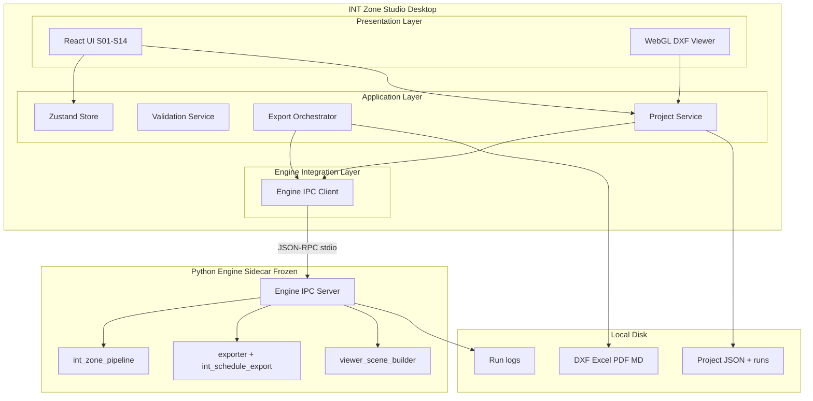
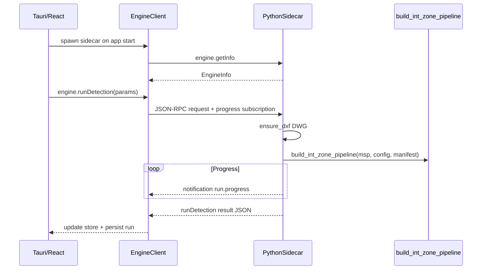
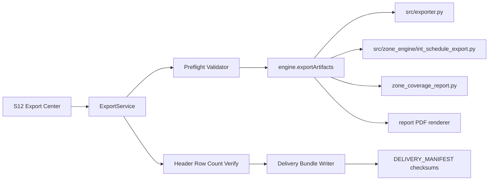
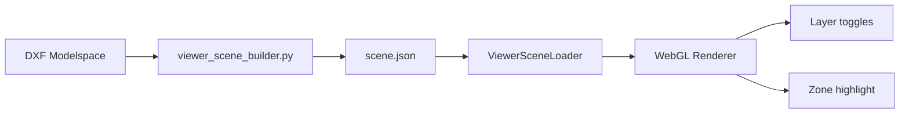
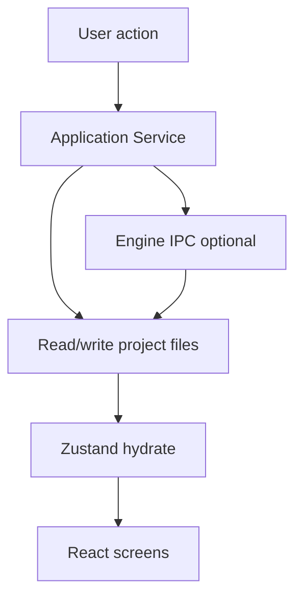
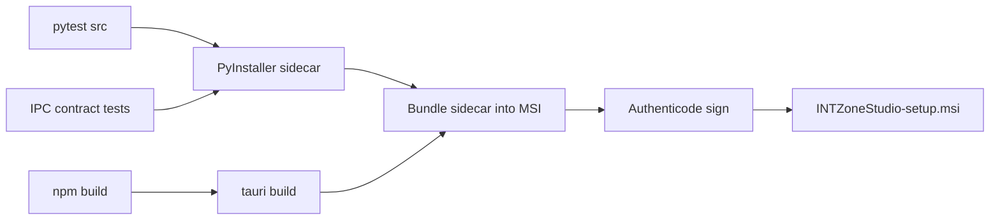

# Architecture — INT Zone Studio Desktop Application

| Field | Value |
| --- | --- |
| **Document title** | INT Zone Studio — Desktop Application Architecture |
| **Version** | 1.0 |
| **Status** | Draft — architecture review |
| **Date** | 6 June 2026 |
| **Classification** | Internal / Confidential |
| **Platform** | Windows 10/11 x64 |
| **Parent documents** | [PRD_Desktop_Application.md](PRD_Desktop_Application.md), [UIUX_Specification_Desktop.md](UIUX_Specification_Desktop.md), [03_Backend_Schema.md](03_Backend_Schema.md), [01_Software_Flow.md](01_Software_Flow.md) |

---

## Document purpose

This document defines the **implementation architecture** for INT Zone Studio: how the Windows desktop shell integrates the **frozen** Python detection engine, persists projects, renders drawings, exports delivery artifacts, and deploys locally without cloud services.

**Constraints (non-negotiable):**

- Windows 10/11 x64 only
- Detection engine frozen at 2026-06-06 production baseline — no algorithm changes via UI or sidecar
- Local-only processing; no cloud sync or telemetry
- Export byte-compatibility with CLI delivery bundle ([DELIVERY_MANIFEST.md](output/client_delivery/DELIVERY_MANIFEST.md))

**Out of scope:** UI visual design (see UIUX spec), detection R&D, macOS/Linux ports.

---

## 1. Desktop stack recommendation

### 1.1 Recommended stack (primary)

| Layer | Technology | Rationale |
| --- | --- | --- |
| **Desktop shell** | [Tauri 2](https://v2.tauri.app/) (Rust host, WebView2) | Native Windows installer, small footprint, secure IPC to sidecar, matches rich tabbed UI in UIUX spec |
| **UI** | React 18 + TypeScript | Component model aligns with S01–S14 screen inventory; mature table/chart libraries |
| **UI styling** | Tailwind CSS + headless primitives | Engineer-dense layouts; WCAG focus states |
| **Client state** | Zustand | Lightweight project/run UI state; see Section 8 |
| **Engine runtime** | Python 3.10+ (embedded sidecar) | Reuses frozen `src/` unchanged; same deps as CLI (`ezdxf`, `shapely`, `pandas`, `openpyxl`) |
| **Engine packaging** | PyInstaller one-file or one-folder sidecar | Ships pinned engine version beside Tauri binary |
| **IPC** | JSON-RPC 2.0 over stdio (primary) or named pipe (optional) | Structured contracts; no HTTP server required |
| **CAD viewer** | WebGL2 (regl or PixiJS) + engine-produced scene JSON | Avoid porting ezdxf to JS; render tessellated layers from Python |
| **Project storage** | JSON project files + run artifacts on disk | No database; matches backend schema philosophy |
| **DWG conversion** | ODA File Converter (external EXE, user-configured path) | Same as CLI ([src/converter.py](src/converter.py)) |
| **Installer** | Tauri MSI (WiX) + bundled engine sidecar + optional ODA prompt | Enterprise-friendly Windows deployment |

### 1.2 Architecture diagram



### 1.3 Alternative stack (fallback)

| Layer | Technology | When to choose |
| --- | --- | --- |
| **Monolith** | PySide6 (Qt 6) + QML or Qt Widgets | Team prefers single Python process; accept heavier UI build vs web stack |
| **Viewer** | Qt Graphics View + Shapely→QPainter paths | Avoid WebGL; in-process geometry |

**Trade-off:** PySide6 eliminates IPC complexity but couples UI release cycle to Python/Qt skills. Tauri + sidecar keeps engine **literally** the same binary artifact as CLI regression tests.

### 1.4 Explicit exclusions

| Excluded | Reason |
| --- | --- |
| Electron | Larger bundle; WebView2 via Tauri is sufficient on Windows |
| Cloud backend / SQLite | PRD local-only; project JSON sufficient |
| Embedded AutoCAD | Out of scope; optional external launch only |
| Algorithm tuning in UI | Engine frozen |
| Direct DWG read in UI | Conversion delegated to ODA + existing converter |

---

## 2. Folder structure

### 2.1 Repository layout (monorepo atop existing engine)

```
Strtup/
├── src/                          # FROZEN — existing detection engine (unchanged)
├── main.py                       # CLI (regression reference)
├── config.yaml                   # Frozen production config snapshot
├── reference/                    # Manifest presets (read-only in app)
├── desktop/
│   ├── app/                      # Tauri + React UI
│   │   ├── src/
│   │   │   ├── components/       # UI component library (UX spec §5)
│   │   │   ├── screens/          # S01–S14 route modules
│   │   │   ├── services/         # Project, export, validation services
│   │   │   ├── store/            # Zustand slices
│   │   │   ├── viewer/           # WebGL scene renderer
│   │   │   └── ipc/              # Engine client, types generated from schema
│   │   ├── src-tauri/            # Tauri Rust shell, sidecar spawn
│   │   ├── package.json
│   │   └── tauri.conf.json
│   ├── engine_sidecar/           # Thin Python IPC wrapper (NOT detection logic)
│   │   ├── server.py             # JSON-RPC entry
│   │   ├── handlers/             # inspect, run, export, scene
│   │   ├── serializers/          # IntZonePipelineResult → JSON
│   │   └── viewer_scene_builder.py
│   └── schemas/                  # IPC + project JSON JSON Schema
│       ├── ipc.v1.schema.json
│       └── project.v1.schema.json
├── tests/
│   ├── ...                       # Existing engine tests
│   └── desktop/                  # IPC contract + export parity tests
├── installer/
│   └── wix/                      # MSI customization
├── PRD_Desktop_Application.md
├── UIUX_Specification_Desktop.md
└── ARCHITECTURE_DESKTOP_APPLICATION.md
```

### 2.2 Runtime directories (user machine)

| Path | Purpose |
| --- | --- |
| `%ProgramFiles%\INT Zone Studio\` | Application binaries, engine sidecar, bundled `reference/` manifests |
| `%AppData%\INT Zone Studio\` | Global settings (`settings.json`), recent projects list |
| `%UserSelected%\[ProjectName]\` | Project root (user-chosen) |
| `[ProjectRoot]\project.izproj` | Project manifest (Section 5) |
| `[ProjectRoot]\input\` | Source DWG/DXF copy or reference path |
| `[ProjectRoot]\runs\{runId}\` | Per-run snapshot, scene JSON, log |
| `[ProjectRoot]\exports\{timestamp}\` | Delivery bundle output |
| `[ProjectRoot]\validation\` | Checklist, adjudication, sign-off records |

### 2.3 Engine immutability boundary

```
desktop/engine_sidecar/  → MAY add IPC, serialization, scene building
src/                     → FROZEN except critical bugfix tagged to engine version
main.py                  → Reference CLI; desktop must not fork pipeline logic
```

---

## 3. Component architecture

### 3.1 Layered model

| Layer | Responsibility | Depends on |
| --- | --- | --- |
| **Presentation** | Screens S01–S14, viewer, wizards | Application services, store |
| **Application** | Workflows: import, run, review, validate, export | Engine bridge, file I/O |
| **Domain** | Project, Run, Zone, Gate, Adjudication, Acceptance | Schemas only (no Python types in UI) |
| **Engine integration** | IPC client, progress streaming, error mapping | Sidecar process |
| **Infrastructure** | File system, process spawn, ODA invocation, logging | OS |

### 3.2 Presentation components (maps to UIUX §5)

| UX component | App module | Notes |
| --- | --- | --- |
| GateCard | `components/GateCard` | Binds to `ProductionReadinessGate[]` |
| DrawingCanvas | `viewer/DrawingCanvas` | Loads `ViewerScene` JSON |
| DataGrid T1–T7 | `components/DataGrid` + column configs | Shared sort/filter engine |
| AdjudicationWorksheet | `screens/exceptions/AdjudicationPanel` | Writes `AdjudicationRecord` to project |
| ProgressStageList | `components/ProgressStageList` | Subscribes to run progress events |

### 3.3 Application services

#### ProjectService

- Create/open/save `project.izproj`
- Import drawing (copy or link DWG/DXF)
- Attach manifest preset from `reference/`
- List runs; load run snapshot for viewer and tables

#### RunService

- Invoke `engine.runDetection`
- Stream progress stages to UI ([PRD FR-09](PRD_Desktop_Application.md))
- Persist run result JSON + log path
- Cancel run (SIGTERM sidecar worker thread)

#### ValidationService

- Merge engine gates + user checklist + adjudication into acceptance state
- Compute blocking vs REVIEW per UIUX decision matrix
- Gate sign-off eligibility

#### ExportService

- Invoke `engine.exportArtifacts` with format flags
- Verify headers/row counts (parity with CLI)
- Write delivery bundle tree
- Optional SHA-256 manifest

#### SettingsService

- Global: ODA path, default output, default slab thickness
- Read-only display of frozen engine config hash

### 3.4 Sidecar handlers (Python)

| Handler | Wraps | Output |
| --- | --- | --- |
| `inspect_drawing` | `parser.load_dxf`, `list_layers`, `converter.ensure_dxf` | Drawing metadata |
| `run_int_detection` | `build_int_zone_pipeline` | Serialized `IntZonePipelineResult` |
| `build_viewer_scene` | Tessellation of walls + INT polygons | `ViewerScene` JSON |
| `export_artifacts` | `export_results`, `export_int_schedule_*`, `render_int_zone_report_markdown` | File paths written |
| `get_engine_info` | Version, freeze date, config hash | EngineInfo |

---

## 4. Engine integration layer

### 4.1 Design goals

1. **Black box:** UI never imports `src/` directly; only sidecar does.
2. **Frozen config:** Sidecar loads pinned `config.yaml` from install dir; user may override **only** `slab_thickness`, `output_dir`, manifest path — not gap/threshold/tier flags ([PRD FR-08](PRD_Desktop_Application.md)).
3. **Regression parity:** Same entry functions as CLI `--zones` path in [main.py](main.py).
4. **Process isolation:** Engine crash does not kill UI; prior run preserved.

### 4.2 Sidecar lifecycle



### 4.3 Python entry alignment

Desktop sidecar **must call** (not reimplement):

| Step | Existing module | Function |
| --- | --- | --- |
| DWG→DXF | [src/converter.py](src/converter.py) | `ensure_dxf(path)` |
| Load drawing | [src/parser.py](src/parser.py) | `load_dxf`, `get_modelspace` |
| INT pipeline | [src/zone_engine/int_zone_pipeline.py](src/zone_engine/int_zone_pipeline.py) | `build_int_zone_pipeline` |
| Readiness gates | [src/zone_engine/production_readiness.py](src/zone_engine/production_readiness.py) | via pipeline result |
| Manifest | [src/zone_engine/manifest_reconciliation.py](src/zone_engine/manifest_reconciliation.py) | `load_manifest`, `reconcile_zones_to_manifest` |
| Stage 1 export | [src/exporter.py](src/exporter.py) | `export_results` |
| INT schedule | [src/zone_engine/int_schedule_export.py](src/zone_engine/int_schedule_export.py) | `export_int_schedule_excel`, `export_int_zones_dxf` |
| Report MD | [src/zone_engine/zone_coverage_report.py](src/zone_engine/zone_coverage_report.py) | `render_int_zone_report_markdown` |

### 4.4 Serialization strategy

Shapely `Polygon` objects **do not cross IPC**. Sidecar converts to:

| Domain object | IPC representation |
| --- | --- |
| `IntZoneData` | `IntZoneDTO` — metrics + `polygonGeoJson` (Feature) |
| `ProductionReadinessGate` | Plain object `{ name, status, detail }` |
| `ManifestReconciliation` | Nested DTO matching [03_Backend_Schema.md](03_Backend_Schema.md) §7.9 |
| `BayCell` / grid | Optional simplified bounds for map grid overlay |
| Full pipeline result | `RunResultDTO` written to `runs/{id}/result.json` |

UI loads DTOs from disk for viewer and tables; IPC response returns `runId` + summary gates only (large payloads via files).

### 4.5 Progress mapping

Internal engine stages **must not** leak to UI. Sidecar maps log hooks to four user stages ([PRD FR-09](PRD_Desktop_Application.md)):

| User stage | Sidecar mapping (approximate) |
| --- | --- |
| Loading drawing | `ensure_dxf` + `load_dxf` |
| Detecting zones | Stage 1 faces + grid frame + assignment |
| Building schedule | Zone aggregation + schedule prep |
| Validating | Manifest reconciliation + production readiness |

Implementation: monkey-patch or callback registry in sidecar only — **no changes** to frozen `src/` unless adding optional progress callback hook approved as engine patch.

### 4.6 Error mapping

| Engine failure | IPC error code | UI treatment |
| --- | --- | --- |
| File not found | `DRAWING_NOT_FOUND` | Blocking modal |
| ODA missing | `ODA_NOT_CONFIGURED` | Settings link |
| DXF corrupt | `DRAWING_INVALID` | Blocking modal |
| Pipeline exception | `ENGINE_RUN_FAILED` | S05 error + log tail |
| Non-zero gates | Success with `gates` | Route to Exceptions |

---

## 5. Project storage format

### 5.1 Design principles

- Human-readable JSON (`.izproj` + run folders)
- Git-friendly optional export of validation records
- Immutable run snapshots — re-run appends new run, never overwrites
- Reference to source drawing by path + content SHA-256

### 5.2 Project file (`project.izproj`)

```json
{
  "schemaVersion": 1,
  "projectId": "uuid-v4",
  "name": "S111_A",
  "createdAt": "2026-06-06T10:00:00Z",
  "updatedAt": "2026-06-06T11:30:00Z",
  "drawing": {
    "sourcePath": "C:\\Projects\\S111_A\\input\\S111_A.dwg",
    "sourceSha256": "abc123...",
    "convertedDxfPath": "runs/latest/cache/S111_A.dxf",
    "units": "mm",
    "layerCount": 14,
    "entityCount": 2847
  },
  "manifest": {
    "presetId": "S111_A",
    "manifestPath": "reference/s111_a_zones_manifest.yaml",
    "zoneCountExpected": 24
  },
  "settings": {
    "slabThicknessM": 0.15,
    "outputRoot": "exports"
  },
  "engine": {
    "version": "2026.06.06",
    "configHash": "sha256-of-bundled-config.yaml"
  },
  "runs": [
    {
      "runId": "20260606T104500Z",
      "startedAt": "2026-06-06T10:45:00Z",
      "completedAt": "2026-06-06T10:46:12Z",
      "status": "success",
      "resultPath": "runs/20260606T104500Z/result.json",
      "scenePath": "runs/20260606T104500Z/scene.json",
      "logPath": "runs/20260606T104500Z/run.log",
      "gateSummary": { "pass": 4, "review": 3, "fail": 0, "skip": 0 }
    }
  ],
  "activeRunId": "20260606T104500Z",
  "acceptance": {
    "status": "in_review",
    "orientationComplete": true,
    "reviewPhase": "B",
    "reviewers": {
      "lead": "Rajesh",
      "qa": "Alex",
      "pm": "Sam"
    }
  },
  "validation": {
    "checklistPath": "validation/checklist.json",
    "adjudicationsPath": "validation/adjudications.json",
    "questionnairePath": "validation/questionnaire.json",
    "signOffPath": "validation/signoff.json"
  },
  "portfolio": null
}
```

**Portfolio projects** set `portfolio.drawings[]` — each child drawing references nested `project.izproj` or embedded drawing block with shared acceptance.

### 5.3 Run result (`runs/{runId}/result.json`)

Denormalized DTO serialized from `IntZonePipelineResult`:

```json
{
  "schemaVersion": 1,
  "runId": "20260606T104500Z",
  "sourceFile": "S111_A.dxf",
  "profile": "GRID_WAREHOUSE",
  "summary": {
    "zoneCount": 24,
    "expectedZoneCount": 24,
    "orphanFaces": 0,
    "totalUnionSqm": 655.24
  },
  "gates": [
    { "name": "zone_count", "status": "PASS", "detail": "24 zones vs expected 24" }
  ],
  "zones": [ "..." ],
  "manifestReconciliation": { "..." },
  "warnings": []
}
```

Zone entries include all fields required for T1–T3 tables ([UIUX Specification §6](UIUX_Specification_Desktop.md)).

### 5.4 Validation artifacts

| File | Content |
| --- | --- |
| `validation/checklist.json` | T5 rows: present, areaOk, status, notes per INT |
| `validation/adjudications.json` | Disposition records (INT-8 worksheet fields) |
| `validation/questionnaire.json` | Nine kit questions |
| `validation/signoff.json` | Accepted / Conditions / Rejected + signatures metadata |

### 5.5 Global settings (`%AppData%/settings.json`)

```json
{
  "schemaVersion": 1,
  "odaConverterPath": "C:\\Program Files\\ODA\\ODAFileConverter\\ODAFileConverter.exe",
  "defaultSlabThicknessM": 0.15,
  "defaultExportOpenFolder": true,
  "recentProjects": ["C:\\Projects\\S111_A\\project.izproj"],
  "defaultTabOnOpen": "map"
}
```

---

## 6. Export subsystem

### 6.1 Architecture



### 6.2 Export modes

| Mode | Artifacts | Engine calls |
| --- | --- | --- |
| **Single format** | One of DXF/XLSX/PDF/MD | Targeted exporter function |
| **Full bundle** | All per [DELIVERY_MANIFEST.md](output/client_delivery/DELIVERY_MANIFEST.md) | Orchestrated sequence |
| **Sign-off PDF** | HTML/PDF from validation JSON | UI/template engine (not detection) |

### 6.3 Artifact contract (frozen)

| Artifact | Producer | Verification |
| --- | --- | --- |
| `{name}_int_zones.dxf` | `export_int_zones_dxf` | Layers INT_ZONES, INT_LABELS present |
| `{name}_annotated.dxf` | `export_results` | DETECTED_REGIONS layer |
| `{name}_int_schedule.xlsx` | `export_int_schedule_excel` | Columns match `INT_EXCEL_COLUMNS` in int_schedule_export.py |
| `{name}_results.xlsx` | `export_results` | Room/face sheet |
| `{name}_int_schedule.pdf` | Sidecar PDF generator wrapping schedule data | Visual scan gate |
| `{name}_int_zone_report.md` | `render_int_zone_report_markdown` | Gate table present |
| `DELIVERY_MANIFEST.md` | ExportService | SHA-256 optional |

### 6.4 Pre-flight validator (application layer)

Before invoking engine:

| Check | Fail behavior |
| --- | --- |
| Active run exists | Block export |
| Output path writable | Blocking modal |
| Blocking FAIL gates + no ack checkbox | Block bundle export |
| Acceptance not Accepted | Amber banner only |

After engine returns:

| Check | Fail behavior |
| --- | --- |
| Excel header match | Retry + log defect |
| Row count = zones + 1 total | Retry |
| Files exist on disk | Partial failure UI |

### 6.5 Export history

Stored in `project.izproj` under `exportHistory[]`: timestamp, formats, paths, engine version, acceptance status at export time.

---

## 7. DXF viewer architecture

### 7.1 Problem statement

Full DXF rendering in JavaScript (ezdxf port) duplicates engine logic and risks drift. The viewer displays **review geometry** sufficient for INT label verification ([UIUX S06](UIUX_Specification_Desktop.md)), not full CAD authoring.

### 7.2 Approach: engine-produced scene graph



### 7.3 ViewerScene schema (`runs/{runId}/scene.json`)

```json
{
  "schemaVersion": 1,
  "units": "mm",
  "bounds": [minX, minY, maxX, maxY],
  "layers": [
    {
      "id": "walls",
      "name": "Source walls",
      "defaultVisible": true,
      "color": "#605E5C",
      "lineWeightMm": 0.18,
      "geometries": [
        { "type": "LineString", "coordinates": [[x,y], ...] }
      ]
    },
    {
      "id": "int_boundaries",
      "name": "INT boundaries",
      "defaultVisible": true,
      "color": "#D13438",
      "lineWeightMm": 0.35,
      "geometries": []
    },
    {
      "id": "int_labels",
      "name": "INT labels",
      "defaultVisible": true,
      "labels": [
        { "intLabel": "INT-15", "x": 1234.5, "y": 5678.0, "sqm": 499.91 }
      ]
    }
  ],
  "zones": [
    {
      "intLabel": "INT-15",
      "polygon": { "type": "Polygon", "coordinates": [...] },
      "centroid": [x, y],
      "status": "PASS"
    }
  ]
}
```

### 7.4 Scene builder (sidecar — new code, not frozen src)

`desktop/engine_sidecar/viewer_scene_builder.py`:

1. Extract wall layer segments via existing `extract_entities` (read-only call into `src/`)
2. Tessellate ARCs to polylines (same arc segment count as config)
3. Emit INT zone polygons from `IntZoneData.polygon`
4. Compute bounds for fit-to-view
5. Simplify for performance: Douglas-Peucker optional for wall lines at high zoom-out

**Does not modify detection** — read-only use of modelspace + pipeline result.

### 7.5 WebGL renderer (React)

| Module | Responsibility |
| --- | --- |
| `ViewerSceneLoader` | Fetch/parse scene.json |
| `CameraController` | Pan, zoom, fit — mouse + keyboard F |
| `LayerRenderer` | Per-layer visibility from UIUX LayerToggleGroup |
| `ZoneHighlightPass` | Selected zone fill 15% opacity + outline |
| `MiniMap` | Secondary canvas, viewport rectangle |
| `LabelRenderer` | Canvas overlay or SDF text for INT IDs |

**Performance targets** ([PRD NFR](PRD_Desktop_Application.md)): ≥ 30 fps pan/zoom on warehouse-scale scenes; tile or cull off-screen geometry.

### 7.6 Selection sync

| Event | Source | Target |
| --- | --- | --- |
| `zone.selected` | DataGrid T1 or map click | Store `selectedIntLabel` → highlight pass |
| `zone.zoomTo` | Double-click row | Camera fit to zone bounds |
| `checklist.link` | S11 Show on map | Same |

### 7.7 External AutoCAD (optional)

Tauri shell command `open_in_autocad` launches AutoCAD with original DWG + exported `*_int_zones.dxf` overlay path as arguments — **no COM integration in v1**.

---

## 8. State management

### 8.1 Split: ephemeral UI vs durable project

| State type | Store | Persistence |
| --- | --- | --- |
| Selected tab, drawer open, map camera | Zustand (UI slice) | Session only |
| Active project, run, gates, zones | Zustand (project slice) | Hydrated from `project.izproj` + `result.json` |
| Checklist, adjudication, acceptance | Zustand (validation slice) | Auto-save to `validation/*.json` |
| Global settings | Zustand (settings slice) | `%AppData%/settings.json` |
| Engine sidecar status | Zustand (engine slice) | Session only |

### 8.2 Zustand slices

```typescript
// Conceptual — not implementation code
ProjectSlice: {
  projectPath, project, activeRunId, runs[], loading, error
}
RunSlice: {
  runStatus: idle | running | success | failed,
  progressStage, progressPct, logTail[]
}
ViewerSlice: {
  scene, selectedIntLabel, visibleLayers, camera
}
ValidationSlice: {
  acceptanceStatus, checklist, adjudications, questionnaire
}
ExportSlice: {
  selectedFormats, outputPath, preflight, exportHistory
}
```

### 8.3 Data flow



**Rule:** React components do not call IPC directly — only services.

### 8.4 Run state machine (client)

Mirrors [PRD §7.1](PRD_Desktop_Application.md):

| Client state | Store flags |
| --- | --- |
| ProjectReady | `activeRunId === null`, `runStatus === idle` |
| Running | `runStatus === running` |
| ResultsReady | `activeRunId set`, gates loaded |
| InReview | `acceptance.status === in_review` |
| Accepted | `acceptance.status === accepted` |

---

## 9. IPC contracts

### 9.1 Transport

| Property | Value |
| --- | --- |
| Protocol | JSON-RPC 2.0 |
| Transport | stdin/stdout lines (NDJSON) between Tauri and sidecar |
| Encoding | UTF-8 |
| Max message size | 10 MB (large payloads use file paths) |
| Progress | JSON-RPC notifications (`engine/progress`) |

Alternative: Windows named pipe `\\.\pipe\intzone-engine-{pid}` for future CLI coexistence.

### 9.2 Methods

#### `engine.getInfo`

**Request:** `{}`  
**Response:**

```json
{
  "engineVersion": "2026.06.06",
  "freezeDate": "2026-06-06",
  "configHash": "sha256:...",
  "pythonVersion": "3.10.11",
  "capabilities": ["runDetection", "exportArtifacts", "buildViewerScene", "inspectDrawing"]
}
```

#### `engine.inspectDrawing`

**Request:**

```json
{
  "drawingPath": "C:\\Projects\\S111_A.dwg",
  "odaConverterPath": "C:\\Program Files\\ODA\\..."
}
```

**Response:**

```json
{
  "format": "dwg",
  "convertedDxfPath": "...",
  "units": "mm",
  "layers": ["WALL", "S-GRID-1", "..."],
  "entityCount": 2847,
  "warnings": []
}
```

**Errors:** `ODA_NOT_CONFIGURED`, `DRAWING_NOT_FOUND`, `DRAWING_INVALID`

#### `engine.runDetection`

**Request:**

```json
{
  "drawingPath": "...",
  "manifestPath": ".../reference/s111_a_zones_manifest.yaml",
  "outputRunDir": ".../runs/20260606T104500Z",
  "slabThicknessM": 0.15,
  "zoneProfile": "GRID_WAREHOUSE",
  "runId": "20260606T104500Z"
}
```

**Notifications:**

```json
{
  "method": "engine/progress",
  "params": { "runId": "...", "stage": "detecting_zones", "percent": 45, "message": "..." }
}
```

**Response:**

```json
{
  "runId": "20260606T104500Z",
  "status": "success",
  "resultPath": ".../result.json",
  "scenePath": ".../scene.json",
  "logPath": ".../run.log",
  "gateSummary": { "pass": 4, "review": 3, "fail": 0, "skip": 0 }
}
```

**Errors:** `ENGINE_RUN_FAILED`, `MANIFEST_NOT_FOUND`

#### `engine.buildViewerScene`

**Request:** `{ "runId", "resultPath", "drawingPath" }`  
**Response:** `{ "scenePath" }`  
*May be called automatically at end of runDetection.*

#### `engine.exportArtifacts`

**Request:**

```json
{
  "resultPath": ".../result.json",
  "drawingPath": "...",
  "outputDir": ".../exports/20260606T120000",
  "formats": {
    "intZonesDxf": true,
    "annotatedDxf": true,
    "intScheduleXlsx": true,
    "resultsXlsx": true,
    "intSchedulePdf": true,
    "zoneReportMd": true,
    "deliveryBundle": true
  },
  "writeChecksumManifest": false
}
```

**Response:**

```json
{
  "files": [
    { "artifact": "int_schedule.xlsx", "path": "...", "sha256": "...", "rows": 25 }
  ],
  "verification": { "headersOk": true, "rowCountsOk": true }
}
```

#### `engine.cancelRun`

**Request:** `{ "runId" }`  
**Response:** `{ "cancelled": true }`

### 9.3 Shared error object

```json
{
  "code": "ENGINE_RUN_FAILED",
  "message": "Human-readable summary",
  "detail": "Optional technical detail",
  "logPath": "...",
  "recoverable": true
}
```

| Code | HTTP analog | UI |
| --- | --- | --- |
| `ODA_NOT_CONFIGURED` | 412 | Settings |
| `DRAWING_NOT_FOUND` | 404 | Modal |
| `DRAWING_INVALID` | 422 | Modal |
| `ENGINE_RUN_FAILED` | 500 | S05 + log |
| `EXPORT_VERIFICATION_FAILED` | 500 | S12 retry |

### 9.4 Versioning

- IPC schema version in each request header: `"jsonrpc": "2.0", "id", "method", "params"`
- Breaking changes bump `engine.getInfo.capabilities` and require app update
- Project file `schemaVersion` independent from IPC version

### 9.5 Contract testing

| Test | Location |
| --- | --- |
| JSON Schema validation | `tests/desktop/ipc_contract_test.py` |
| Golden run S111_A | Compare `result.json` gates to CLI baseline |
| Export parity | Byte diff or header/row hash vs CLI output |

---

## 10. Deployment strategy

### 10.1 Build pipeline



### 10.2 Artifact contents

| Component | Location in install |
| --- | --- |
| Tauri exe + WebView2 bootstrap | `INT Zone Studio.exe` |
| React assets | `resources/` |
| Engine sidecar | `engine/intzone-engine.exe` (PyInstaller) |
| Frozen config | `engine/config.yaml` |
| Manifest presets | `engine/reference/*.yaml` |
| JSON schemas | `schemas/` |
| Acceptance kit (help) | `docs/acceptance_review_kit/` |

### 10.3 Prerequisites (user environment)

| Prerequisite | Required | Installer behavior |
| --- | --- | --- |
| Windows 10/11 x64 | Yes | Block install on x86 |
| WebView2 Runtime | Yes | Bundle Evergreen bootstrapper if missing |
| ODA File Converter | For DWG | Prompt on first DWG import; not bundled (license) |
| AutoCAD | No | Optional external verification |

### 10.4 Versioning and updates

| Item | Strategy |
| --- | --- |
| App version | SemVer `1.0.0` — UI + shell |
| Engine version | Date-stamped `2026.06.06` — frozen baseline tag |
| Updates | MSI major upgrade; engine and app ship together |
| Project compatibility | `schemaVersion` migration scripts in app layer only |

### 10.5 Security model (local)

- Sidecar spawned with no network permissions
- Tauri capability allowlist: filesystem (project dirs only), process spawn (ODA, Explorer, AutoCAD path user-configured), no arbitrary shell
- No elevation required for normal operation
- Logs and projects remain user-owned on disk

### 10.6 CI gates before release

| Gate | Command / criterion |
| --- | --- |
| Engine regression | `pytest tests/ -v` |
| CLI export baseline | Run S111_A `--zones`; hash outputs |
| Desktop IPC | `pytest tests/desktop/` |
| Export parity | FR NFR-12 — identical Excel headers/rows |
| Smoke UI | Manual or Playwright: J1 happy path |
| Installer | Clean VM install → run detection → export bundle |

### 10.7 Distribution channels

| Channel | v1.0 |
| --- | --- |
| Client MSI (signed) | Primary |
| Microsoft Store | No |
| Portable ZIP | Optional internal QA |

---

## 11. Cross-reference matrices

### 11.1 PRD FR → architectural component

| PRD FR | Component |
| --- | --- |
| FR-01–FR-06 import/project | ProjectService + `engine.inspectDrawing` |
| FR-08–FR-13 run | RunService + `engine.runDetection` |
| FR-14–FR-20 review | ViewerScene + Zustand viewer slice |
| FR-21–FR-25 report | Run result DTO + Report tab |
| FR-26–FR-32 validation | ValidationService + validation JSON |
| FR-33–FR-41 export | ExportService + `engine.exportArtifacts` |
| FR-42–FR-44 batch | Batch queue + sequential RunService |

### 11.2 Software flow → sidecar handlers

| [01_Software_Flow.md](01_Software_Flow.md) stage | Handler |
| --- | --- |
| Input / DWG convert | `inspectDrawing`, `ensure_dxf` |
| Stage 1 + Stage 2 INT pipeline | `runDetection` → `build_int_zone_pipeline` |
| Validation reporting | Serialized in `result.json` |
| Export layer | `exportArtifacts` |

### 11.3 Backend schema → persistence

| [03_Backend_Schema.md](03_Backend_Schema.md) model | Stored where |
| --- | --- |
| `IntZoneData` | `result.json` zones[] |
| `ProductionReadinessGate` | `result.json` gates[] |
| `ManifestReconciliation` | `result.json` manifestReconciliation |
| `AppConfig` | Bundled `config.yaml` + read-only in UI |
| `ZonesManifest` | `reference/*.yaml` + project manifest ref |

---

## 12. Risks and mitigations

| Risk | Impact | Mitigation |
| --- | --- | --- |
| IPC serialization drift | UI shows wrong metrics | Contract tests + golden files |
| Large scene JSON | Viewer slow | Geometry simplification + layer culling |
| PyInstaller + Shapely bundle size | > 500 MB install | One-folder sidecar; exclude test deps |
| ODA not installed | DWG blocked | Clear UX + DXF fallback path |
| Engine progress opaque | Poor UX | Sidecar wrapper callbacks without src changes where possible |
| WebView2 missing on LTSC | App won't start | Bootstrapper in MSI |

---

## 13. Implementation phases (recommended)

| Phase | Deliverable | Exit criterion |
| --- | --- | --- |
| **P0** | Sidecar + IPC + `runDetection` + `result.json` | S111_A gates match CLI |
| **P1** | Tauri shell + S02/S03/S05 + RunService | Run from UI |
| **P2** | ViewerScene + S06 map | INT zones visible, selection works |
| **P3** | Tables S07/S09 + validation JSON | Full review data |
| **P4** | S10/S11/S12 + ExportService | Delivery bundle parity |
| **P5** | Batch S13 + MSI installer | Clean VM smoke pass |

---

## 14. Open architecture decisions

| ID | Decision | Options | Recommendation |
| --- | --- | --- | --- |
| AD-01 | Sidecar transport | stdio vs named pipe | stdio for v1 |
| AD-02 | PDF schedule | ReportLab in sidecar vs print HTML | ReportLab in sidecar matching CLI |
| AD-03 | Progress hooks | Wrapper vs minimal src callback | Wrapper first; callback if insufficient |
| AD-04 | Portfolio model | Monolithic izproj vs child projects | Child project refs |
| AD-05 | Checksum manifest | Always on for client export | Optional checkbox default off |

---

## 15. References

| Document | Use |
| --- | --- |
| [PRD_Desktop_Application.md](PRD_Desktop_Application.md) | FR, NFR, state machine |
| [UIUX_Specification_Desktop.md](UIUX_Specification_Desktop.md) | Screens, workflows, tables |
| [03_Backend_Schema.md](03_Backend_Schema.md) | Data models and module contracts |
| [01_Software_Flow.md](01_Software_Flow.md) | Pipeline stages and outputs |
| [client_validation_package.md](client_validation_package.md) | Engine freeze baseline |
| [DELIVERY_MANIFEST.md](output/client_delivery/DELIVERY_MANIFEST.md) | Export bundle layout |

---

*END OF ARCHITECTURE DOCUMENT*  
*INT Zone Studio — Desktop Application | v1.0 | June 2026*
