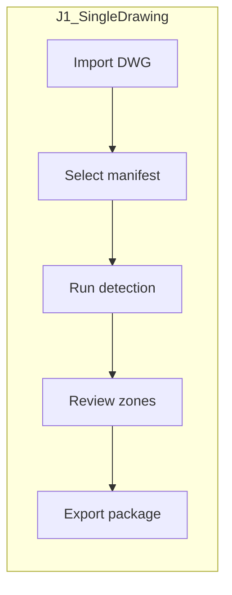
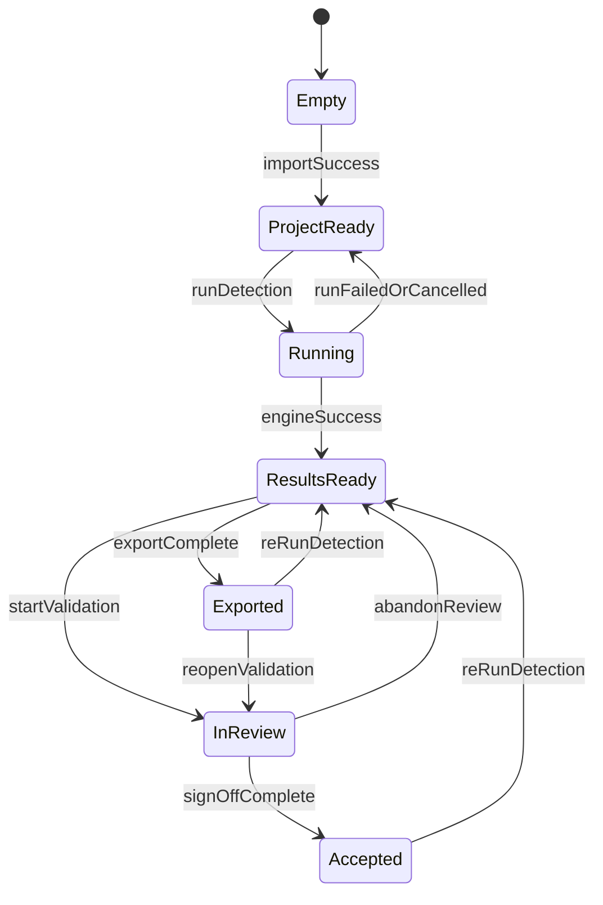
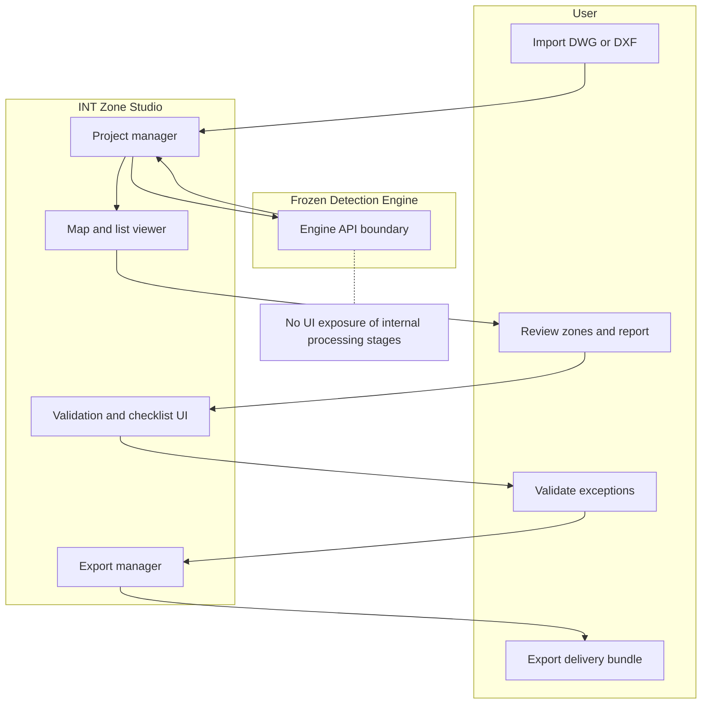
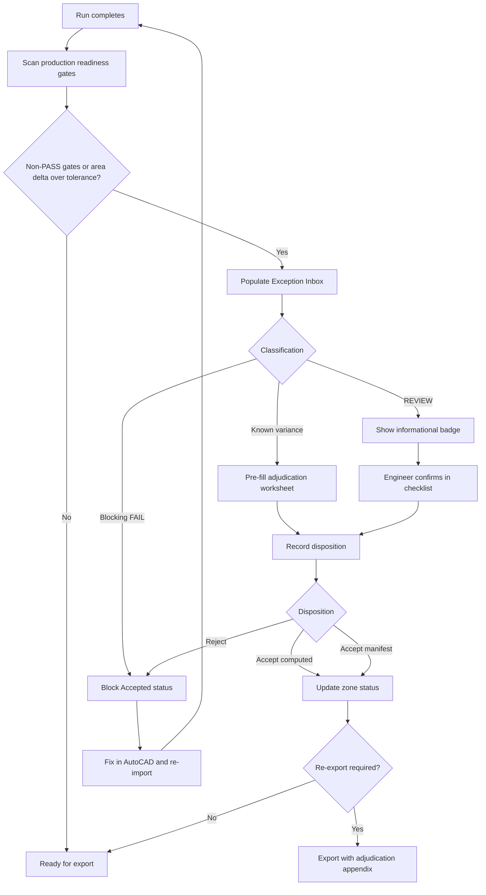
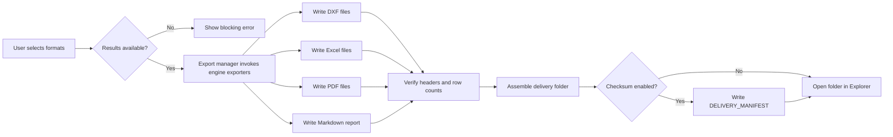

# Product Requirements Document
## INT Zone Studio — Windows Desktop Application

| Field | Value |
| --- | --- |
| **Document title** | INT Zone Studio — Desktop Application PRD |
| **Version** | 1.0 |
| **Status** | Draft |
| **Date** | 6 June 2026 |
| **Classification** | Internal / Confidential |
| **Platform** | Windows 10/11 x64 |
| **Related documents** | [prd.md](prd.md) (historical Stage 1), [02_UIUX_Brief.md](02_UIUX_Brief.md), [client_validation_package.md](client_validation_package.md) |

---

## Document purpose

This PRD defines the **end-user desktop product** that wraps the frozen INT zone detection engine. It covers import, detection orchestration, review, validation, and export workflows for structural engineers.

**Explicitly out of scope for this document:** detection algorithms, gap-closure heuristics, threshold tuning, and any changes to the frozen production pipeline (see [client_validation_package.md](client_validation_package.md) §2).

**Assumption:** The detection engine exists as an embedded, version-locked service. The desktop app invokes it; it does not reimplement or expose internal processing stages.

---

## 1. Product vision

### 1.1 One-line summary

**Give an engineer a DWG slab plan — get validated INT pour schedules, annotated DXF, and a sign-off-ready delivery package in one guided Windows session.**

### 1.2 Vision statement

INT Zone Studio enables structural engineers to move from CAD drawing to client-ready INT zone deliverables without command-line tools, scattered output folders, or paper checklists. The product orchestrates a **frozen, validated detection engine**, surfaces results in a reviewable visual workspace, and guides engineers through exception disposition and formal acceptance — producing the same export artifacts as the current CLI delivery bundle.

### 1.3 Problem statement

Today, engineers and QA staff follow a fragmented workflow:

1. Run Python CLI scripts on DWG/DXF files
2. Open multiple files in `output/` and overlay DXF in AutoCAD
3. Walk paper or Markdown checklists ([01_REVIEW_WORKFLOW_GUIDE.md](output/client_delivery/acceptance_review_kit/01_REVIEW_WORKFLOW_GUIDE.md))
4. Manually reconcile schedules against structural PDFs
5. Adjudicate known variances (e.g., S111_J INT-8) in separate worksheets
6. Assemble a delivery folder matching [DELIVERY_MANIFEST.md](output/client_delivery/DELIVERY_MANIFEST.md)

This process takes **2–4 hours per drawing** for visual verification alone, requires comfort with CLI and file paths, and offers no single source of truth for project acceptance status.

### 1.4 Product goals

| Goal | Description |
| --- | --- |
| **Guided workflow** | Replace CLI with a linear import → run → review → validate → export path |
| **Visual confidence** | Let engineers confirm INT labels and boundaries without leaving the app (optional AutoCAD for final overlay) |
| **Auditable validation** | Capture gate status, exception dispositions, and sign-off in the project record |
| **Delivery parity** | Export byte-compatible artifacts matching the frozen CLI delivery bundle |
| **Non-destructive** | Never modify the source DWG/DXF; all outputs are new files |

### 1.5 Success criteria (product-level)

| Metric | Target | Measurement |
| --- | --- | --- |
| Engineer time per drawing (happy path) | **< 15 minutes** (excluding engine runtime) | Timed usability test on S111_A sample |
| Export format parity | 100% column/header match with [export_verification.md](output/client_delivery/QA_evidence/export_verification.md) | Automated diff vs CLI baseline |
| Exception capture | 100% of adjudicated zones have disposition + reviewer recorded | Project audit log review |
| Crash rate on validated samples | 0 crashes on J33A, J33B, S111_A | Smoke test suite |
| Acceptance workflow completion | Phases A–E of review kit achievable in-app | QA walkthrough |

### 1.6 Out of scope (v1.0)

- macOS and Linux
- Cloud sync, multi-user real-time collaboration
- AutoCAD plugin or live DWG editing
- Detection algorithm tuning UI (gap thresholds, tier settings, seed expansion)
- Network connectivity or mandatory telemetry
- AI-based room or zone classification

---

## 2. User personas

### 2.1 Rajesh — Senior Structural Engineer (Primary reviewer)

| Attribute | Detail |
| --- | --- |
| **Age / experience** | 42, 18 years in structural design |
| **Tech comfort** | Expert in AutoCAD; comfortable with Excel; not a programmer |
| **Device** | Windows laptop, dual monitor; AutoCAD installed for final overlay |
| **Goals** | Confirm every INT label sits on the correct grid bay; adjudicate area variances; sign off for production |
| **Pain points** | Cannot trust black-box CLI output without visual verification; spends hours in AutoCAD cross-checking |
| **Success metric** | Signs off on a drawing in one session with documented exception dispositions |
| **Frustrations with CLI** | Must open log files to understand warnings; no structured adjudication for known variances |

### 2.2 Priya — CAD Operator / Draughtsman (Batch processor)

| Attribute | Detail |
| --- | --- |
| **Age / experience** | 27, proficient with DWG/DXF production |
| **Tech comfort** | Expert in AutoCAD and layer management; basic Excel |
| **Device** | Windows desktop workstation |
| **Goals** | Process multiple slab plans quickly; hand clean reports to senior engineer |
| **Pain points** | Repetitive CLI commands; tracking which files succeeded or failed in batch |
| **Success metric** | Batch of 3+ drawings processed with per-file status and combined summary |
| **Frustrations with CLI** | No progress UI; must manually check `output/` folder after each run |

### 2.3 Alex — QA Checker (Schedule reconciler)

| Attribute | Detail |
| --- | --- |
| **Role** | Independent checker on client or internal QA team |
| **Tech comfort** | Strong Excel; reads structural schedules; limited CAD |
| **Device** | Windows laptop |
| **Goals** | Compare exported Pour No., SQM, CUM against structural schedule PDF; complete acceptance checklist |
| **Pain points** | Switching between Excel export, PDF schedule, and Markdown reports |
| **Success metric** | All mandatory checklist items ticked with traceable evidence |
| **Frustrations with CLI** | Reports scattered across Markdown, Excel, and PDF with no unified view |

### 2.4 Sam — Project Manager (Gate owner)

| Attribute | Detail |
| --- | --- |
| **Role** | Owns delivery timeline and client sign-off |
| **Tech comfort** | Reads summaries; delegates technical review |
| **Device** | Windows laptop |
| **Goals** | Track review status across drawings; export final delivery bundle; archive sign-off |
| **Pain points** | No visibility into whether review Phases A–E are complete |
| **Success metric** | Project shows Accepted or Accepted with Conditions with exportable sign-off record |
| **Frustrations with CLI** | Status lives in email threads and paper forms, not in the tool |

---

## 3. User journeys

### 3.1 Journey overview



| ID | Name | Primary actor | Trigger | Outcome |
| --- | --- | --- | --- | --- |
| **J1** | First-time single drawing | Priya | New slab plan DWG arrives | PASS gates → export delivery bundle |
| **J2** | Client acceptance review | Rajesh, Alex | Multi-drawing project ready for sign-off | Zone inventory complete → acceptance status set |
| **J3** | Exception adjudication | Rajesh | REVIEW or FAIL gate / area variance | Disposition recorded → re-export with annotation |
| **J4** | Batch project folder | Priya | Folder of DWGs for one contract | Queue complete → per-file + portfolio summary |
| **J5** | Re-run after external fix | Priya | DWG corrected in AutoCAD | Diff vs prior run → updated export |

---

### 3.2 J1 — First-time single drawing (happy path)

**Actor:** Priya  
**Preconditions:** INT Zone Studio installed; ODA File Converter configured (or DWG pre-converted)

| Step | User action | System response | Screen |
| ---: | --- | --- | --- |
| 1 | Click **New Project** | Opens wizard | S02 |
| 2 | Select `S111_A.dwg` | Shows layers, entity count, units | S02 |
| 3 | Choose profile **S111_A** (manifest auto-attached) | Displays expected 24 INT zones | S02 |
| 4 | Click **Create Project** | Project saved; dashboard shows **Ready to run** | S03 |
| 5 | Click **Run Detection** | Progress stages: Loading → Detecting → Building schedule → Validating | S05 |
| 6 | Run completes | Gate summary: all PASS (or REVIEW flagged) | S03 |
| 7 | Open **Map** tab | Canvas shows INT boundaries and labels | S06 |
| 8 | Spot-check INT-1, INT-15, INT-24 in list | Selection highlights on canvas | S07 |
| 9 | Open **Report** tab | Full zone report visible | S09 |
| 10 | Click **Export** → select DXF, Excel, PDF, bundle | Files written; folder opens | S12 |

**Success metric:** Export folder matches CLI layout for S111_A; engineer elapsed time < 15 minutes.

---

### 3.3 J2 — Client acceptance review

**Actors:** Rajesh (visual), Alex (schedule), Sam (sign-off)  
**Preconditions:** Portfolio project with J33A, J33B, S111_A drawings processed

| Step | User action | System response | Screen |
| ---: | --- | --- | --- |
| 1 | Open portfolio project | Dashboard shows 65/65 zones aggregate | S03 |
| 2 | Rajesh opens **Checklist** per drawing | 24 + 17 + 24 zone tick-off rows | S11 |
| 3 | Rajesh ticks each INT after map verification | Progress bar updates | S11 |
| 4 | Alex opens **Report** → Manifest reconciliation | SQM/CUM vs manifest Δ% displayed | S09 |
| 5 | Alex compares Excel export to structural PDF | Notes discrepancies in per-drawing sheet | S07 |
| 6 | Sam sets acceptance status **In Review** | Status badge on dashboard | S03 |
| 7 | Team completes questionnaire fields in-app | Responses saved to project | S10 |
| 8 | Sam selects **Accepted** and exports sign-off PDF | Sign-off record archived | S12 |

**Maps to review kit phases:** A (orientation) → B (visual) → C (schedule) → E (sign-off).

---

### 3.4 J3 — Exception adjudication

**Actor:** Rajesh  
**Preconditions:** Run completed with REVIEW gates or manifest area FAIL

| Step | User action | System response | Screen |
| ---: | --- | --- | --- |
| 1 | Dashboard shows **3 items need review** | Exception inbox pre-filtered | S10 |
| 2 | Open **S111_J INT-8** variance item | Side-by-side: Computed m² vs Manifest m² vs Δ% | S08 |
| 3 | Optionally record AutoCAD measured value | Field stored on worksheet | S10 |
| 4 | Select disposition: **Accept computed** | Status updates; project notes appended | S10 |
| 5 | Re-export delivery bundle | Export includes adjudication appendix | S12 |

**Success metric:** Disposition matches [07_INT8_ADJUDICATION_WORKSHEET.md](output/client_delivery/acceptance_review_kit/07_INT8_ADJUDICATION_WORKSHEET.md) fields.

---

### 3.5 J4 — Batch project folder

**Actor:** Priya

| Step | User action | System response | Screen |
| ---: | --- | --- | --- |
| 1 | Home → **Batch Import** | Folder picker | S01 |
| 2 | Select folder with 3 DWGs | Queue populated | S13 |
| 3 | Click **Run All** | Sequential runs with per-file progress | S13 |
| 4 | Review summary row | Pass/warn/fail counts | S13 |
| 5 | Export combined portfolio summary | Optional aggregate report | S12 |

---

### 3.6 J5 — Re-run after external fix

**Actor:** Priya

| Step | User action | System response | Screen |
| ---: | --- | --- | --- |
| 1 | Re-import updated DWG into existing project | Prompt: replace input or new run | S03 |
| 2 | Run detection | New run appended to history | S05 |
| 3 | View **Compare runs** | Diff: zone count, gate changes, area deltas | S09 |
| 4 | Export if improved | Prior run preserved in history | S12 |

---

## 4. Functional requirements

Requirements use **Must** (v1.0 ship), **Should** (v1.0 if time permits), **Could** (defer). Each includes acceptance criteria (AC).

### 4.1 Import and project setup

| ID | Priority | Requirement | Acceptance criteria |
| --- | --- | --- | --- |
| FR-01 | Must | Accept `.dwg` and `.dxf` via file picker or drag-drop | Valid sample files open without CLI; unsupported extensions rejected with clear message |
| FR-02 | Must | Convert DWG via ODA File Converter when installed; show conversion status | If ODA missing, show install path setting and manual DXF fallback instructions |
| FR-03 | Must | Display drawing metadata: filename, layer list, entity count, drawing units | Metadata visible on S02/S03 within 5 s of import |
| FR-04 | Must | Attach zone manifest YAML (`project`, `zone_count_expected`, `zones[]`) | User can browse to YAML or select preset profile |
| FR-05 | Must | Provide project profile presets: J33A, J33B, S111_A, Custom | Preset auto-loads manifest from `reference/` equivalent paths |
| FR-06 | Must | Persist project state: input path, manifest, last run, validation status, output path | Reopening app restores last project from disk |
| FR-07 | Should | Support portfolio projects containing multiple drawings | Portfolio aggregates zone counts across drawings |

### 4.2 Run detection (engine black box)

| ID | Priority | Requirement | Acceptance criteria |
| --- | --- | --- | --- |
| FR-08 | Must | Single **Run Detection** action invokes frozen engine with locked production config | No user-editable gap/threshold/tier controls in v1 (frozen per validation package §2.3) |
| FR-09 | Must | Show user-facing progress stages only: *Loading drawing → Detecting zones → Building schedule → Validating* | Stages advance without exposing internal phase names (P2.1, P2.5, etc.) |
| FR-10 | Must | Run detection on background worker; UI remains interactive | UI thread never blocks > 200 ms during run |
| FR-11 | Must | Allow cancel of in-flight run | Cancel restores prior run results if any |
| FR-12 | Must | Write run log to project logs folder; display path in UI | Log link opens in default text editor |
| FR-13 | Must | Display engine version and freeze date on About screen | Matches client validation baseline (2026-06-06) |

### 4.3 Review detected zones

| ID | Priority | Requirement | Acceptance criteria |
| --- | --- | --- | --- |
| FR-14 | Must | 2D canvas viewer with pan, zoom, fit-to-view | Sample drawing navigable at 60 fps on reference hardware |
| FR-15 | Must | Layer toggles: source geometry, INT zone boundaries, INT labels | At least 3 independent toggles |
| FR-16 | Must | Zone list grid columns: Pour No., Concrete Area (SQM), Concrete Volume (CUM), Face Count, Grid Ref, status badge | Column headers match export_verification.md |
| FR-17 | Must | Bidirectional selection: list ↔ canvas highlight | Selected INT boundary highlighted distinct color |
| FR-18 | Must | Filter/search by INT label and gate status (PASS / REVIEW / FAIL / SKIP) | Filter reduces list in < 100 ms for 65 zones |
| FR-19 | Must | Empty-zone row (0 faces) shows indicator and optional note field | Empty zones visually distinct (e.g., INT-18 pattern) |
| FR-20 | Should | Mini-map for large warehouse drawings | Viewport indicator on canvas |

### 4.4 Inspect zone reports

| ID | Priority | Requirement | Acceptance criteria |
| --- | --- | --- | --- |
| FR-21 | Must | In-app Zone Report with sections matching `*_int_zone_report.md`: Summary, Production readiness, INT zone table, Manifest reconciliation, Warnings | All sections present for sample S111_A run |
| FR-22 | Must | Production readiness gates displayed: `zone_count`, `orphan_faces`, `zone_face_coverage`, `union_vs_clipped_bay`, `face_sum_vs_union`, `manifest_area` | Gate name, status badge, detail text shown |
| FR-23 | Must | Gate drill-down lists affected INT IDs without algorithm explanation | User sees which zones triggered REVIEW, not why internally |
| FR-24 | Must | Manifest reconciliation table: Computed m², Manifest m², Δ%, Status, Faces | Matches sample report columns |
| FR-25 | Should | Export report as Markdown or PDF from viewer | File matches CLI-generated report content |

### 4.5 Validate exceptions

| ID | Priority | Requirement | Acceptance criteria |
| --- | --- | --- | --- |
| FR-26 | Must | Exception inbox aggregating non-PASS gates and manifest deltas above 0.05% tolerance | Inbox count matches report gate failures |
| FR-27 | Must | Per-zone adjudication: Accept computed / Accept manifest / Reject + notes + optional measured value | All fields persist on project save |
| FR-28 | Must | Zone inventory checklist with tick-off, reviewer name, timestamp per INT | Checklist exportable; maps to 03_ZONE_INVENTORY_CHECKLIST |
| FR-29 | Must | Project acceptance status: Not Started / In Review / Accepted / Accepted with Conditions / Rejected | Status visible on S03 dashboard |
| FR-30 | Must | In-app questionnaire (9 questions mirroring client kit) | Responses exportable with sign-off |
| FR-31 | Must | Export sign-off record (PDF or printable HTML) per 08_CLIENT_SIGN_OFF_FORM | Includes disposition, signatures block, known metrics table |
| FR-32 | Should | Blocking vs non-blocking classification per decision matrix in review workflow guide | UI badge matches kit Section 5 |

### 4.6 Export

| ID | Priority | Requirement | Acceptance criteria |
| --- | --- | --- | --- |
| FR-33 | Must | Export `*_int_zones.dxf` — INT boundaries and labels overlay | Opens in AutoCAD; layers INT_ZONES / INT_LABELS present |
| FR-34 | Must | Export `*_annotated.dxf` — Stage 1 annotated drawing | Matches delivery manifest DB-4/DXF gate |
| FR-35 | Must | Export `*_int_schedule.xlsx` with columns: Pour No., Concrete Area (SQM), Concrete Volume (CUM), Face Count, Grid Ref, Detection Tier, Centroid X (m), Centroid Y (m), Union/Bay Coverage % | Header row exact match; data row count = zones + totals |
| FR-36 | Must | Export `*_int_schedule.pdf` | Matches PDF/G7 delivery gate |
| FR-37 | Must | Export `*_int_zone_report.md` | Matches DB-2/G2 report gate |
| FR-38 | Must | Export `*_results.xlsx` — micro-face / room-level results where applicable | Present in delivery bundle layout |
| FR-39 | Must | Export full delivery bundle folder structure per DELIVERY_MANIFEST.md | Subfolders J33A, J33B, S111_A pattern replicable for any project code |
| FR-40 | Must | Export dialog: select formats, output directory, **Open folder** on completion | User reaches exported files in one click |
| FR-41 | Should | SHA-256 checksum manifest optional export | Matches DELIVERY_MANIFEST format when enabled |

### 4.7 Batch and portfolio

| ID | Priority | Requirement | Acceptance criteria |
| --- | --- | --- | --- |
| FR-42 | Should | Batch queue: add multiple files, run sequentially, per-file status | Failed file does not block subsequent files |
| FR-43 | Should | Portfolio dashboard: aggregate required vs computed zones | Shows 65/65 style summary for 3-drawing portfolio |
| FR-44 | Could | Combined Excel across batch | Single workbook with source file column |

### 4.8 Settings and help

| ID | Priority | Requirement | Acceptance criteria |
| --- | --- | --- | --- |
| FR-45 | Must | Settings: default output directory, ODA converter path, default slab thickness | Settings persist across sessions |
| FR-46 | Must | Read-only display of frozen detection configuration snapshot | User sees values but cannot edit (gap 500 mm, etc.) |
| FR-47 | Must | Help link to acceptance workflow guide | Opens kit PDF/HTML or embedded help |
| FR-48 | Should | Recent projects list on Home | Last 10 projects with status badge |

---

## 5. Non-functional requirements

| ID | Category | Requirement |
| --- | --- | --- |
| NFR-01 | **Platform** | Windows 10 and Windows 11, 64-bit only; distributed via MSI or MSIX installer |
| NFR-02 | **Performance** | UI remains responsive during engine run (background worker); engine completes sample DWGs within same order of magnitude as CLI (< 2 minutes on reference hardware) |
| NFR-03 | **Performance** | Canvas pan/zoom at ≥ 30 fps for warehouse-scale drawings |
| NFR-04 | **Reliability** | Zero crashes during smoke test on J33A, J33B, S111_A sample drawings |
| NFR-05 | **Reliability** | Auto-save project state after each successful run |
| NFR-06 | **Usability** | Zero CLI required for any v1 workflow |
| NFR-07 | **Usability** | Every error message includes: what happened, recommended action, link to log or settings |
| NFR-08 | **Auditability** | Immutable run history per project: timestamp, input file hash, manifest version, gate summary, export paths |
| NFR-09 | **Security** | All processing local; no network required; no telemetry without explicit opt-in |
| NFR-10 | **Accessibility** | Keyboard navigation for zone list and primary actions; WCAG 2.1 AA contrast for core flows |
| NFR-11 | **Install size** | Target installed size < 500 MB including embedded runtime and engine |
| NFR-12 | **Compatibility** | Export outputs byte-compatible with current CLI exports for identical inputs (regression gate before release) |
| NFR-13 | **Maintainability** | Engine invoked via stable API boundary; engine version pinned and displayed |
| NFR-14 | **Localization** | English UI only for v1.0 |

---

## 6. Screen inventory

### 6.1 Navigation model

```
Home (S01)
  └── New Project Wizard (S02)
        └── Project Dashboard (S03) ── hub tabs ──┬── Map (S06)
                                                  ├── Zones (S07) → Detail (S08)
                                                  ├── Report (S09)
                                                  ├── Exceptions (S10)
                                                  ├── Checklist (S11)
                                                  └── Export (S12)
  └── Batch Queue (S13)
  └── Settings & About (S14)
```

Detection Progress (S05) is a modal overlay from S03. Drawing Settings (S04) is a slide-over or dialog from S03.

### 6.2 Screen catalog

| ID | Screen | Purpose | Entry points | Key components |
| --- | --- | --- | --- | --- |
| S01 | Home / Recent Projects | Launch pad | App start | New project, batch import, recents list, settings |
| S02 | New Project Wizard | Import and configure | S01 New Project | File picker, metadata preview, profile/manifest selector |
| S03 | Project Dashboard | Status hub | S02 complete, S01 recent | Run button, gate summary cards, acceptance status, tab bar |
| S04 | Drawing Settings | Per-project settings | S03 gear icon | Slab thickness, output path, ODA path, read-only frozen config |
| S05 | Detection Progress | Run feedback | S03 Run Detection | Stage progress bar, cancel, log tail (last 20 lines) |
| S06 | Zone Map Viewer | Visual review | S03 Map tab | Canvas, layer toggles, mini-map, zoom controls |
| S07 | Zone List | Tabular review | S03 Zones tab | Sortable grid, filters, status badges, totals row |
| S08 | Zone Detail | Single-zone drill-down | S07 row click | Metrics table, notes, link to adjudication |
| S09 | Validation Report | Full report viewer | S03 Report tab | Tabbed sections mirroring Markdown report |
| S10 | Exception Inbox | Issue triage | S03 Exceptions tab, gate click | Filtered list, adjudication form, disposition buttons |
| S11 | Zone Inventory Checklist | Formal tick-off | S03 Checklist tab | Per-INT checkbox, reviewer field, drawing tabs |
| S12 | Export Center | Output generation | S03 Export tab | Format checkboxes, path, export, open folder |
| S13 | Batch Queue | Multi-file processing | S01 Batch | File table, run all, per-file status |
| S14 | Settings & About | Global preferences | S01, S03 menu | Paths, engine version, freeze notice, help links |

### 6.3 Wireframe — S03 Project Dashboard

```
┌──────────────────────────────────────────────────────────────────────────┐
│  INT Zone Studio                                    [Settings] [—][□][✕] │
├──────────────────────────────────────────────────────────────────────────┤
│  Project: S111_A · S111_A.dwg          Status: ● Results Ready            │
│  Manifest: S111_A (24 zones expected)   Acceptance: Not Started          │
├──────────────────────────────────────────────────────────────────────────┤
│  ┌─────────────┐ ┌─────────────┐ ┌─────────────┐ ┌─────────────┐        │
│  │ zone_count  │ │orphan_faces │ │manifest_area│ │  Exceptions │        │
│  │   PASS      │ │   PASS      │ │   PASS      │ │   3 REVIEW  │        │
│  └─────────────┘ └─────────────┘ └─────────────┘ └─────────────┘        │
│                                                                          │
│         [  Run Detection  ]    [  Re-import Drawing  ]                 │
├──────────────────────────────────────────────────────────────────────────┤
│  Map  |  Zones  |  Report  |  Exceptions  |  Checklist  |  Export       │
├──────────────────────────────────────────────────────────────────────────┤
│                                                                          │
│   (active tab content — e.g., gate cards + quick stats)                  │
│                                                                          │
│   INT zones: 24/24    Total SQM: 655.24    Orphans: 0                    │
│                                                                          │
└──────────────────────────────────────────────────────────────────────────┘
```

### 6.4 Wireframe — S06 Zone Map Viewer

```
┌──────────────────────────────────────────────────────────────────────────┐
│  Layers: [☑ Walls] [☑ INT boundaries] [☑ Labels]     [Fit] [+][−]       │
├───────────────────────────────┬──────────────────────────────────────────┤
│                               │  Selected: INT-15                        │
│                               │  Union: 499.91 m²                        │
│     ┌──────┐  ┌──────┐        │  Faces: 36                               │
│     │INT-14│  │INT-15│        │  Gate: PASS                              │
│     └──────┘  └──────┘        │  ─────────────────                       │
│                               │  [ Open in Zone Detail ]                 │
│   (drawing canvas)            │  [ Add to Checklist ✓ ]                  │
│                               │                                          │
│                               │  Filter: [All statuses ▼] [Search…]    │
│                               │  ┌────┬────────┬──────┬────────┐        │
│                               │  │INT │ SQM      │Faces │ Status │        │
│                               │  │ 15 │ 499.91   │  36  │ PASS   │        │
│                               │  │ 18 │  0.00    │   0  │ REVIEW │        │
│                               │  └────┴────────┴──────┴────────┘        │
│  [mini-map ▪]                 │                                          │
└───────────────────────────────┴──────────────────────────────────────────┘
```

---

## 7. Workflow diagrams

### 7.1 Application state machine



### 7.2 End-to-end product workflow



### 7.3 Exception adjudication flow



### 7.4 Export pipeline



---

## 8. Error handling

### 8.1 Error taxonomy

| Class | Severity | Examples | UI behavior |
| --- | --- | --- | --- |
| **Blocking** | Error | File not found; corrupt DWG; ODA converter missing when DWG selected; output folder not writable | Modal dialog; block Run and Export; show fix tip |
| **Run failed** | Error | Engine exit code non-zero; unexpected engine exception | Preserve prior run; show last 50 log lines; offer Retry |
| **Validation FAIL** | Error / Warning | `zone_count` mismatch; `orphan_faces` > 0; `manifest_area` FAIL | Route to Exception Inbox; block **Accepted** status; allow export with banner |
| **Validation REVIEW** | Warning | `zone_face_coverage` empty zones; `union_vs_clipped_bay` low coverage; `face_sum_vs_union` mismatch | Informational badge; engineer confirms in checklist; does not block export |
| **Known variance** | Warning | Area Δ > 0.05% (e.g., S111_J INT-8 at 0.207%) | Open pre-filled adjudication worksheet |
| **Informational** | Info | Extra micro-faces vs INT count; REVIEW flags on face_sum vs union | Explain in Report panel: expected by design |
| **Non-blocking import** | Warning | Layer name auto-fallback applied | Toast notification; details in run log |

### 8.2 Error message template

All user-facing errors follow:

```
[Severity icon] [Short title]
[One sentence: what happened.]
[Recommended action.]
[View log →]  [Open settings →]
```

**Examples:**

| Situation | Message |
| --- | --- |
| ODA missing | **Cannot convert DWG** — ODA File Converter was not found at the configured path. Install ODA or convert the file to DXF manually, then re-import. [Open settings] |
| Zone count FAIL | **Zone count mismatch** — The engine found 23 INT zones but the manifest expects 24. Verify the manifest profile or drawing revision. [View report] [View log] |
| Empty zone REVIEW | **Empty zone flagged for review** — INT-18 has 0 assigned faces. Confirm this is structurally expected, then tick the checklist. [Open checklist] |

### 8.3 Recovery flows

| Scenario | Recovery actions |
| --- | --- |
| Import failure | Choose different file; install ODA; convert to DXF externally |
| Run failure | View log → fix drawing in AutoCAD → re-import → retry |
| Manifest mismatch | Change profile; update manifest YAML; contact admin |
| Validation FAIL | Exception inbox → adjudicate or fix drawing → re-run |
| Export failure | Change output path; check disk space; retry export |
| Accepted blocked | Complete checklist; resolve blocking FAIL items; record INT-8 disposition |

### 8.4 Fail-safe principles

Aligned with [02_UIUX_Brief.md](02_UIUX_Brief.md) §7:

- **Fail loudly** — no silent skips; every warning appears in UI and log
- **Non-destructive** — source DWG never modified; cancel never deletes prior results
- **Human assist** — REVIEW items require engineer confirmation, not auto-dismiss
- **Audit trail** — every error and recovery action timestamped in project history

---

## 9. Future roadmap

### 9.1 Release phases

| Phase | Theme | Key features | Detection scope |
| --- | --- | --- | --- |
| **v1.0** | Core desktop | Import, run, map/list review, report, exceptions, export, Windows installer | Frozen engine embedded; no tuning UI |
| **v1.1** | Collaboration | Read-only report export for email; packaged ZIP handoff; print-friendly checklist | None |
| **v1.2** | Productivity | Project templates; manifest editor; run-to-run diff view | None |
| **v2.0** | Platform | macOS port; optional CLI sync for power users | None |
| **v2.x** | Integration | Seed-point assist picker (calls existing engine seed API — UI only) | No new detection logic |
| **v3.0** | Enterprise | SSO; centralized manifest library; server-side audit log | None |

### 9.2 Explicit non-goals (all phases unless client proves missing INT zone)

- Detection tuning UI (gap threshold, tier-2, colinear matching, seed expansion)
- New gap-closure algorithms or detection phases
- Threshold sliders exposed to end users
- Reopening frozen pipeline for undiagnosed micro-face events

### 9.3 Dependencies on client acceptance

Desktop v1.0 development proceeds in parallel with client sign-off per [client_validation_package.md](client_validation_package.md). Engine API surface and export contracts are locked to the 2026-06-06 delivery baseline.

---

## Appendix A — Glossary

| Term | Definition |
| --- | --- |
| **INT zone** | Pour partition label (INT-1 … INT-N) used in structural schedules |
| **Manifest** | YAML file defining expected zone count and reference areas/volumes per INT |
| **Gate** | Production readiness check with status PASS, REVIEW, FAIL, or SKIP |
| **Pour schedule** | Tabular export of Pour No., SQM, CUM for concrete ordering |
| **REVIEW** | Non-blocking flag requiring engineer confirmation |
| **FAIL** | Blocking validation issue requiring resolution or formal rejection |
| **Delivery bundle** | Folder of DXF, Excel, PDF, and report files per DELIVERY_MANIFEST |
| **Portfolio** | Multi-drawing project (e.g., J33A + J33B + S111_A = 65 zones) |
| **Adjudication** | Formal disposition of a known area or labelling variance |

---

## Appendix B — Assumptions and dependencies

| Item | Assumption |
| --- | --- |
| Detection engine | Frozen production build embedded; version pinned to 2026-06-06 baseline |
| DWG support | ODA File Converter installed on user machine, or user supplies DXF |
| Manifests | Project manifests maintained by QA/admin; shipped as presets for known projects |
| AutoCAD | Optional for final overlay verification; not required to operate the app |
| Tech stack | Implementation decision (Electron, Tauri, PyQt, etc.) — not a PRD blocker |
| Network | Not required for v1.0 operation |

---

## Appendix C — Open questions

| ID | Question | Owner | Target |
| --- | --- | --- | --- |
| OQ-01 | Desktop framework selection | Engineering | Before sprint 1 |
| OQ-02 | Embedded vs sidecar Python runtime | Engineering | Architecture spike |
| OQ-03 | Canvas rendering library for DWG-scale geometry | Engineering | UX spike |
| OQ-04 | Code signing certificate for MSI | PM | Before beta |
| OQ-05 | In-app vs external AutoCAD launch for overlay | UX | v1.0 scope trim |

---

## Appendix D — Traceability matrix

| FR ID | Screen(s) | Journey |
| --- | --- | --- |
| FR-01 – FR-06 | S02, S04 | J1, J4, J5 |
| FR-08 – FR-13 | S03, S05, S14 | J1, J4, J5 |
| FR-14 – FR-20 | S06, S07, S08 | J1, J2 |
| FR-21 – FR-25 | S09 | J1, J2 |
| FR-26 – FR-32 | S10, S11 | J2, J3 |
| FR-33 – FR-41 | S12 | J1, J2, J3 |
| FR-42 – FR-44 | S13, S03 | J4, J2 |
| FR-45 – FR-48 | S14, S01 | All |

---

## Appendix E — References

| Document | Relevance |
| --- | --- |
| [client_validation_package.md](client_validation_package.md) | Freeze statement, 65/65 coverage, forward work scope |
| [02_UIUX_Brief.md](02_UIUX_Brief.md) | Personas, UX principles, error message style |
| [01_Software_Flow.md](01_Software_Flow.md) | Output artifacts and module boundaries (user-facing stages only) |
| [03_Backend_Schema.md](03_Backend_Schema.md) | Data fields for UI binding (IntZone, gates, manifest) |
| [DELIVERY_MANIFEST.md](output/client_delivery/DELIVERY_MANIFEST.md) | Export file list and layout |
| [export_verification.md](output/client_delivery/QA_evidence/export_verification.md) | Excel column contract |
| [01_REVIEW_WORKFLOW_GUIDE.md](output/client_delivery/acceptance_review_kit/01_REVIEW_WORKFLOW_GUIDE.md) | Validation workflow Phases A–E |
| [08_CLIENT_SIGN_OFF_FORM.md](output/client_delivery/acceptance_review_kit/08_CLIENT_SIGN_OFF_FORM.md) | Sign-off record template |
| Sample [S111_A_int_zone_report.md](output/S111_A_int_zone_report.md) | Report section and gate names |

---

*END OF PRODUCT REQUIREMENTS DOCUMENT*  
*INT Zone Studio — Desktop Application | v1.0 | June 2026*
