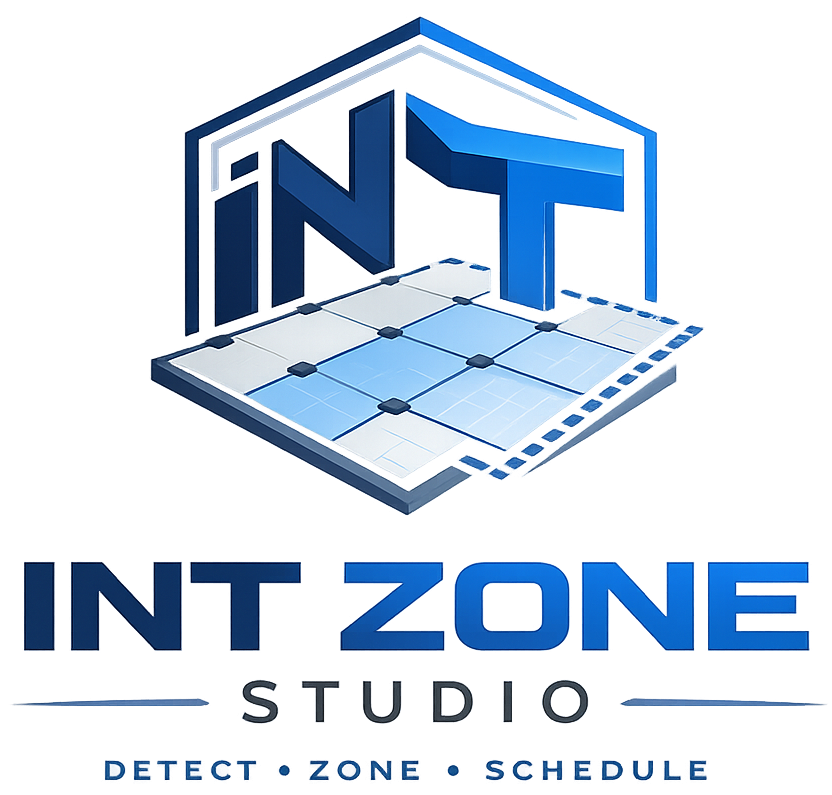

<div align="center">



# **INT ZONE** STUDIO

**Slab pour-cell detection · review · export — built for structural engineers**

<sub>

[](https://gitlab.com/asishpapu372-group/INT_Zone_Studio/-/releases)
[](LICENSE)
[](docs/manual/INSTALLATION.md)
[](CONTRIBUTING.md)

</sub>

<br />

[**Download**](https://github.com/Asish372/INT_Zone_Studio/releases/latest) ·
[**User Guide**](docs/manual/USER_GUIDE.md) ·
[**Installation**](docs/manual/INSTALLATION.md) ·
[**Changelog**](CHANGELOG.md) ·
[**Report Issue**](https://github.com/Asish372/INT_Zone_Studio/issues)

<br />

```
Import Drawing → Automatic Detection → Review → Recovery → Save → Reopen → Export
```

</div>

---

## Overview

**INT Zone Studio** is a desktop CAD workspace for slab drawings (DXF/DWG). It detects enclosed pour-cell polygons, surfaces suspected gaps, supports click-to-recover missing cells, and exports a delivery package — **fully local**, no cloud, no telemetry.

Current line: **Pilot Evaluation Build v1** (`0.1.0-pilot.1`) — field validation with engineers, not a commercial release.

| | |
|---|---|
| **Author** | [Asish Bindhani](https://www.linkedin.com/in/asish372) |
| **Repository** | [github.com/Asish372/INT_Zone_Studio](https://github.com/Asish372/INT_Zone_Studio) |
| **Pilot scope** | [PILOT_V1.md](PILOT_V1.md) |

---

## Download

| Asset | Version | Platform |
|-------|---------|----------|
| **INT Zone Studio Standalone Setup** | `0.1.0-pilot.1` | Windows 10/11 x64 |
| **Release notes** | [v0.1.0-pilot.1](RELEASE_NOTES_PILOT_V1.md) | — |
| **Changelog** | [CHANGELOG.md](CHANGELOG.md) | All versions |

➡️ **[Get the latest installer from Releases](https://github.com/Asish372/INT_Zone_Studio/releases/latest)**

After install: Start Menu → **INT Zone Studio**. No Python or terminal required.

---

## Screenshots

<table>
<tr>
<td width="50%"><br/><sub>Welcome — import DXF/DWG or open saved workspace</sub></td>
<td width="50%"><br/><sub>Automatic detection on warehouse slab plan</sub></td>
</tr>
<tr>
<td><br/><sub>Polygon table, properties, CAD viewer</sub></td>
<td><br/><sub>Validation and suspected gaps</sub></td>
</tr>
</table>

---

## Documentation

| Manual | Description |
|--------|-------------|
| [Installation](docs/manual/INSTALLATION.md) | System requirements, installer, first run |
| [User Guide](docs/manual/USER_GUIDE.md) | Full pilot workflow step-by-step |
| [FAQ & troubleshooting](docs/manual/FAQ.md) | Common issues and fixes |
| [Release notes (v1)](RELEASE_NOTES_PILOT_V1.md) | What ships in pilot v1 |
| [Pilot program](PILOT_V1.md) | Scope, metrics, exit criteria |
| [Contributing](CONTRIBUTING.md) | Dev setup and PR guidelines |

Engineer session kit: [`pilot/ENGINEER_SESSION_CHECKLIST.md`](pilot/ENGINEER_SESSION_CHECKLIST.md)

---

## Features (Pilot v1)

- Import **DXF** and **DWG** slab drawings
- **Automatic detection** of pour-cell polygons from CAD geometry
- Interactive viewer — pan, zoom, minimap, layer visibility
- **Suspected gaps** — validation-driven hints to missing regions
- **Seed recovery** — click-to-recover with preview
- Review status per polygon (Approve / Reject / Needs Review)
- Save & reopen workspace projects (`.pjson`)
- Export — DXF, CSV, JSON, Excel, bundled project package
- CLI engine for batch processing

---

## Quick start (developers)

**Prerequisites:** Python 3.10+, Node.js 18+, Rust (for Tauri builds)

```bash
# Python engine
python -m venv .venv
.venv\Scripts\activate
pip install -r requirements.txt
python scripts/run_polygon_workspace.py
```

```bash
# UI (second terminal)
cd desktop/studio
npm install
npm run dev
```

Open http://localhost:1420

**Desktop build:**

```bash
cd desktop/studio
npm run tauri:build
powershell -File ../../scripts/stage_release_installer.ps1
```

**Tests:** `pytest tests/ -v`

---

## Architecture

```
┌─────────────────────────────────────────────────────────┐
│  INT Zone Studio (Tauri + React)                        │
│  CAD viewer · tables · review · export UI               │
└────────────────────────┬────────────────────────────────┘
                         │ HTTP / JSON (dev) or sidecar IPC
┌────────────────────────▼────────────────────────────────┐
│  Python engine_sidecar (FastAPI)                        │
│  detection · validation · workspace · scene builder     │
└────────────────────────┬────────────────────────────────┘
                         │
┌────────────────────────▼────────────────────────────────┐
│  src/ + zone_engine — polygonize, gap close, seeds      │
└─────────────────────────────────────────────────────────┘
```

| Path | Role |
|------|------|
| [`desktop/studio/`](desktop/studio/) | React + Tauri shell |
| [`desktop/engine_sidecar/`](desktop/engine_sidecar/) | Detection & workspace API |
| [`src/`](src/) | Core DXF parsing, detection, export |
| [`scripts/`](scripts/) | CLI, packaging, release staging |
| [`docs/branding/`](docs/branding/) | Logo and social assets |

---

## Configuration

Edit [`config.yaml`](config.yaml) for layer names, gap threshold, slab thickness, and units.

| Setting | Default | Description |
|---------|---------|-------------|
| `geometry.gap_threshold` | 500 | Max gap to auto-close (drawing units) |
| `geometry.slab_thickness` | 0.15 | Slab thickness (metres) |
| `layers.wall_layers` | WALL, S-WALL, BEAM | Layers to extract |

---

## Pilot feedback

Evaluating this build? Use:

- [`pilot_metrics_template.csv`](pilot_metrics_template.csv) — per-drawing metrics
- [`PILOT_FEEDBACK.md`](PILOT_FEEDBACK.md) — qualitative notes
- [GitHub Issues](https://github.com/Asish372/INT_Zone_Studio/issues) — bugs with sanitized drawings

---

## Known limitations (v0.1.0-pilot.1)

| Area | Note |
|------|------|
| Save workspace | Full path entry — no browse dialog in pilot v1 |
| Re-run detection | Refreshes session view; does not re-import CAD |
| Recent projects | Use Open Project |
| AI / cloud | Not included — local only |

---

## Third-party

- DWG conversion may use [ODA File Converter](https://www.opendesign.com/guestfiles/oda_file_converter) (ODA terms apply)
- CAD: [ezdxf](https://github.com/mozman/ezdxf) · Geometry: [Shapely](https://github.com/shapely/shapely)

---

<div align="center">

**Asish Bindhani** · [LinkedIn](https://www.linkedin.com/in/asish372) · [GitHub](https://github.com/Asish372)

MIT © 2026 Asish Bindhani

</div>
