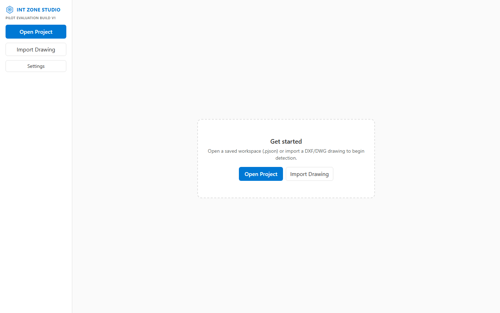
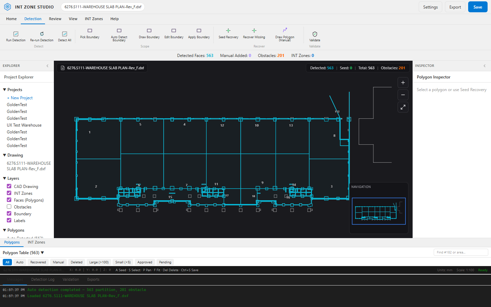
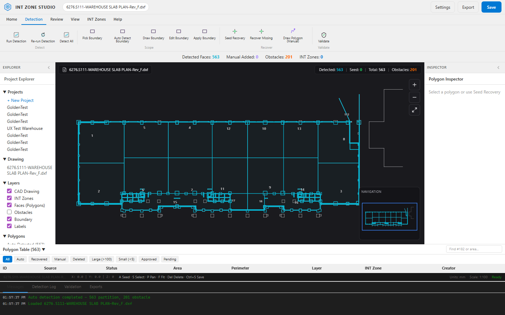
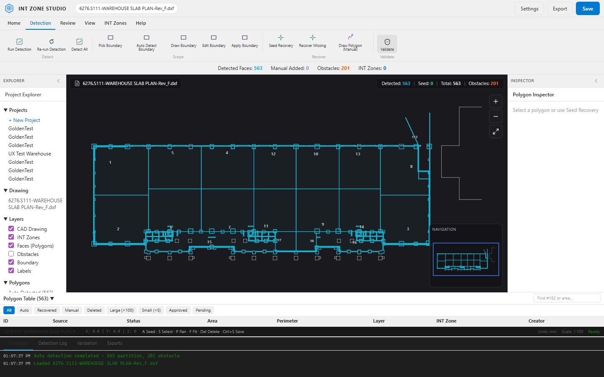

# INT Zone Studio

**Open-source CAD workspace for slab pour-cell polygon detection, review, and export.**

INT Zone Studio helps structural engineers work through slab drawings (DXF/DWG): automatic polygon detection, suspected-gap guidance, manual recovery, project save/reopen, and delivery export — all **local**, with no cloud or telemetry.

| | |
|---|---|
| **Latest release** | [v0.1.0-pilot.1](https://github.com/Asish372/INT_Zone_Studio/releases/tag/v0.1.0-pilot.1) — Pilot Evaluation Build v1 |
| **License** | [MIT](LICENSE) |
| **Author** | [Asish Bindhani](https://www.linkedin.com/in/asish372) |
| **Platform** | Windows 10/11 x64 (desktop); CLI and web dev mode cross-platform |

> **Note:** v0.1.0-pilot.1 is a **pilot evaluation build** for field validation with engineers — not a production or commercial release. See [PILOT_V1.md](PILOT_V1.md) and [RELEASE_NOTES_PILOT_V1.md](RELEASE_NOTES_PILOT_V1.md).

---

## Screenshots

**Welcome screen** — import a DXF/DWG or open a saved workspace:



**Automatic detection** — slab pour cells detected on a warehouse drawing (563 partitions in this example):



**Review workflow** — polygon table, properties, and CAD viewer:



**Validation** — run validation and inspect suspected gaps:



*Sample drawing: warehouse slab plan (DXF). Regenerate screenshots: `python scripts/capture_readme_screenshots.py` (requires dev server + engine).*

---

## Why this exists

Slab audit workflows often break when detection misses cells. INT Zone Studio optimizes for **gap-to-recovery usefulness**: suspected gaps that lead an engineer to the right missing pour cell, not raw polygon counts alone.

**Supported pilot workflow:**

```
Import Drawing → Automatic Detection → Review → Recovery → Save Project → Reopen Project → Export Package
```

---

## Features (Pilot v1)

- **Import** DXF and DWG slab drawings
- **Automatic detection** of enclosed pour-cell polygons from CAD geometry
- **Interactive viewer** — pan, zoom, minimap, layer visibility
- **Suspected gaps** — validation-driven hints to missing regions
- **Seed recovery** — click-to-recover missing polygons with preview
- **Review** — approve / reject / needs-review per polygon
- **Save & reopen** workspace projects (`.pjson`)
- **Export** — DXF, CSV, JSON, Excel, and bundled project package
- **CLI engine** — same detection core for batch processing and automation

---

## Quick start (Windows installer)

1. Download **INT Zone Studio Standalone Setup** from the [latest release](https://github.com/Asish372/INT_Zone_Studio/releases/latest).
2. Run the installer (requires Windows 10/11 x64).
3. For **DWG** files, install the free [ODA File Converter](https://www.opendesign.com/guestfiles/oda_file_converter) when prompted, or pre-convert to DXF in AutoCAD.

Portable zip builds may also be attached to releases for offline evaluation.

---

## Development

### Prerequisites

- Python 3.10+
- Node.js 18+
- Rust toolchain (optional, for Tauri desktop builds)

### Python dependencies

```bash
python -m venv .venv
.venv\Scripts\activate          # Windows
# source .venv/bin/activate     # macOS/Linux
pip install -r requirements.txt
```

### Web UI + Python sidecar (recommended for contributors)

**Terminal 1** — detection engine API:

```bash
python scripts/run_polygon_workspace.py
```

**Terminal 2** — React UI:

```bash
cd desktop/studio
npm install
npm run dev
```

Open http://localhost:1420

### Tauri desktop (Windows)

```bash
cd desktop/studio
npm install
npm run tauri:dev
```

Build installer:

```bash
cd desktop/studio
npm run tauri:build
```

### CLI batch processing

```bash
# Single DXF or DWG
python main.py input/your_drawing.dxf

# Batch folder
python main.py input/ --batch

# List layers (helpful for config.yaml)
python main.py input/drawing.dwg --list-layers
```

Outputs land in `./output/` (annotated DXF, Excel, logs). Tune behavior in [`config.yaml`](config.yaml).

### Tests

```bash
pytest tests/ -v
```

---

## Architecture

```
┌─────────────────────────────────────────────────────────┐
│  INT Zone Studio (Tauri + React)                        │
│  CAD viewer · tables · review · export UI               │
└────────────────────────┬────────────────────────────────┘
                         │ HTTP / JSON (dev) or sidecar IPC
┌────────────────────────▼────────────────────────────────┐
│  Python engine_sidecar (FastAPI)                        │
│  detection · validation · workspace · scene builder     │
└────────────────────────┬────────────────────────────────┘
                         │
┌────────────────────────▼────────────────────────────────┐
│  src/ + zone_engine — polygonize, gap close, seeds      │
│  ezdxf · shapely · networkx                             │
└─────────────────────────────────────────────────────────┘
```

| Path | Role |
|------|------|
| [`desktop/studio/`](desktop/studio/) | React + Tauri desktop shell |
| [`desktop/engine_sidecar/`](desktop/engine_sidecar/) | Studio detection & workspace API |
| [`src/`](src/) | Core DXF parsing, detection, export |
| [`scripts/`](scripts/) | CLI runners, validation, packaging |
| [`tests/`](tests/) | pytest suite |
| [`docs/`](docs/) | Research notes and V2 roadmap |

Deeper design: [ARCHITECTURE_DESKTOP_APPLICATION.md](ARCHITECTURE_DESKTOP_APPLICATION.md)

---

## Configuration

Edit [`config.yaml`](config.yaml) for layer names, gap threshold, slab thickness, units, and accuracy modes. Key settings:

| Setting | Default | Description |
|---------|---------|-------------|
| `geometry.gap_threshold` | 500 | Max gap to auto-close (drawing units) |
| `geometry.slab_thickness` | 0.15 | Slab thickness (metres) |
| `geometry.drawing_unit` | mm | Drawing units: `mm`, `cm`, `m` |
| `layers.wall_layers` | WALL, S-WALL, BEAM | Layers to extract |

---

## Pilot feedback

If you are evaluating this build with real drawings:

- Use [`pilot_metrics_template.csv`](pilot_metrics_template.csv) for per-drawing metrics
- Copy [`PILOT_FEEDBACK.md`](PILOT_FEEDBACK.md) for qualitative notes
- Open a [GitHub Issue](https://github.com/Asish372/INT_Zone_Studio/issues) with sanitized examples

See [CONTRIBUTING.md](CONTRIBUTING.md) for contribution guidelines during the pilot phase.

---

## Known limitations (v0.1.0-pilot.1)

| Area | Limitation |
|------|------------|
| Save workspace | Full path entry — no browse dialog in pilot v1 |
| Re-run detection | Refreshes session view; does not re-import CAD from disk |
| Recent projects | Use Open Project |
| AI / cloud | Not included — local-only |
| DWG | Requires ODA File Converter or manual DXF export |

Full list: [RELEASE_NOTES_PILOT_V1.md](RELEASE_NOTES_PILOT_V1.md)

---

## Third-party notice

- **DWG conversion** uses the [ODA File Converter](https://www.opendesign.com/guestfiles/oda_file_converter) (separate download; subject to ODA terms).
- CAD parsing via [ezdxf](https://github.com/mozman/ezdxf); geometry via [Shapely](https://github.com/shapely/shapely).

---

## Author

**Asish Bindhani**  
[LinkedIn](https://www.linkedin.com/in/asish372) · [GitHub @Asish372](https://github.com/Asish372)

---

## License

MIT © 2026 Asish Bindhani. See [LICENSE](LICENSE).
