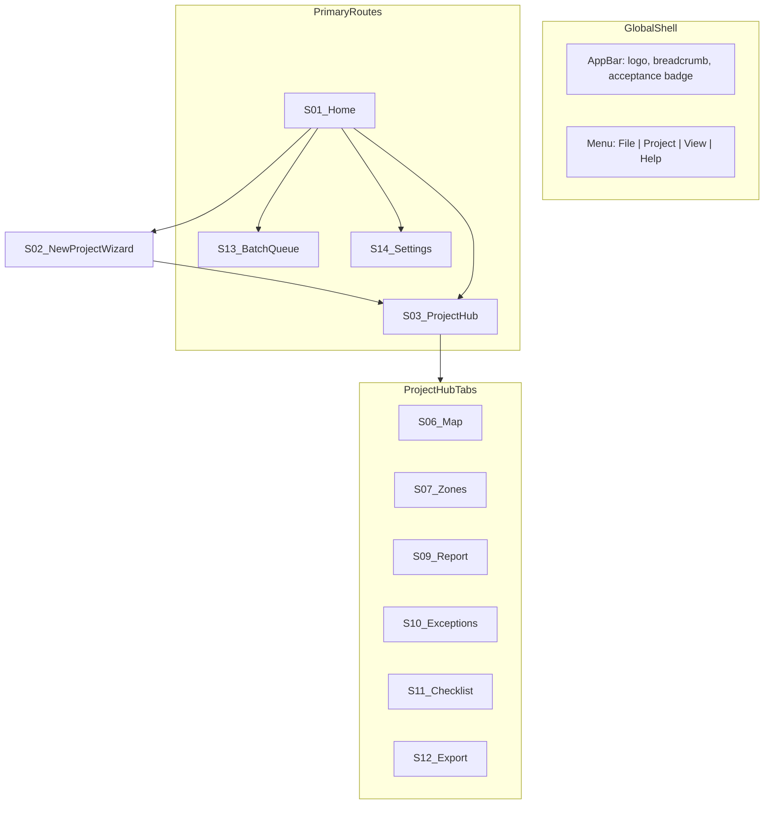
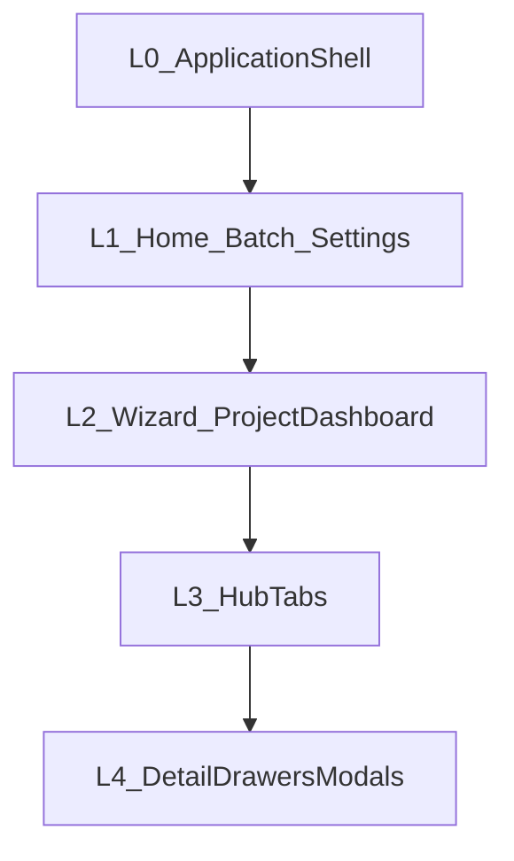
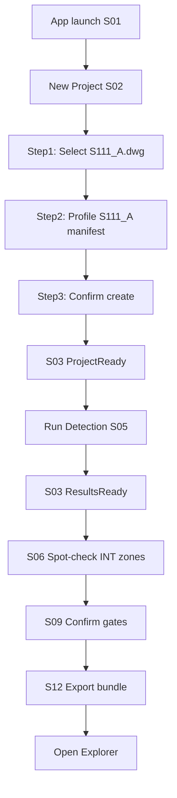
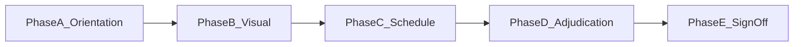
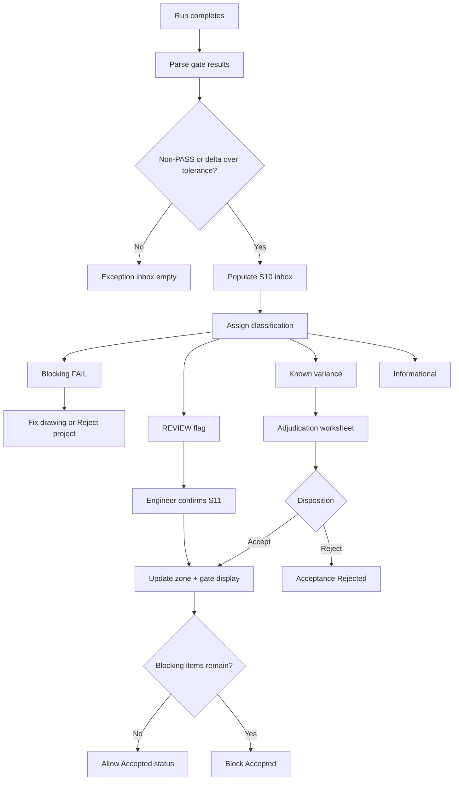
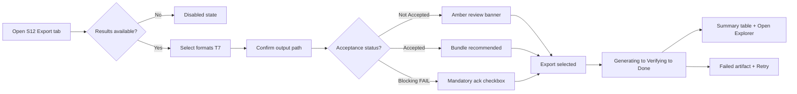

# UI/UX Specification
## INT Zone Studio — Windows Desktop Application

| Field | Value |
| --- | --- |
| **Document title** | INT Zone Studio — Desktop UI/UX Specification |
| **Version** | 1.0 |
| **Status** | Draft |
| **Date** | 6 June 2026 |
| **Classification** | Internal / Confidential |
| **Platform** | Windows 10/11 x64 |
| **Parent document** | [PRD_Desktop_Application.md](PRD_Desktop_Application.md) |
| **Related documents** | [02_UIUX_Brief.md](02_UIUX_Brief.md) (CLI historical), [01_REVIEW_WORKFLOW_GUIDE.md](output/client_delivery/acceptance_review_kit/01_REVIEW_WORKFLOW_GUIDE.md) |

---

## Document purpose

This specification defines the **user interface and experience** for INT Zone Studio — the Windows desktop application for structural engineers who import slab plans, run INT zone detection, review results, validate exceptions, and export delivery packages.

**In scope:** Navigation, screen hierarchy, user flows, wireframe descriptions, component library, table layouts, review workflow, exception workflow, export workflow.

**Out of scope:** Implementation technology, source code, API design, detection algorithms, threshold tuning UI.

**Audience:** UX designers, product owners, QA, and engineers validating acceptance workflows before build.

---

## 0. Design philosophy

INT Zone Studio is a **professional quantity-surveying tool**, not a general-purpose CAD viewer or consumer app. Every screen prioritizes auditability, numeric precision, and CAD-familiar interaction over visual novelty.

### 0.1 Engineer-first principles

| Principle | UX implication |
| --- | --- |
| **Quantity-surveying precision** | Always display units (m², m³). Area columns use 2–4 decimal places. Never round table values for display in a way that hides variance (e.g., INT-8 at 0.207% must remain visible). |
| **CAD-native mental model** | Layer toggles, pan/zoom, fit-to-view, grid bay references. Avoid card-based marketing dashboards or empty-state illustrations. |
| **Audit over aesthetics** | Timestamps, reviewer names, run IDs, and gate statuses visible without drilling into settings. |
| **Fail loudly** | PASS, REVIEW, FAIL, and SKIP badges on gates, zones, and rows. No silent warnings or collapsed-by-default error lists. |
| **Dual-monitor default** | Map canvas uses full primary width; inspector, zone list, and checklist panels dock to the right or secondary monitor. |
| **No algorithm UI** | Frozen detection configuration is read-only. No gap thresholds, tier sliders, or seed expansion controls. |
| **Non-destructive** | Source DWG/DXF never modified. All actions label outputs as new files. |

### 0.2 Visual tone

| Element | Specification |
| --- | --- |
| Chrome | Neutral gray (#F0F0F0 background, #2D2D2D text) — similar to AutoCAD / structural QS tools |
| Data tables | High-contrast rows, sticky headers, alternate row shading on long checklists |
| Status colors | PASS green (#107C10), REVIEW amber (#CA5010), FAIL red (#D13438), SKIP gray (#605E5C) |
| Typography | Segoe UI (Windows native); monospace for INT IDs and file paths |
| Density | Compact table row height (32 px); prioritize data rows over whitespace |

### 0.3 Terminology rules

| Use | Do not use |
| --- | --- |
| INT zone, Pour No., gate, manifest | Room, slab section (unless quoting source drawing) |
| Union (m²), Concrete Area (SQM) | Area (generic, no unit) |
| Run detection | Process, analyze, AI detect |
| Delivery bundle | Output folder (in user-facing export copy) |

---

## 1. Desktop navigation structure

### 1.1 Information architecture



### 1.2 Global shell

The application shell persists across all primary routes except full-screen modals.

| Region | Contents | Behavior |
| --- | --- | --- |
| **Title bar** | Window title: `INT Zone Studio — [Project name]` | Standard Windows chrome |
| **Menu bar** | File, Project, View, Help | See Section 1.4 |
| **App bar** | Breadcrumb, acceptance status badge, primary **Run Detection** button (when in project) | Run button duplicates S03 action when project open |
| **Primary nav** | Home · Batch · Settings (icons + labels) | Project hub accessed via Home recents or post-wizard; no permanent “Project” top-level item |
| **Status bar** | Run ID, last run timestamp, engine freeze date, log link | Click log link opens run log in default editor |

### 1.3 Route definitions

| Route | Screen ID | URL / state key | Description |
| --- | --- | --- | --- |
| Home | S01 | `/home` | Recent projects, new project, batch entry |
| New project | S02 | `/project/new` | 3-step wizard |
| Project hub | S03 + tabs | `/project/{id}` | Dashboard + tab content |
| Batch | S13 | `/batch` | Multi-file queue |
| Settings | S14 | `/settings` | Global preferences |

**Tab routes (within project):** `/project/{id}/map`, `/zones`, `/report`, `/exceptions`, `/checklist`, `/export`

### 1.4 Menu structure

**File**
- New Project → S02
- Open Recent → S01 list
- Batch Import → S13
- Exit

**Project** (enabled when project open)
- Run Detection (F5)
- Re-import Drawing
- Drawing Settings → S04
- Close Project → S01

**View**
- Toggle layer panel (Map tab)
- Fit to view (Map tab)
- Show run history panel

**Help**
- Acceptance workflow guide (opens kit doc)
- Engine freeze notice
- About INT Zone Studio → S14

### 1.5 Modal overlays

| Modal | Screen | Trigger | Blocks background |
| --- | --- | --- | --- |
| Detection progress | S05 | Run Detection | Yes — hub tabs disabled |
| Drawing settings | S04 | Project → Drawing Settings | No — slide-over panel preferred |
| Zone detail | S08 | Zone row click | No — right drawer |
| Blocking error | — | Import/run/export failure | Yes |
| Sign-off form | — | Export tab → Generate sign-off | Yes |

### 1.6 Keyboard shortcuts

| Shortcut | Action | Context |
| --- | --- | --- |
| `Ctrl+N` | New project | Global |
| `Ctrl+O` | Open file in wizard | S02 step 1 |
| `F5` | Run detection | Project hub |
| `Ctrl+E` | Go to Export tab | Project hub |
| `Ctrl+F` | Focus zone search | Map, Zones, Checklist |
| `Ctrl+1`–`Ctrl+6` | Switch hub tabs | Project hub |
| `Esc` | Cancel run / close drawer | S05, S08 |
| `F` | Fit to view | Map tab |
| `+` / `-` | Zoom in / out | Map tab |

### 1.7 Back navigation rules

- **Home** is always reachable via primary nav or breadcrumb root; unsaved adjudication drafts prompt save confirmation.
- **Tab state** (sort column, filter, scroll position) persists when switching tabs within a session.
- **Wizard abandonment** returns to S01 without creating a project.
- **Batch queue** does not replace open project; batch runs create or update linked project records.

---

## 2. Screen hierarchy

### 2.1 Depth levels



| Level | Screens / surfaces |
| --- | --- |
| **L0** | Application shell (menu, app bar, status bar) |
| **L1** | S01 Home, S13 Batch, S14 Settings |
| **L2** | S02 Wizard (3 steps), S03 Project Dashboard header |
| **L3** | S06 Map, S07 Zones, S09 Report, S10 Exceptions, S11 Checklist, S12 Export |
| **L4** | S04 Settings drawer, S05 Progress modal, S08 Zone detail drawer, Gate drill-down, Adjudication worksheet, Sign-off form |

### 2.2 Screen catalog

| ID | Screen | Parent | Children | Entry condition | Primary exit |
| --- | --- | --- | --- | --- | --- |
| S01 | Home | L0 | — | App launch | S02, S03, S13, S14 |
| S02 | New Project Wizard | S01 | Steps 1–3 | New Project | S03 |
| S03 | Project Dashboard | S01, S02 | Tab bar | Project created/opened | S01, tabs |
| S04 | Drawing Settings | S03 | — | Settings gear | S03 |
| S05 | Detection Progress | S03 | — | Run Detection | S03 (on complete/fail) |
| S06 | Map | S03 | S08 drawer | ResultsReady+ | Other tabs |
| S07 | Zones | S03 | S08 drawer | ResultsReady+ | S06 on dbl-click |
| S08 | Zone Detail | S06, S07, S10 | Adjudication inline | Zone selected | Close drawer |
| S09 | Report | S03 | Gate drill-down | ResultsReady+ | S10 on gate click |
| S10 | Exceptions | S03 | Adjudication panel | ResultsReady+ | S11, S12 |
| S11 | Checklist | S03 | — | ResultsReady+ | S06 on row link |
| S12 | Export | S03 | Sign-off modal | ResultsReady+ | Explorer |
| S13 | Batch Queue | S01 | — | Batch Import | S03 per file |
| S14 | Settings & About | S01, S03 | — | Settings nav | Prior screen |

*ResultsReady+* = at least one successful detection run exists.

### 2.3 Role visibility

Which surfaces each persona uses most often (all tabs remain available; defaults differ).

| Screen / tab | Priya (CAD) | Rajesh (Lead) | Alex (QA) | Sam (PM) |
| --- | --- | --- | --- | --- |
| S02 Wizard | Primary | Occasional | — | — |
| S05 Progress | Primary | — | — | — |
| S06 Map | Secondary | **Primary** | Secondary | — |
| S07 Zones | Secondary | Secondary | **Primary** | Summary only |
| S09 Report | — | Secondary | **Primary** | Summary only |
| S10 Exceptions | — | **Primary** | Secondary | — |
| S11 Checklist | — | **Primary** | **Primary** | Progress view |
| S12 Export | Primary | Secondary | Secondary | **Primary** |
| S13 Batch | **Primary** | — | — | — |
| Acceptance status | — | Sets | Validates | **Primary** |

**Default tab on open (by role preference in settings):** Priya → Zones; Rajesh → Map; Alex → Report; Sam → Export.

---

## 3. User flows

### 3.1 First launch to first export (J1)



| Step | Action | Screen | System feedback |
| ---: | --- | --- | --- |
| 1 | Launch app | S01 | Empty recents or sample link |
| 2 | New Project | S02 | Wizard step 1 |
| 3 | Select DWG | S02 | Layers, entity count, mm units |
| 4 | Select S111_A profile | S02 | 24 zones expected |
| 5 | Create Project | S03 | Badge: Ready to run |
| 6 | Run Detection | S05 | 4 progress stages |
| 7 | Review gates | S03 | Gate cards PASS/REVIEW |
| 8 | Map tab | S06 | INT boundaries visible |
| 9 | Report tab | S09 | Manifest reconciliation |
| 10 | Export tab | S12 | Bundle → Explorer |

**Success:** Engineer elapsed time < 15 minutes (excluding engine runtime).

### 3.2 Batch folder flow (J4)

| Step | Action | Screen |
| ---: | --- | --- |
| 1 | Batch Import from S01 | S13 |
| 2 | Select folder with 3 DWGs | S13 queue populated |
| 3 | Assign profile per row (or bulk) | S13 |
| 4 | Run All | S13 per-file progress |
| 5 | Click completed row | S03 for that drawing |
| 6 | Portfolio summary (if linked) | S03 header: 65/65 aggregate |

### 3.3 Re-run after AutoCAD fix (J5)

| Step | Action | Screen |
| ---: | --- | --- |
| 1 | Re-import Drawing | S03 dialog: replace input |
| 2 | Run Detection | S05 new run ID |
| 3 | Report → Compare runs | S09 run selector dropdown |
| 4 | Review diff highlights | S09 delta column |
| 5 | Export if acceptable | S12 |

### 3.4 Application state ↔ UI mapping

| State | Dashboard badge | Gate cards | Tabs | Run button | Export |
| --- | --- | --- | --- | --- | --- |
| **Empty** | — | — | — | — | — |
| **ProjectReady** | Ready to run (blue) | Grayed “Run to populate” | Disabled except Settings | Enabled | Disabled |
| **Running** | Running… (S05 modal) | — | Disabled | Cancel | Disabled |
| **ResultsReady** | Results ready (blue) | Populated PASS/REVIEW/FAIL | Enabled | Enabled (re-run) | Enabled |
| **InReview** | In review (amber) | Unchanged | Enabled; Checklist banner | Enabled | Enabled + amber banner |
| **Accepted** | Accepted (green) | Unchanged | Enabled | Enabled | Enabled; bundle recommended |
| **Rejected** | Rejected (red) | Unchanged | Enabled | Enabled | Export only; sign-off blocked |
| **Exported** | Exported (green) | Unchanged | Enabled | Enabled | Enabled |

### 3.5 Client acceptance flow (J2) — summary

Rajesh + Alex + Sam: Open portfolio → S11 checklist (65 zones) → S09 manifest → S10 exceptions → S12 sign-off PDF. Detailed in Section 7.

---

## 4. Wireframe descriptions

Each wireframe lists layout regions, primary controls, default focus, and key states. Sample data uses production project terms.

### S01 — Home / Recent Projects

```
┌──────────────────────────────────────────────────────────────────────────┐
│  INT Zone Studio                              [Batch] [Settings] [—][□][✕]│
├──────────────────────────────────────────────────────────────────────────┤
│                                                                          │
│   [ + New Project ]     [ Batch Import Folder ]                          │
│                                                                          │
│   Recent Projects                                                        │
│   ┌────────────────────────────────────────────────────────────────────┐ │
│   │ Name          │ Drawing        │ Zones │ Acceptance    │ Modified  │ │
│   │ S111_A        │ S111_A.dwg     │ 24/24 │ Not Started   │ Today     │ │
│   │ Client Port.  │ 3 drawings     │ 65/65 │ In Review     │ Yesterday │ │
│   └────────────────────────────────────────────────────────────────────┘ │
│                                                                          │
│   Engine: v2026.06.06 (frozen)                    [View freeze notice] │
└──────────────────────────────────────────────────────────────────────────┘
```

| Region | Content |
| --- | --- |
| Header | App title, Batch and Settings shortcuts |
| Actions | New Project (primary), Batch Import (secondary) |
| Main | Recent projects table: name, drawing, zone ratio, acceptance status, modified date |
| Footer | Engine version + freeze notice link |

**States:** Empty recents → centered message “No projects yet. Create one from a DWG or DXF slab plan.” **Focus:** New Project button.

---

### S02 — New Project Wizard

**Step 1 — File**

```
┌──────────────────────────────────────────────────────────────────────────┐
│  New Project                                    Step 1 of 3: Drawing     │
│  ●──────────○──────────○                                                 │
├──────────────────────────────────────────────────────────────────────────┤
│  Drawing file                                                            │
│  [  C:\Projects\S111_A.dwg                                    ] [Browse] │
│                                                                          │
│  Drawing metadata (read-only)                                            │
│  Layers: 14    Entities: 2,847    Units: mm    Format: DWG → DXF OK     │
│                                                                          │
│                                        [ Cancel ]  [ Next → ]            │
└──────────────────────────────────────────────────────────────────────────┘
```

**Step 2 — Profile / manifest**

```
│  Project profile                                                         │
│  ( ) J33A — Warehouse (24 zones)                                         │
│  ( ) J33B — S111_J (17 zones)                                            │
│  (•) S111_A (24 zones)                                                   │
│  ( ) Custom — browse manifest YAML [........................] [Browse]   │
```

**Step 3 — Confirm**

```
│  Project name: [ S111_A                                    ]             │
│  Output folder: [ C:\Projects\S111_A\output               ] [Browse]     │
│  Slab thickness: [ 0.15 ] m                                              │
│                                                                          │
│  Summary: S111_A.dwg · 24 INT zones · manifest S111_A                    │
│                                        [ ← Back ]  [ Create Project ]    │
```

**States:** Invalid file → blocking inline error on step 1. ODA missing for DWG → warning banner with link to Settings. **Focus:** Browse on step 1; Create Project on step 3.

---

### S03 — Project Dashboard

```
┌──────────────────────────────────────────────────────────────────────────┐
│  ← Home   S111_A / S111_A.dwg          Acceptance: Not Started    [⚙]   │
├──────────────────────────────────────────────────────────────────────────┤
│  ┌─────────────┐ ┌─────────────┐ ┌─────────────┐ ┌─────────────┐        │
│  │ zone_count  │ │orphan_faces │ │manifest_area│ │ Exceptions  │        │
│  │   PASS      │ │   PASS      │ │   PASS      │ │  3 REVIEW   │        │
│  └─────────────┘ └─────────────┘ └─────────────┘ └─────────────┘        │
│  [ Run Detection ]  [ Re-import Drawing ]              Run: 2026-06-06   │
├──────────────────────────────────────────────────────────────────────────┤
│  Map | Zones | Report | Exceptions | Checklist | Export                │
├──────────────────────────────────────────────────────────────────────────┤
│  Quick stats: INT 24/24 · Total union 655.24 m² · Orphans 0              │
│  (default tab content or last active tab)                                │
└──────────────────────────────────────────────────────────────────────────┘
```

**Gate cards:** Click navigates to S10 filtered by gate, or S09 gate section. **Portfolio mode:** Drawing selector dropdown above gate cards (J33A | J33B | S111_A | All).

**States:** ProjectReady → gate cards show “—”; Run Detection emphasized. **Focus:** Run Detection when ProjectReady; active tab when ResultsReady.

---

### S04 — Drawing Settings (slide-over)

| Field | Editable | Notes |
| --- | --- | --- |
| Slab thickness (m) | Yes | Default 0.15 |
| Output directory | Yes | Per project |
| ODA converter path | Yes | Link to global default |
| Frozen detection config | **Read-only** | gap 500 mm, snap 1 mm, etc. |
| Label prefix / layers | Read-only in v1 | Display only |

**Footer:** Save, Cancel. Changes apply to next run only.

---

### S05 — Detection Progress (modal)

```
┌──────────────────────────────────────────────────────────────────────────┐
│  Running detection — S111_A.dwg                                    [✕]   │
├──────────────────────────────────────────────────────────────────────────┤
│  ✓ Loading drawing                                                       │
│  ● Detecting zones                                                       │
│  ○ Building schedule                                                     │
│  ○ Validating                                                            │
│  ████████████░░░░░░░░░░  58%                                             │
├──────────────────────────────────────────────────────────────────────────┤
│  Log tail:                                                               │
│  │ Processing entities...                                               │
│  │ INT zones assigned: 24                                               │
│  [ View full log ]                              [ Cancel ]               │
└──────────────────────────────────────────────────────────────────────────┘
```

**States:** Complete → auto-close 1 s or “View results”. Failed → stays open with error summary + Retry. **Focus:** Cancel during run.

---

### S06 — Zone Map Viewer

```
┌──────────────────────────────────────────────────────────────────────────┐
│  Layers: [☑ Walls] [☑ INT boundaries] [☑ Labels]   [Fit] [+] [−] [1:1] │
├────────────────────────────────────────────┬─────────────────────────────┤
│                                            │  INT-15                     │
│      ┌─────────┐  ┌───────────────┐        │  Union: 499.91 m²           │
│      │ INT-14  │  │ INT-15        │        │  Faces: 36                  │
│      └─────────┘  └───────────────┘        │  Status: PASS               │
│                                            │  [ Zone detail ]            │
│         (DrawingCanvas)                    │  [ Jump to checklist ]      │
│                                            │  ─────────────────────────  │
│  [MiniMap]                                 │  Zone list (compact T1)     │
│                                            │  Filter [All ▼] [Search…]   │
└────────────────────────────────────────────┴─────────────────────────────┘
```

**CAD viewer specs:**

| Element | Spec |
| --- | --- |
| INT boundary stroke | 0.35 mm equivalent, color #D13438 (red family), distinct from source walls (#605E5C) |
| Selection highlight | 2 px outline + 15% fill opacity #0078D4 |
| Labels | Line 1: INT ID (bold); Line 2: union m² (regular) |
| Source walls | Thin gray; toggle off for clarity |
| Mini-map | Bottom-left 120×90 px; viewport rectangle draggable |
| Pan | Middle-mouse drag or Space+drag |
| Zoom | Wheel, +/- toolbar, Fit centers all INT zones |

**Empty state:** “Run detection to view INT zones on drawing.”

---

### S07 — Zone List

Full-width DataGrid (T1). Toolbar: search, status filter, export visible rows to CSV (review only). Totals row pinned bottom: sum union m², zone count.

**Interactions:** Single click → select + highlight on Map if tab switched. Double-click → switch to Map and zoom to zone. Right-click → Jump to checklist row, Open adjudication.

---

### S08 — Zone Detail (right drawer, 400 px)

| Section | Fields |
| --- | --- |
| Header | INT-15 · PASS |
| Metrics | Union m², Face sum m², Clipped bay m², Union/bay %, Faces, Grid ref, CUM |
| Manifest | Computed vs manifest Δ% (if applicable) |
| Notes | Free text (saved to project) |
| Actions | Adjudicate (if exception), Mark checklist Present, Zoom on map |

**Focus:** First metric row; drawer closes on Esc.

---

### S09 — Validation Report

Tabbed viewer mirroring `*_int_zone_report.md`:

| Tab | Content |
| --- | --- |
| Summary | Grid bays, micro-faces, orphans, assignment method |
| Gates | Production readiness table (T2 gates list) |
| INT zones | Full T2 table |
| Manifest | T3 reconciliation |
| Warnings | Bullet list |
| Compare runs | J5 — run dropdown, delta highlights (Should) |

Gate row click → S10 filtered. Manifest row with Δ% > 0.05% → highlighted amber/red.

---

### S10 — Exception Inbox

Split pane: left 40% T4 list, right 60% detail + adjudication.

```
┌─────────────────────────────┬────────────────────────────────────────────┐
│ Filter: [All][Blocking][REVIEW]│  INT-8 · Known variance                 │
│ ┌─────────────────────────┐ │  Computed: 87.27 m²  Manifest: 87.45 m²   │
│ │ FAIL manifest_area INT-8│ │  Δ: 0.207%                              │
│ │ REVIEW zone_face INT-18 │ │  ───────────────────────────────────────  │
│ │ REVIEW union/bay INT-12 │ │  Disposition:                             │
│ └─────────────────────────┘ │  ( ) Accept computed  ( ) Accept manifest   │
│ [ Collapse decision matrix ]│  ( ) Reject                               │
│                             │  Measured (optional): [________] m²         │
│                             │  Notes: [________________________________] │
│                             │  [ Save disposition ]                     │
└─────────────────────────────┴────────────────────────────────────────────┘
```

**Empty state:** “No exceptions — all gates PASS or REVIEW acknowledged in checklist.”

---

### S11 — Zone Inventory Checklist

Portfolio: drawing tabs **J33A | J33B | S111_A**. Summary tracker row at top (T5). Columns per kit doc. Status dropdown per row: OK · EMPTY-OK · REVIEW · FAIL.

**Progress banner (sticky):** `Verified OK: 42/65 · Empty (expected): 5 · Issues: 2 · Reviewer: [Rajesh____]`

Row link **Show on map** → S06 zoom. Import checklist template from kit optional (read-only reference panel).

---

### S12 — Export Center

See Section 9 for full layout. Preview tree of delivery bundle (T7). Primary action: **Export selected** ; secondary: **Export full delivery bundle**.

---

### S13 — Batch Queue

```
┌──────────────────────────────────────────────────────────────────────────┐
│  Batch Queue                                    [ Add files ] [ Run All ] │
├──────────────────────────────────────────────────────────────────────────┤
│  File              │ Profile │ Status    │ Zones │ Gates      │ Duration │
│  S111_A.dwg        │ S111_A  │ Complete  │ 24/24 │ 3 REVIEW   │ 1m 12s   │
│  S111_J.dwg        │ J33B    │ Running   │ —     │ —          │ —        │
│  Warehouse.dwg     │ J33A    │ Queued    │ —     │ —          │ —        │
└──────────────────────────────────────────────────────────────────────────┘
```

Row click **Open project** → S03. Failed rows show error tooltip + View log.

---

### S14 — Settings & About

| Section | Fields |
| --- | --- |
| Paths | Default output dir, ODA converter path |
| Defaults | Slab thickness, default tab on project open |
| Engine | Version, freeze date 2026-06-06, read-only config summary |
| Help | Links to acceptance kit, PRD, UX spec |
| About | Version, copyright |

---

## 5. Component library

Naming convention: `PascalCase` for specification IDs. No implementation binding.

### 5.1 Shell components

#### AppBar
- **Purpose:** Persistent context and primary run action.
- **Anatomy:** Breadcrumb | project name | acceptance StatusBadge | Run Detection PrimaryButton | settings icon.
- **States:** Run enabled (ProjectReady, ResultsReady); disabled (Running, no project).
- **Do:** Keep acceptance badge visible on project routes. **Don't:** Hide FAIL count behind icon-only badge.

#### Breadcrumb
- **Anatomy:** Home > [Project name] > [Tab name optional].
- **Do:** Home always clickable. **Don't:** Deep paths beyond tab level.

#### StatusBadge (acceptance)
- **States:** Not Started (gray), In Review (amber), Accepted (green), Accepted with Conditions (green + asterisk), Rejected (red).

#### ProjectHeader
- **Anatomy:** Drawing filename, manifest profile, expected zone count, last run timestamp.

---

### 5.2 Navigation components

#### PrimaryNav
- **Items:** Home, Batch, Settings with icons.
- **States:** Active route underline.

#### TabBar (hub)
- **Tabs:** Map, Zones, Report, Exceptions, Checklist, Export.
- **Badge:** Exceptions tab shows count of open items; Checklist shows incomplete fraction.

#### DrawingSelector
- **Purpose:** Portfolio project drawing switcher.
- **Anatomy:** Dropdown with drawing name + zone count sublabel.

#### StepIndicator (wizard)
- **Steps:** Drawing · Profile · Confirm.
- **States:** Complete (check), active (filled), upcoming (empty).

---

### 5.3 Action components

#### PrimaryButton — Run Detection
- **Label:** Run Detection (not “Start” or “Analyze”).
- **States:** Loading spinner when S05 open.

#### DestructiveButton — Cancel run
- **Confirmation:** “Cancel detection? Current run will be discarded; previous results kept.”

#### LinkButton — View log
- **Opens:** Run log file in default editor.

---

### 5.4 Data display components

#### GateCard
- **Anatomy:** Gate name (monospace) | StatusChip | detail line (truncated) | chevron.
- **Gates:** zone_count, orphan_faces, zone_face_coverage, union_vs_clipped_bay, face_sum_vs_union, manifest_area.
- **Interaction:** Click → S10 or S09.

#### MetricTile
- **Anatomy:** Label | value + unit | optional sublabel.
- **Example:** Total union · 655.24 m² · 24 zones.

#### RunHistoryTimeline
- **Anatomy:** Vertical list of runs: run ID, timestamp, gate summary, link to compare.

---

### 5.5 Table components

#### DataGrid
- Sortable columns, sticky header, row selection, keyboard arrow navigation.
- **States:** Loading skeleton, empty (“No zones — run detection first”).

#### TotalsRow
- Bold labels; numeric sums for area columns.

#### StatusChip
| Status | Color | Icon | Label text |
| --- | --- | --- | --- |
| PASS | Green | Checkmark | PASS |
| REVIEW | Amber | Warning | REVIEW |
| FAIL | Red | X | FAIL |
| SKIP | Gray | Dash | SKIP |

**Accessibility:** Never rely on color alone; always show text label.

---

### 5.6 CAD components

#### DrawingCanvas
- **Purpose:** Render source geometry and INT overlays.
- **States:** Loading, ready, no data.

#### LayerToggleGroup
- **Pattern:** AutoCAD-style checklist list with layer color swatch.
- **Layers:** Source walls, INT boundaries, INT labels, optional grid lines.

#### ZoomToolbar
- **Buttons:** Fit, Zoom in, Zoom out, 1:1.

#### MiniMap
- **Purpose:** Spatial orientation on large warehouse plans.

#### ZoneHighlight
- **States:** Default, selected, REVIEW (amber outline), FAIL (red outline), checklist-verified (green tick overlay optional).

---

### 5.7 Form components

#### ManifestPicker
- Radio list of presets + custom YAML path.

#### PathPicker
- Text field + Browse; validates write access on export paths.

#### DispositionRadioGroup
- Options: Accept computed | Accept manifest | Reject.
- **Validation:** Notes required when Reject selected.

#### ReviewerNameField
- Text; defaults to Windows display name; editable.

---

### 5.8 Feedback components

#### Toast
- **Variants:** Info (blue), Warning (amber), Error (red).
- **Duration:** 5 s unless pinned; post-run “3 items need review” links to S10.

#### BlockingModal
- **Anatomy:** Icon | title | cause | recommended action | primary + secondary buttons.

#### InlineBanner
- **Placement:** Top of S12 Export; S03 when InReview or blocking FAIL.

#### ProgressStageList
- **Stages:** Loading drawing → Detecting zones → Building schedule → Validating.
- **Anatomy:** Step label | check/spinner/pending icon.

---

### 5.9 Validation components

#### ChecklistRow
- **Anatomy:** INT ID | data columns | Present checkbox | Area OK checkbox | Status dropdown | Notes field.

#### AdjudicationWorksheet
- **Fields:** Zone, computed, manifest, Δ%, optional measured, disposition, notes, reviewer, timestamp.

#### SignOffDispositionSelector
- **Options:** Accepted | Accepted with Conditions | Rejected — mirrors kit form 08.

---

## 6. Table layouts

### 6.1 Global formatting rules

| Rule | Specification |
| --- | --- |
| Alignment | Numeric columns right-aligned; INT IDs left-aligned monospace |
| Units | Header includes unit: `Union (m²)`, `Concrete Volume (CUM)` |
| Decimals | Areas 2–4 dp per source data; percentages 1–3 dp |
| Header | Sticky on vertical scroll; bold 11 pt |
| Rows | 32 px height; alternate #FAFAFA / #FFFFFF on checklists > 20 rows |
| Selection | Single row default; Ctrl+click multi-select disabled in v1 |
| Sort | Click header toggles asc/desc; arrow indicator |

---

### T1 — Zone List (S07)

| Column | Width priority | Sort | Notes |
| --- | --- | --- | --- |
| Pour No. | Fixed 80 px | Default asc | INT-1 … INT-N |
| Union (m²) | Medium | Yes | Primary QS metric |
| Concrete Volume (CUM) | Medium | Yes | |
| Face Count | Narrow | Yes | Integer |
| Grid Ref | Medium | Yes | e.g. 0:8 |
| Union/Bay Coverage % | Medium | Yes | Highlight < 10% amber |
| Status | Fixed 90 px | Yes | StatusChip |

**Row interaction:** Click → S08 drawer. Double-click → S06 zoom. Enter key → open drawer.

---

### T2 — INT Zone Report table (S09)

| Column | Notes |
| --- | --- |
| INT | Pour No. |
| Faces | Count |
| Union (m²) | |
| Face sum (m²) | |
| Clipped bay (m²) | |
| Union/bay % | |

**Highlight:** Rows where face sum vs union diverges > 2% → REVIEW row background.

---

### T3 — Manifest reconciliation (S09)

| Column | Notes |
| --- | --- |
| INT | |
| Computed (m²) | |
| Manifest (m²) | |
| Δ % | Red if > 0.05%; bold for known INT-8 |
| Status | PASS / FAIL / SKIP |
| Faces | |

---

### T4 — Exception Inbox (S10)

| Column | Notes |
| --- | --- |
| Severity | Icon: Error / Warning / Info |
| Gate / Zone | e.g. manifest_area · INT-8 |
| Summary | One line human text |
| Classification | Blocking / REVIEW / Known variance / Informational |
| Action | View → selects detail panel |

**Filter chips:** All | Blocking | REVIEW | Known variance

**Sort default:** Blocking first, then severity, then zone ID.

---

### T5 — Zone Inventory Checklist (S11)

| Column | Notes |
| --- | --- |
| INT | Link to map |
| Computed (m²) | |
| Faces | |
| Expected | Populated / Empty |
| Present | Checkbox — engineer verification |
| Area OK | Checkbox |
| Status | OK / EMPTY-OK / REVIEW / FAIL dropdown |
| Notes | Free text |

**Summary tracker (above table):**

| Drawing | Zones | Verified OK | Empty expected | Issues |
| --- | ---: | ---: | ---: | ---: |
| J33A | 24 | ___ / 24 | 3 | ___ |
| J33B | 17 | ___ / 17 | 1 | ___ |
| S111_A | 24 | ___ / 24 | 1 | ___ |
| **Total** | **65** | ___ / 65 | **5** | ___ |

---

### T6 — Batch Queue (S13)

| Column | Notes |
| --- | --- |
| File | Name + path tooltip |
| Profile | Manifest preset |
| Status | Queued / Running / Complete / Failed |
| Zones | e.g. 24/24 |
| Gates | e.g. 3 REVIEW |
| Duration | mm:ss |
| Actions | Open project, View log, Remove |

---

### T7 — Export manifest preview (S12)

| Column | Notes |
| --- | --- |
| Include | Checkbox |
| Artifact | e.g. `{name}_int_schedule.xlsx` |
| Size est. | From last export or — |
| Last exported | Timestamp |

**Default bundle checkboxes (all on for full bundle):**

- `{name}_int_zones.dxf`
- `{name}_annotated.dxf`
- `{name}_int_schedule.xlsx`
- `{name}_results.xlsx`
- `{name}_int_schedule.pdf`
- `{name}_int_zone_report.md`

---

## 7. Review workflow

In-app implementation of [01_REVIEW_WORKFLOW_GUIDE.md](output/client_delivery/acceptance_review_kit/01_REVIEW_WORKFLOW_GUIDE.md) Phases A–E.

### 7.1 Phase diagram



### 7.2 Phase specifications

| Phase | Goal | UI surfaces | Engineer actions | Exit criteria (UI) |
| --- | --- | --- | --- | --- |
| **A — Orientation** | Align on freeze scope | S03 dashboard; Help → freeze notice; optional orientation panel | Read 65/65 summary; check “Orientation complete” | Checkbox enabled on dashboard |
| **B — Visual verification** | Confirm INT labels at grid bays | S06 Map + S11 Checklist | For each INT: verify on map; tick Present; set EMPTY-OK for expected empty (5 total) | Progress 65/65 Present |
| **C — Schedule reconciliation** | SQM/CUM vs structural schedule | S07 Zones + S09 Manifest + external PDF | Tick Area OK or note variance; compare Pour No. order | All Area OK or linked to S10 |
| **D — Area adjudication** | Disposition known variances | S10 Exceptions; INT-8 worksheet | Record Accept computed / manifest / Reject | No open FAIL; INT-8 disposition saved |
| **E — Decision and sign-off** | Formal acceptance | S12 Export; sign-off modal; questionnaire | Complete 9 questionnaire items; select Accepted / Conditions / Rejected; export sign-off PDF | Acceptance status set; PDF archived |

### 7.3 Role responsibilities in UI

| Role | Primary UI tasks |
| --- | --- |
| **Rajesh (Lead)** | Phase B map verification; Phase D adjudication; checklist sign-off |
| **Alex (QA)** | Phase C manifest vs schedule; checklist Area OK column |
| **Sam (PM)** | Phase A orientation; Phase E disposition + bundle export |
| **Priya (CAD)** | Pre-review run + export draft bundle (amber banner — not signed off) |

**Reviewer picker (S11 footer):** Separate fields for Lead engineer, QA checker, PM — optional but recommended for audit.

### 7.4 Progress tracker (persistent banner)

Displayed on S03 and S11 when acceptance ≠ Not Started:

```
Review progress: Verified OK 42/65 · Empty (expected) 5/5 · Issues 2 · Phase: Visual (B)
Acceptance: In Review                                    [ Open checklist ]
```

Phase indicator advances automatically when exit criteria met; engineer can override phase manually in settings for recovery.

### 7.5 Decision matrix (read-only reference in S10)

| Finding | Classification | UI action |
| --- | --- | --- |
| INT zone missing from overlay | **Blocking** | FAIL checklist row; blocks Accepted |
| INT label wrong bay | **Blocking** | CONDITION or Rejected path |
| Unexpected empty zone | **Blocking** until confirmed | Engineer sets EMPTY-OK or FAIL |
| INT-8 area 0.207% variance | **Non-blocking (known)** | Phase D worksheet |
| REVIEW face_sum vs union | **Informational** | Confirm in checklist; no adjudication form |
| Gap diagnostics in log | **Out of scope** | Info toast with link to validation package |

---

## 8. Exception workflow

### 8.1 Exception lifecycle



### 8.2 Entry points

| Source | Action | Destination |
| --- | --- | --- |
| S03 gate card (REVIEW/FAIL) | Click | S10 filtered to gate |
| S03 Exceptions card “3 REVIEW” | Click | S10 All |
| Post-run toast | “3 items need review” | S10 |
| S07 row StatusChip REVIEW | Click | S08 → Adjudicate or checklist link |
| S09 manifest row FAIL | Click | S10 pre-filled worksheet |
| S11 row Status FAIL | Click | S10 |

### 8.3 Exception Inbox layout

| Pane | Width | Content |
| --- | --- | --- |
| Left list | 40% | T4 with filter chips |
| Right detail | 60% | Classification badge, metrics, evidence links, adjudication form |
| Collapsible footer | Full width | Decision matrix (Section 7.5) — reference only |

**List item format:** `[FAIL] manifest_area · INT-8 — Δ 0.207% exceeds 0.05% tolerance`

### 8.4 Adjudication worksheet fields

Mirrors [07_INT8_ADJUDICATION_WORKSHEET.md](output/client_delivery/acceptance_review_kit/07_INT8_ADJUDICATION_WORKSHEET.md):

| Field | Type | Required |
| --- | --- | --- |
| Drawing | Read-only | — |
| Zone ID | Read-only | — |
| Grid reference | Read-only | — |
| Computed union (m²) | Read-only | — |
| Manifest (m²) | Read-only | — |
| Δ % | Read-only | — |
| AutoCAD measured (m²) | Number input | Optional |
| Disposition | Radio | Yes |
| Notes | Multiline | Required if Reject |
| Reviewer | Text | Auto-filled |
| Timestamp | Read-only | Auto on save |

**Evidence links (read-only):** Open zone on map · Open manifest row · Open exported schedule PDF path

### 8.5 Outcomes by disposition

| Disposition | Zone status | Acceptance impact | Export impact |
| --- | --- | --- | --- |
| Accept computed | PASS with annotation | Unblocks if no other FAIL | Appendix notes computed value authoritative |
| Accept manifest | PASS with annotation | Unblocks if no other FAIL | Appendix notes manifest value authoritative |
| Reject | FAIL | Forces Rejected | Sign-off disabled |
| REVIEW only (no worksheet) | REVIEW until checklist tick | Does not block if confirmed EMPTY-OK | Standard export |

### 8.6 REVIEW vs FAIL engineer guidance

| Type | Engineer action | Blocks Accepted? |
| --- | --- | --- |
| **FAIL** (zone_count, orphan_faces, manifest_area) | Fix drawing re-run OR adjudicate OR reject | Yes until resolved |
| **REVIEW** (empty zone, union/bay, face_sum) | Confirm on checklist with EMPTY-OK or OK | No if documented |
| **Informational** | Read report note | No |

---

## 9. Export workflow

### 9.1 Export flow diagram



### 9.2 Export Center layout (S12)

```
┌──────────────────────────────────────────────────────────────────────────┐
│  Export                                                                  │
├──────────────────────────────────────────────────────────────────────────┤
│  ⚠ Export for review — project not yet Accepted. Sign-off recommended.   │
├──────────────────────────────────────────────────────────────────────────┤
│  Formats                                          [ Select all ]         │
│  ☑ INT zones DXF      ☑ Annotated DXF      ☑ INT schedule Excel         │
│  ☑ Results Excel      ☑ INT schedule PDF     ☑ Zone report Markdown      │
│  ☑ Full delivery bundle (all above + folder structure)                   │
├──────────────────────────────────────────────────────────────────────────┤
│  Output: [ C:\Projects\S111_A\output\2026-06-06_export    ] [Browse]    │
│  ☑ Open folder when complete    ☐ Write DELIVERY_MANIFEST checksums      │
├──────────────────────────────────────────────────────────────────────────┤
│  Pre-flight                                                              │
│  ✓ Results from run 2026-06-06 00:44                                     │
│  ✓ 24 INT zones                                                          │
│  ⚠ 3 REVIEW gates — export allowed                                       │
│  ☐ I acknowledge blocking issues (required if FAIL present)              │
├──────────────────────────────────────────────────────────────────────────┤
│  Bundle preview (tree)                                                   │
│  ▼ S111_A/                                                               │
│      S111_A_int_zones.dxf                                                │
│      S111_A_int_schedule.xlsx                                            │
│      ...                                                                 │
├──────────────────────────────────────────────────────────────────────────┤
│  [ Export selected ]  [ Generate sign-off PDF ]   Export history ▼      │
└──────────────────────────────────────────────────────────────────────────┘
```

### 9.3 Pre-flight states

| Condition | Export button | Banner | Extra requirement |
| --- | --- | --- | --- |
| No run | Disabled | “Run detection first” | — |
| ResultsReady, not Accepted | Enabled | Amber: review export | — |
| Accepted | Enabled | Green: ready for client | Bundle checkbox default on |
| Blocking FAIL present | Enabled | Red: blocking issues | Acknowledgment checkbox required |
| Rejected | Enabled | Red: project rejected | Sign-off PDF disabled |

### 9.4 Export progress UX

| Stage | Progress label |
| --- | --- |
| 1 | Generating files… |
| 2 | Verifying headers and row counts… |
| 3 | Writing delivery bundle… |
| 4 | Done |

**Success panel:** Table of written files with path, size, timestamp. Primary: **Open in Explorer**. Secondary: Copy paths.

**Failure panel:** Name failed artifact; show last log lines; **Retry** (single format) or **Change output path**.

### 9.5 Delivery bundle structure (preview tree)

Matches [DELIVERY_MANIFEST.md](output/client_delivery/DELIVERY_MANIFEST.md):

```
client_delivery/
├── J33A/
│   ├── {name}_int_zones.dxf
│   ├── {name}_int_schedule.xlsx
│   ├── {name}_int_schedule.pdf
│   ├── {name}_int_zone_report.md
│   ├── {name}_annotated.dxf
│   └── {name}_results.xlsx
├── J33B/
│   └── (same pattern)
├── S111_A/
│   └── (same pattern)
└── QA_evidence/          (optional checkbox)
```

Portfolio export creates multi-folder bundle; single-drawing export flattens to one project folder.

### 9.6 Sign-off PDF workflow (Phase E)

Triggered from S12 **Generate sign-off PDF** (enabled when checklist complete and disposition selected):

1. Modal: SignOffDispositionSelector + questionnaire fields (9 items from kit 06)
2. Signature blocks: Client lead, QA, PM, vendor counter-signature
3. Generate → save alongside export folder
4. Update acceptance status on project

### 9.7 Engineer pre-send checklist (in-app copy)

Before marking Accepted and sending bundle to client:

- [ ] All INT zones ticked Present (or EMPTY-OK documented)
- [ ] Manifest reconciliation reviewed; variances adjudicated
- [ ] Schedule PDF visually scanned
- [ ] Export bundle matches DELIVERY_MANIFEST layout
- [ ] Sign-off PDF generated and archived

---

## 10. Layout and responsive behavior

| Constraint | Specification |
| --- | --- |
| Minimum window | 1280 × 720 px |
| Recommended | 1920 × 1080 primary + 1920 × 1080 secondary |
| Map + inspector split | Default 65% / 35%; draggable divider; min inspector 320 px |
| Hub tab content | Fills remaining height below gate cards; tables scroll internally |
| Wizard | Max width 720 px centered on Home background |
| Modals | S05 width 560 px; blocking errors 480 px |

**Dual monitor:** Detach Map tab to secondary window (Could, v1.1) — document as future; v1 supports wide single window only.

---

## 11. Accessibility

| Requirement | Implementation |
| --- | --- |
| Keyboard | Full tab order; DataGrid arrow keys; Esc closes drawers |
| Focus visible | 2 px focus ring on all interactive elements |
| Status | StatusChip always includes text, not color alone |
| Contrast | WCAG 2.1 AA for text and status colors on gray chrome |
| Screen reader | Gate cards announce “zone_count, PASS, 24 zones vs expected 24” |
| Motion | Progress animation optional; respect Windows reduce motion |

---

## 12. Empty states

| Screen | Message | Primary action |
| --- | --- | --- |
| S01 no recents | No projects yet. | New Project |
| S06 no run | Run detection to view INT zones. | Run Detection |
| S10 no exceptions | All gates PASS or REVIEW acknowledged. | Open checklist |
| S11 not started | Start visual verification on the Map tab. | Go to Map |
| S13 empty queue | Add DWG or DXF files to process. | Add files |
| S12 no run | Run detection before exporting. | Run Detection |

---

## 13. Traceability matrix

| UX section | PRD FR IDs | Screens | Journeys |
| --- | --- | --- | --- |
| Navigation §1 | FR-05, FR-45–FR-48 | S01–S14 | All |
| Wizard §4 S02 | FR-01–FR-06 | S02 | J1, J4 |
| Run §4 S05 | FR-08–FR-13 | S05 | J1, J4, J5 |
| Map §4 S06 | FR-14–FR-20 | S06, S08 | J1, J2 |
| Report §4 S09 | FR-21–FR-25 | S09 | J1, J2 |
| Exceptions §8 | FR-26–FR-32 | S10, S08 | J2, J3 |
| Checklist §7 | FR-28–FR-30 | S11 | J2 |
| Export §9 | FR-33–FR-41 | S12 | J1, J2 |
| Batch §4 S13 | FR-42–FR-44 | S13 | J4 |
| Tables §6 | FR-16–FR-17, FR-24 | S07, S09–S13 | J1–J4 |

---

## 14. References

| Document | Use in this spec |
| --- | --- |
| [PRD_Desktop_Application.md](PRD_Desktop_Application.md) | FR IDs, screen inventory, state machine |
| [02_UIUX_Brief.md](02_UIUX_Brief.md) | UX principles, error message style |
| [01_REVIEW_WORKFLOW_GUIDE.md](output/client_delivery/acceptance_review_kit/01_REVIEW_WORKFLOW_GUIDE.md) | Review Phases A–E |
| [03_ZONE_INVENTORY_CHECKLIST.md](output/client_delivery/acceptance_review_kit/03_ZONE_INVENTORY_CHECKLIST.md) | T5 columns, 65-zone layout |
| [07_INT8_ADJUDICATION_WORKSHEET.md](output/client_delivery/acceptance_review_kit/07_INT8_ADJUDICATION_WORKSHEET.md) | Adjudication fields |
| [08_CLIENT_SIGN_OFF_FORM.md](output/client_delivery/acceptance_review_kit/08_CLIENT_SIGN_OFF_FORM.md) | Sign-off disposition |
| [export_verification.md](output/client_delivery/QA_evidence/export_verification.md) | Excel column headers |
| [DELIVERY_MANIFEST.md](output/client_delivery/DELIVERY_MANIFEST.md) | Bundle tree structure |

---

*END OF UI/UX SPECIFICATION*  
*INT Zone Studio — Desktop Application | v1.0 | June 2026*
