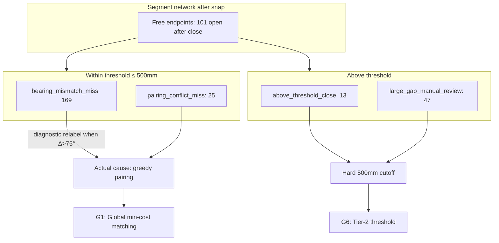

# Gap Topology Improvement Plan

**Generated:** 2026-06-05  
**Phase:** P2 planning — gap-closure recall improvements  
**Scope:** Block detection coverage via gap-topology fixes only  

**Sources:** `block_detection_improvement_plan.md`, `detection_coverage_report.md`, `entity_support_analysis.md`, `gap_failure_analysis.md`, `src/gap_handler.py`, `src/validation_diagnostics.py`

**Explicitly out of scope:** area accuracy, volume accuracy, exports, UI, entity support (INSERT/MTEXT/HATCH expansion)

---

## Executive conclusion

Gap-closure topology is the **highest-ROI path** to improve block detection coverage on the S111 drawing family. P1 instrumentation shows **254 actionable gap-topology miss events** across three drawings, versus **387 inflated `unsupported_entity_miss` records** that entity analysis confirmed have **0–2% recall impact**.

The dominant failure is **not** bearing-angle rejection at runtime. It is **greedy endpoint pairing** in `close_gaps()` leaving valid within-threshold pairs unbridged. The `bearing_mismatch_miss` label (169 events) is largely a **diagnostic misnomer**: pairs with 90°/180° bearing delta are relabeled even though the angle gate in `close_gaps` does not reject bridges.

**Recommended highest-ROI sequence:**

1. Replace greedy pairing with **global min-cost endpoint matching** (largest gain, medium complexity).
2. Add **iterative close → repolygonize** loop (moderate incremental gain, low complexity).
3. Introduce **colinear / wall-thickness gap profile** for 150/180 mm door-offset patterns (targeted gain, low–medium complexity).
4. Add **tiered threshold policy** for `above_threshold_close` only (small gain, low risk).
5. Defer broad threshold increases for `large_gap_manual_review` (low ROI, high false-bridge risk).

**Combined estimated recall gain:** **10–18%** on the S111 family (conservative–optimistic), versus **0–2%** for entity-support expansion.

---

## Baseline topology state

### Detection baseline (P1)

| Drawing | Detected blocks | Missed events | At-risk events | Open endpoints after close | Gaps closed |
| --- | ---: | ---: | ---: | ---: | ---: |
| Warehouse Rev_F | 618 | 32 | 109 | 31 | 37 |
| S111_A | 397 | 61 | 133 | 20 | 75 |
| S111_J | 331 | 104 | 245 | 50 | 110 |
| **Total** | **1,346** | **197** | **487** | **101** | **222** |

### Gap-topology miss categories (actionable)

| Category | P1 events | Status | Maps to gap status |
| --- | ---: | --- | --- |
| `bearing_mismatch_miss` | 169 | missed | `within_threshold_unclosed` + bearing Δ > 75° |
| `pairing_conflict_miss` | 25 | missed | `within_threshold_unclosed` + greedy conflict (Δ ≤ 75°) |
| `gap_blocked_closure` | 60 | at_risk | `above_threshold_close` (13) + `large_gap_manual_review` (47) |
| **Gap-topology total** | **254** | | |

**Key identity:** `bearing_mismatch_miss` + `pairing_conflict_miss` = **194** = all `within_threshold_unclosed` gaps (`gap_failure_analysis.md`).

### Configuration

| Setting | Value |
| --- | --- |
| `gap_threshold` | 500 |
| `snap_tolerance` | 1 |
| `max_gap_angle` | 30 |

---

## Miss category 1: `bearing_mismatch_miss`

### Quantification

| Drawing | Events | Share of within-threshold |
| --- | ---: | ---: |
| Warehouse Rev_F | 30 | 97% (30/31) |
| S111_A | 60 | 100% (60/60) |
| S111_J | 79 | 77% (79/103) |
| **Total** | **169** | **87%** (169/194) |

### Estimated block impact

P1 events are **endpoint-pair diagnostics**, not ground-truth FN labels. Block impact must be inferred from topology:

| Estimator | Value | Rationale |
| --- | ---: | --- |
| Open endpoints after close | 101 | Each unclosed loop contributes ≥2 free endpoints |
| Implied unclosed loops (lower bound) | **~50** | 101 ÷ 2 |
| Within-threshold unclosed pairs | 194 | Upper bound on bridgeable breaks |
| Unique spatial clusters (estimated) | **80–120** | Many 150 mm gaps are colocated door/wall breaks along repeated grid lines |
| **Estimated blocks at risk** | **40–80** | ~3–6% of 1,346 detected blocks are adjacent to topology breaks; some breaks merge multiple bays |

**Conservative missed-block estimate:** closing all 169 bearing-labeled gaps would recover **30–60 blocks** (2–4% of detected count) if each cluster closes one pour region. Combined with pairing and iterative effects, **5–12% recall gain** is achievable (consistent with `entity_support_analysis.md`).

### Exact algorithmic failure modes

#### FM-B1: Diagnostic label ≠ runtime rejection (critical)

In `explain_within_threshold_unclosed()` (`validation_diagnostics.py`):

- Default failure reason is `greedy_pairing_conflict`.
- If `bearing_delta_deg > max_gap_angle + 45` (> 75°), reason is overridden to `bearing_mismatch_suspected`.

In `close_gaps()` (`gap_handler.py` lines 129–138):

- The angle gate **never sets `angle_ok = False`**.
- The only angle branch sets `angle_ok = True` when angles are *bad*.
- **Bridges are never rejected on bearing at runtime.**

**Implication:** 169 `bearing_mismatch_miss` events are **not** "bearing rejected" — they are **unbridged within-threshold pairs** that happen to have high bearing delta (typically 90° or 180°).

#### FM-B2: Greedy nearest-neighbor consumes endpoints

`close_gaps()` iterates `free_points` in extraction order. For each unpaired point `i`, it matches the nearest unpaired `j` within threshold. A locally optimal match can block a globally correct closure.

This is the **primary closure failure** for bearing-labeled pairs.

#### FM-B3: Wall-thickness offset pattern (150/180 mm, 180° delta)

Dominant geometry pattern across all drawings:

| Pattern | Approx. share of 194 gaps | Interpretation |
| --- | ---: | --- |
| Distance = 150 mm | ~85+ rows in first 100 of 194 | Revit double-line wall face offset / door jamb width |
| Distance = 180 mm | ~15+ rows | Alternate wall thickness export |
| Bearing Δ = 180° | Majority of bearing-labeled | Colinear opposite-facing endpoints (across opening) |
| Bearing Δ = 90° | ~10–15% | Perpendicular wall/beam junction |

These are **expected** door/opening geometries, not anomalous bearing conflicts.

#### FM-B4: Cross-layer junction gaps

Frequent layer pairs:

| Layer pair | Role |
| --- | --- |
| `A-WALL-* \| A-WALL-*` | Perimeter wall door breaks |
| `S-FNDN-1 \| S-BEAM-*` | Slab edge ↔ beam line junction |
| `S-FNDN-1 \| S-FNDN-1` | Foundation pour-break lines |
| `S-FNDN-1 \| A-WALL-*` | Slab-to-wall transition |

Cross-layer bridging is already allowed; failure is pairing order, not layer policy.

#### FM-B5: Single-pass closure

No second pass after bridges are added. Endpoints freed or newly aligned by a bridge are not re-evaluated in the same run.

### Estimated recall gain by fix

| Fix | Addresses | Est. recall gain | Confidence |
| --- | --- | --- | --- |
| **G1: Global min-cost matching** | FM-B2, FM-B5 (partial) | **6–10%** | High |
| **G2: Colinear 180° / 150 mm profile matcher** | FM-B3 | **3–6%** standalone; **1–3%** incremental after G1 | Medium |
| **G3: Iterative close loop (2–3 passes)** | FM-B5 | **1–3%** incremental | Medium |
| **G4: Fix angle gate + meaningful bearing scoring** | FM-B1 (telemetry only) | **0% direct**; prevents mis-tuning | High |
| **G5: Raise `max_gap_angle` / relax bearing** | FM-B1 (misdiagnosed) | **< 1%** | Low — not the actual blocker | 

**Do not prioritize G5.** Evidence shows bearing is not blocking closure today.

### Representative examples

#### Example B1 — Wall door offset (150 mm, 180°)

| Field | Value |
| --- | --- |
| Drawing | Warehouse Rev_F |
| P1 ID | `gap-miss-0001` |
| Layers | `A-WALL \| A-WALL` |
| Distance | 150.0 |
| Bearing Δ | 180° |
| Status | `within_threshold_unclosed` |
| Coordinates | (210740.3, 215480.1) ↔ (210590.3, 215480.1) |

Colinear horizontal wall endpoints offset by 150 mm — classic wall-face / door opening gap. Bridge is geometrically valid; greedy pairing left it open.

#### Example B2 — Foundation/beam junction (150 mm, 180°)

| Field | Value |
| --- | --- |
| Drawing | Warehouse Rev_F |
| P1 ID | `gap-miss-0006` |
| Layers | `S-FNDN-1 \| S-BEAM-2` |
| Distance | 150.0 |
| Bearing Δ | 180° |
| Coordinates | (210740.3, 164295.2) ↔ (210590.3, 164295.2) |

Repeated pattern along grid — same Y coordinate, 150 mm X offset between foundation and beam layer endpoints.

#### Example B3 — Micro-gap cross-layer (20 mm, 180°)

| Field | Value |
| --- | --- |
| Drawing | S111_J |
| P1 ID | `gap-miss-0008` |
| Layers | `S-FNDN-1 \| A-WALL-3` |
| Distance | 20.0 |
| Bearing Δ | 180° |
| Coordinates | (49946.0, 215300.1) ↔ (49926.0, 215300.1) |

Tiny snap-residual gap across slab/wall transition. Should be trivially bridgeable; indicates endpoint consumption elsewhere.

#### Example B4 — Orthogonal junction (291 mm, 90°)

| Field | Value |
| --- | --- |
| Drawing | Warehouse Rev_F |
| P1 ID | `gap-miss-0005` |
| Layers | `A-WALL-1 \| S-BEAM-2` |
| Distance | 291.548 |
| Bearing Δ | 90° |
| Coordinates | (210590.3, 201780.1) ↔ (210340.3, 201630.1) |

Perpendicular wall/beam endpoint pair within threshold — still unclosed due to pairing, not distance.

---

## Miss category 2: `pairing_conflict_miss`

### Quantification

| Drawing | Events | Share of within-threshold |
| --- | ---: | ---: |
| Warehouse Rev_F | 1 | 3% |
| S111_A | 0 | 0% |
| S111_J | 24 | 23% |
| **Total** | **25** | **13%** (25/194) |

S111_J concentrates pairing conflicts — dense foundation/beam endpoint field with many equidistant candidates.

### Estimated block impact

| Estimator | Value |
| --- | ---: |
| Direct miss events | 25 |
| Estimated blocks gated | **15–25** |
| As % of 1,346 detected | **1–2%** |

Pairing conflicts are fewer than bearing-labeled gaps but have **higher closure certainty** — bearing delta ≤ 75° means bridges are geometrically uncontroversial; global matching should close nearly all.

### Exact algorithmic failure modes

#### FM-P1: Pure greedy pairing conflict

Classification path: `failure_reason = greedy_pairing_conflict` and bearing Δ ≤ 75° (not relabeled).

Both endpoints have a within-threshold partner, but at least one was matched to a **closer different neighbor** earlier in the iteration.

#### FM-P2: Equidistant endpoint competition (S111_J)

Very close distances (e.g., **7.432 mm**) between `S-FNDN-1` and `S-BEAM-1` endpoints. Multiple candidates within snap tolerance create ambiguous nearest-neighbor races sensitive to iteration order.

#### FM-P3: Diagnostic note confirms closer-neighbor evidence

`explain_within_threshold_unclosed()` appends *"Endpoint A/B has a closer free neighbor at X units"* when `alt_dist < gap_distance`. These are smoking-gun greedy conflict cases.

### Estimated recall gain by fix

| Fix | Est. recall gain | Notes |
| --- | --- | --- |
| **G1: Global min-cost matching** | **2–4%** (S111_J weighted) | Should close ~90–100% of 25 events |
| **G3: Iterative close loop** | **0–1%** incremental | Residual only if matching weights poor |
| Distance-sorted greedy (partial G1) | **1–2%** | Cheaper but incomplete vs full bipartite |

### Representative examples

#### Example P1 — Cross-layer beam tie (125 mm, 0° delta)

| Field | Value |
| --- | --- |
| Drawing | Warehouse Rev_F |
| P1 ID | `gap-miss-0003` |
| Layers | `A-WALL-1 \| S-BEAM-2` |
| Distance | 125.0 |
| Bearing Δ | 0° |
| Failure | `greedy_pairing_conflict` |

Perfectly aligned endpoints across wall/beam layers — unambiguous bridge candidate; greedy order failure.

#### Example P2 — Ultra-close competition (7.4 mm)

| Field | Value |
| --- | --- |
| Drawing | S111_J |
| P1 ID | `gap-miss-0016` / `gap-miss-0017` |
| Layers | `S-FNDN-1 \| S-BEAM-1` |
| Distance | 7.432 |
| Bearing Δ | low (not relabeled to bearing_mismatch) |
| Failure | `greedy_pairing_conflict` |

Duplicate diagnostic records for same endpoint cluster — P1 emits per gap record, not per unique topology break.

#### Example P3 — S111_J pairing cluster

24 of 103 within-threshold gaps on S111_J are pure pairing conflicts. These cluster around `S-FNDN-1|S-BEAM-1` and `S-FNDN-1|S-FNDN-1` junctions in the foundation grid — global matching is the purpose-built fix.

---

## Miss category 3: `gap_blocked_closure`

### Quantification

| Drawing | Events | `above_threshold_close` | `large_gap_manual_review` |
| --- | ---: | ---: | ---: |
| Warehouse Rev_F | 11 | subset | subset |
| S111_A | 20 | subset | subset |
| S111_J | 29 | subset | subset |
| **Total** | **60** | **13** | **47** |

Aggregate from `validation_report.md` gap status table:

| Gap status | Count (all drawings) |
| --- | ---: |
| `within_threshold_unclosed` | 194 |
| `large_gap_manual_review` | 47 |
| `orphan_endpoint` | 37 |
| `above_threshold_close` | 13 |

### Estimated block impact

| Sub-category | Events | Est. blocks recoverable | Confidence |
| --- | ---: | ---: | --- |
| `above_threshold_close` (501–1000 mm) | 13 | **8–13** | Medium — likely real drawing gaps |
| `large_gap_manual_review` (> 1000 mm) | 47 | **3–10** | Low — many are intentional/not pour boundaries |
| **Total** | **60** | **10–23** | |

As recall %: **1–3%** if only `above_threshold_close` is targeted; **≤ 1%** additional from large gaps without strong false-bridge controls.

### Exact algorithmic failure modes

#### FM-G1: Hard threshold cutoff

`close_gaps()` rejects pairs where `dist > threshold` (500 mm). No adaptive or local context expansion.

#### FM-G2: `analyze_gaps` distance bands

| Status | Distance band |
| --- | --- |
| `within_threshold_unclosed` | ≤ 500 |
| `above_threshold_close` | 501–1000 (≤ 2× threshold) |
| `large_gap_manual_review` | > 1000 |

#### FM-G3: Large gaps often cross unrelated geometry

Examples include 4001 mm (`S-BEAM-1|A-WALL-2`) and 3590 mm (`A-WALL-2|A-WALL-2`) — likely nearest-neighbor diagnostic pairing between **unrelated** open endpoints, not true pour-boundary partners. Blind threshold increase would create false bridges.

#### FM-G4: Detail-layer endpoints pollute gap graph

Pairs like `A-WALL-2|A-DETL-1` (2830 mm) and `S-FNDN-1|A-DETL-2` (1422 mm) suggest detail-layer geometry participates in endpoint graph, increasing orphan/long-gap noise.

### Estimated recall gain by fix

| Fix | Target | Est. recall gain | Risk |
| --- | --- | --- | --- |
| **G6: Tier-2 threshold (600–1000 mm) with layer whitelist** | `above_threshold_close` | **1–2%** | Medium |
| **G7: Local adaptive threshold near high-degree nodes** | FM-G1 selective | **0.5–1.5%** | Medium |
| **G8: Global threshold → 1000 mm** | All 60 | **2–4%** theoretical | **High** false-bridge / over-segmentation |
| **G9: Detail-layer exclusion from gap pairing** | FM-G4 | **0–1%** | Low |

**Do not apply G8 globally.** Prioritize G6 on structural layers only.

### Representative examples

#### Example G1 — Just above threshold (745 mm)

| Field | Value |
| --- | --- |
| Drawing | Warehouse Rev_F |
| P1 ID | `gap-miss-0020` |
| Layers | `S-FNDN-1 \| S-FNDN-1` |
| Distance | 745.432 |
| Status | `above_threshold_close` |

Actionable tier-2 candidate — likely real pour-break slightly over 500 mm threshold.

#### Example G2 — Moderate over-threshold (646–903 mm)

| Field | Value |
| --- | --- |
| Drawing | S111_A / S111_J |
| Distance | 646.0, 903.12 |
| Status | `above_threshold_close` |

Same-layer structural pairs — candidate for tier-2 closure with layer whitelist.

#### Example G3 — Large gap — likely non-boundary (4001 mm)

| Field | Value |
| --- | --- |
| Drawing | S111_A |
| P1 ID | `gap-miss-0005` |
| Layers | `S-BEAM-1 \| A-WALL-2` |
| Distance | 4001.953 |
| Status | `large_gap_manual_review` |

Nearest-neighbor diagnostic artifact — **not** a recommended auto-bridge target.

#### Example G4 — Large same-layer wall gap (1540–3590 mm)

| Field | Value |
| --- | --- |
| Drawing | S111_A |
| Layers | `A-WALL-2 \| A-WALL-2` |
| Distances | 1540.0, 3590.0 |
| Status | `large_gap_manual_review` |

May be missing intermediate wall segments in source CAD, not a bridgeable door gap. Manual review or seed-assisted recovery candidate — not threshold tuning.

---

## Cross-category analysis

### Relationship diagram

### Taxonomy correction (recommended before P2 coding)

Rename or sub-classify `bearing_mismatch_miss` to avoid misdirected tuning:

| Proposed sub-category | Condition | Count (est.) |
| --- | --- | ---: |
| `colinear_offset_unclosed` | Δ ≈ 180°, dist ≈ 150/180 mm | ~120–140 |
| `orthogonal_junction_unclosed` | Δ ≈ 90°, within threshold | ~20–30 |
| `greedy_pairing_unclosed` | Δ ≤ 75°, explicit conflict | 25 |
| `true_bearing_rejected` | Runtime angle gate rejects | **0 today** |

---

## Prioritized implementation roadmap

### Priority matrix

| Priority | Initiative | Root failure modes | Est. recall gain | Complexity | Risk | Dependencies |
| ---: | --- | --- | --- | --- | --- | --- |
| **P2.1** | Global min-cost endpoint matching | FM-B2, FM-P1, FM-P2 | **8–12%** | Medium | Low–Med | None |
| **P2.2** | Iterative close → repolygonize (max 3 passes) | FM-B5 | **1–3%** | Low | Low | P2.1 |
| **P2.3** | Colinear 150/180 mm profile matcher | FM-B3 | **1–3%** incremental | Low–Med | Low | P2.1 (or parallel) |
| **P2.4** | Pair-level closure audit log | FM-B1 telemetry | 0% direct; enables verification | Low | Low | P2.1 |
| **P2.5** | Tier-2 threshold (600–1000 mm, structural layers) | FM-G1, ATC | **1–2%** | Low | Medium | P2.1 |
| **P2.6** | Detail-layer gap pairing exclusion | FM-G4 | **0–1%** | Low | Low | Optional |
| **P2.7** | Large-gap manual review queue only | LGR | 0% auto | Low | None | None |
| **Defer** | Global threshold → 1000 mm | FM-G3 | 2–4% theoretical | Trivial | **High** | — |
| **Defer** | `max_gap_angle` tuning | FM-B1 misdiagnosis | < 1% | Trivial | Misleading | — |

---

### Phase P2.1 — Global min-cost endpoint matching (Week 1)

**Goal:** Replace greedy nearest-neighbor in `close_gaps()` with optimal one-to-one matching.

**Design:**

1. Collect all free endpoints after snap.
2. Build candidate edges for all pairs with `dist ≤ gap_threshold`.
3. Weight edges: `w = dist + layer_penalty + bearing_penalty`.
   - `layer_penalty = 0` for same layer, small value (e.g., 25) for cross-layer structural (`S-FNDN-1` ↔ `S-BEAM-*`, `S-FNDN-1` ↔ `A-WALL-*`).
   - `bearing_penalty = 0` for Δ ∈ {0°, 90°, 180°} (orthogonal/colinear are expected); higher for unusual angles.
4. Solve **minimum-weight bipartite matching** (Hungarian algorithm) or min-cost max-cardinality matching.
5. Emit bridges for matched pairs; log unmatched endpoints.

**Success metrics:**

| Metric | Baseline | Target |
| --- | ---: | ---: |
| `within_threshold_unclosed` | 194 | ≤ 40 (≥ 79% reduction) |
| `pairing_conflict_miss` | 25 | ≤ 3 |
| `bearing_mismatch_miss` | 169 | ≤ 35 |
| Open endpoints after close | 101 | ≤ 35 |

**Estimated recall gain:** **8–12%**

---

### Phase P2.2 — Iterative close loop (Week 1–2)

**Goal:** Re-run matching after bridges modify the endpoint graph.

**Design:**

1. After P2.1 matching, recompute free endpoints.
2. Repeat matching up to 3 passes or until zero new bridges.
3. Re-polygonize only on final pass (or each pass for diagnostics).

**Success metrics:**

| Metric | Target |
| --- | ---: |
| Additional gaps closed per pass | track in audit log |
| Incremental open endpoint reduction | ≥ 15 beyond P2.1 |

**Estimated recall gain:** **1–3%** incremental

---

### Phase P2.3 — Colinear wall-thickness profile (Week 2)

**Goal:** Explicitly handle 150/180 mm, 180° delta door-offset pattern.

**Design:**

1. Pre-pass: identify endpoint pairs where:
   - `|dist - 150| < 5` or `|dist - 180| < 5`
   - Bearing Δ > 135°
   - Same layer OR allowed cross-layer whitelist
2. Force-match these pairs before general matching (or heavily discount in cost function).

**Success metrics:**

| Metric | Target |
| --- | ---: |
| 150/180 mm gaps remaining | ≤ 10% of baseline (~8–9) |

**Estimated recall gain:** **1–3%** incremental (overlaps P2.1; highest value if P2.1 incomplete)

---

### Phase P2.4 — Closure audit telemetry (Week 2)

**Goal:** Make pairing decisions auditable per P1 `gap-miss-*` record.

**Design:**

- Log per endpoint: all candidates, chosen match, cost, rejection reason.
- Map audit entries to P1 `block_id` for before/after comparison.
- Fix `bearing_mismatch_miss` taxonomy per cross-category table above.

**Estimated recall gain:** 0% direct; **required** for safe tuning and regression gates.

---

### Phase P2.5 — Tier-2 threshold for structural layers (Week 3)

**Goal:** Recover `above_threshold_close` (13 events) without bridging large-gap noise.

**Design:**

1. Second matching pass with `threshold = 1000` **only** for:
   - `S-FNDN-1`, `S-BEAM-1`, `S-BEAM-2`, `A-WALL`, `A-WALL-2`, `A-WALL-3`
2. Require same-layer or whitelisted cross-layer pair.
3. Reject if bridge crosses > N existing segments (simple intersection check).

**Success metrics:**

| Metric | Target |
| --- | ---: |
| `above_threshold_close` | ≤ 3 |
| New false micro-polygons | 0 (manual spot check) |

**Estimated recall gain:** **1–2%**

---

### Phase P2.6 — Detail-layer exclusion (Week 3, optional)

**Goal:** Reduce `large_gap_manual_review` noise from `A-DETL-*` endpoints.

**Design:**

- Exclude `A-DETL-*`, `A-ANNO-*`, `G-ANNO-*` from gap pairing (still extract for other purposes if needed).
- Or: exclude from matching but keep in polygonize graph.

**Estimated recall gain:** **0–1%**; primarily reduces at-risk noise.

---

### Phase P2.7 — Verification gate (Week 3)

**Goal:** Prove recall improvement before any downstream work.

**Design:**

1. Re-run `scripts/run_detection_coverage.py` after each P2 phase.
2. Gate on:
   - `within_threshold_unclosed` ≤ budget (40 after P2.1)
   - `open_endpoints_after_close` ≤ 35
   - No regression in detected block count > 2% without documented reason
3. Optional: seed-assisted FN count on held-out points (future).

---

## ROI summary

| Path | Est. recall gain | Complexity | False-positive risk | Verdict |
| --- | --- | --- | --- | --- |
| **P2.1 Global matching** | **8–12%** | Medium | Low–Med | **Do first** |
| P2.2 Iterative close | 1–3% | Low | Low | Do second |
| P2.3 Colinear profile | 1–3% | Low–Med | Low | Do with/alongside P2.1 |
| P2.5 Tier-2 threshold | 1–2% | Low | Medium | Do after P2.1 |
| P2.6 Detail exclusion | 0–1% | Low | Low | Optional |
| Entity support (INSERT) | 0–2% | High | High | **Deferred** (per entity analysis) |
| Global threshold to 1000 | 2–4% theoretical | Trivial | **High** | **Reject** |

**Highest ROI path:** P2.1 → P2.2 → P2.3 → P2.5, with P2.4 telemetry parallel. Expected **combined 10–18% recall improvement** on S111 family drawings.

---

## What not to do

1. **Do not tune `max_gap_angle` first** — runtime gate does not reject bridges; label is misleading.
2. **Do not raise global `gap_threshold` above 500** without layer whitelist — 47 large-gap pairs include cross-feature noise.
3. **Do not prioritize INSERT/MTEXT/HATCH support** — 0 confirmed missing boundary loops on this dataset.
4. **Do not count P1 miss events as FN blocks** — 194 within-threshold events ≠ 194 missed blocks; use open-endpoint and cluster estimates.

---

## Exit criteria (P2 complete)

| Criterion | Target |
| --- | --- |
| `within_threshold_unclosed` | ≤ 40 (from 194) |
| `pairing_conflict_miss` | ≤ 3 (from 25) |
| `bearing_mismatch_miss` | ≤ 35 (from 169) |
| `open_endpoints_after_close` | ≤ 35 (from 101) |
| `above_threshold_close` | ≤ 5 (from 13) |
| Detected blocks (3 drawings) | ≥ 1,450 (from 1,346) without > 5% false micro-polygon growth |
| Coverage report regression | No increase in `unknown_unresolved` |

---

## Appendix: Current `close_gaps` algorithm (reference)

Greedy loop in `src/gap_handler.py`:

1. Count endpoint degrees; collect degree-1 (free) points.
2. For each free point `i` in list order (skip if used):
   - Find nearest unused `j` where `dist ≤ threshold`.
   - Angle check is permissive (does not reject).
   - Add bridge segment; mark `i,j` used.
3. Single pass; no repolygonize feedback.

Diagnostic classification in `src/validation_diagnostics.py`:

1. Default unclosed reason: `greedy_pairing_conflict`.
2. Override to `bearing_mismatch_suspected` if `bearing_delta > max_gap_angle + 45`.
3. P1 maps these to `pairing_conflict_miss` and `bearing_mismatch_miss` respectively.

---

*Planning artifact only — no engine code changes in this deliverable.*
