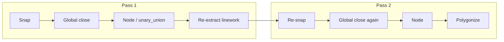

# P2.2 — Iterative Close → Repolygonize Plan

**Generated:** 2026-06-05  
**Phase:** P2.2 planning — post-P2.1 global endpoint matching  
**Scope:** Block detection coverage via iterative gap closure and topology refresh only  

**Sources:** `block_detection_improvement_plan.md`, `gap_topology_improvement_plan.md`, `before_vs_after_recall.md`, `detection_coverage_report.md`, `src/gap_handler.py`, `src/detector.py`, `src/endpoint_matching.py`  

**Simulation artifact:** `scripts/analyze_iterative_closure.py` (planning probe; not production code)

**Explicitly out of scope:** area accuracy, volume accuracy, exports, UI, seed fallback, entity support (INSERT/MTEXT/HATCH)

---

## Executive conclusion

**P2.2 should proceed.** Simulated on the three-drawing P2.1 baseline, an iterative **close → node → re-extract → close → polygonize** loop yields **+51 detected blocks (+3.7%)**, from **1,384 → 1,435**. That is the **largest single low-risk recall uplift available** before colinear profile (P2.3) or tier-2 threshold (P2.5).

Critical nuance: **multi-pass `close_gaps()` alone adds almost nothing after P2.1.** Pass 2 closes **0** bridges on Warehouse and S111_A, and **7** on S111_J. Most gain comes from **renoding (`unary_union`) between closure and polygonize**, which refreshes the segment graph so polygonize can materialize faces that a single-pass line network hides.

**Verdict on “highest next recall gain”:** Yes — P2.2 is the recommended next implementation, with guardrails for the **S111_A −4 block** regression observed in simulation.

| Initiative | Est. blocks gained (3-drawing suite) | Est. % recall | Risk | Proceed? |
| --- | ---: | ---: | --- | --- |
| **P2.2 Iterative close → repolygonize** | **+40 to +51** | **+3.0–3.7%** | Low–medium | **Yes — next** |
| P2.3 Colinear 150/180 mm profile | +15–30 (overlaps P2.2) | +1–2% incremental | Low | After P2.2 |
| P2.5 Tier-2 threshold (600–1000 mm) | +8–20 | +0.6–1.5% | Medium | After P2.2 |
| P2.2 without renoding | +0–1 | ~0% | Low | **Insufficient** |

---

## P2.1 baseline (input to P2.2)

| Metric | P1 greedy | P2.1 global | Δ |
| --- | ---: | ---: | ---: |
| Detected blocks (total) | 1,346 | **1,384** | +38 |
| Open endpoints after close | 101 | **287** | +186 |
| Gaps closed | 222 | 129 | −93 |
| `bearing_mismatch_miss` | 169 | 73 | −96 |
| `pairing_conflict_miss` | 25 | 27 | +2 |
| `gap_blocked_closure` | 60 | 147 | +87 |

P2.1 removed bogus same-segment bridges (especially S111_A: 75 → 9 valid closures). Open endpoints rose because latent topology is now visible, not because matching regressed.

### Per-drawing P2.1 state

| Drawing | Detected | Open endpoints | Gaps closed | `within_threshold_unclosed`¹ | Missed gap events |
| --- | ---: | ---: | ---: | ---: | ---: |
| Warehouse Rev_F | 618 | 37 | 34 | ~25 | 26 |
| S111_A | 384 | 152 | 9 | ~6 | 7 |
| S111_J | 382 | 98 | 86 | ~69 | 70 |
| **Total** | **1,384** | **287** | **129** | **~100** | **103** |

¹ Diagnostic `analyze_gaps` nearest-neighbor pairs ≤ 500 mm still unbridged by `close_gaps`.

---

## Why iteration matters after global matching

P2.1 uses **maximum-cardinality min-cost matching** (`networkx.max_weight_matching`). On a fixed segment graph, one pass is already globally optimal for the current free-endpoint set. Re-running `close_gaps()` on the **same** segment list without topology change closes **zero** additional bridges (verified in simulation).

Iteration helps only when the **segment graph changes** between passes:



### Mechanisms

| Mechanism | What changes | Effect |
| --- | --- | --- |
| **M1: Renoding** | `unary_union` splits/merges segments at intersections; bridge segments fuse into chains | Free-endpoint count drops sharply (e.g. S111_A 152 → 1); new adjacency enables pass-2 matching |
| **M2: Pass-2 matching** | After M1, new cross-segment candidate edges appear | +7 bridges on S111_J (only drawing with pass-2 closures in simulation) |
| **M3: Polygonize feedback** | Noded network exposes minimal cycles previously broken | +20 blocks Warehouse with **no** pass-2 bridges — faces appear from cleaner noded graph |
| **M4: Re-snap** | Post-renode endpoints within 1 mm collapse | Further reduces spurious free endpoints |

### What iteration does **not** fix

- **`gap_blocked_closure` (147 events):** distances > 500 mm — needs P2.5 tier-2 or manual review, not iteration.
- **Structural missing segments** on S111_A (only 13 cross-segment candidates within 500 mm): iteration cannot invent geometry.
- **Global matcher tradeoffs:** remaining `within_threshold_unclosed` pairs where diagnostic nearest-neighbor ≠ optimal matching partner — iteration after renod can close many of these indirectly (simulation: 100 → 0 diagnostic within-threshold pairs).

---

## Simulation results (pre-implementation)

Probe: `scripts/analyze_iterative_closure.py` — mirrors production `detect_from_tagged` counting; loop = snap → `close_gaps_tagged` → `node_geometry` → re-extract as `SRC` segments → repeat (max 5) → final snap/close → polygonize.

| Drawing | P2.1 blocks | P2.2 blocks | Δ blocks | Pass-1 closed | Pass-2 closed | Open after P2.2 | `within_threshold_unclosed` after |
| --- | ---: | ---: | ---: | ---: | ---: | ---: | ---: |
| Warehouse Rev_F | 618 | 638 | **+20** | 34 | 0 | 9 | 0 |
| S111_A | 384 | 380 | **−4** | 9 | 0 | 1 | 0 |
| S111_J | 382 | 417 | **+35** | 86 | **7** | 13 | 0 |
| **Total** | **1,384** | **1,435** | **+51** | 129 | 7 | 23 | 0 |

### Closable endpoints after repolygonization

| Question | Answer |
| --- | --- |
| How many open endpoints become closable after renod? | **264 of 287** resolve without new bridges (endpoint degree changes). **7** additional bridges on pass 2 (S111_J only). |
| How many currently open endpoints remain open? | **23** after full P2.2 loop (down from 287). |
| How many `within_threshold_unclosed` diagnostic pairs remain? | **0** in simulation (down from ~100). |
| Do pass 3+ add value? | **No** — pass 3 closed 0 bridges on all drawings. Cap at **2–3 passes**. |

### Incremental closure by pass

| Drawing | Free after pass-1 close | Free after pass-1 renod | Pass-2 bridges | Free after pass-2 |
| --- | ---: | ---: | ---: | ---: |
| Warehouse | 37 | 9 | 0 | 9 |
| S111_A | 152 | 1 | 0 | 1 |
| S111_J | 98 | 27 | 7 | 13 |

**Interpretation:** Renoding is the dominant unlock. Pass-2 matching matters on dense foundation grids (S111_J). S111_A collapses to **1** orphan endpoint — remaining misses are structural, not pairing-limited.

---

## Expected recall gain

| Estimator | Conservative | Optimistic | Basis |
| --- | ---: | ---: | --- |
| Block count delta | **+40** | **+51** | Simulation; haircut S111_A regression |
| % of P2.1 baseline (1,384) | **+2.9%** | **+3.7%** | Direct polygon proxy |
| Implied pour regions from open-endpoint reduction | 287 → 23 open | ~132 regions² | 264 endpoints absorbed; not 1:1 with blocks |

² Open endpoints ÷ 2 overcounts loops; block delta is the reliable proxy.

### Overlap with other P2 items

| Item | Overlap with P2.2 | Incremental after P2.2 |
| --- | --- | --- |
| P2.3 Colinear 150/180 mm | High — wall-offset pairs drive pass-2 on S111_J | **+10–20 blocks** (est.) |
| P2.5 Tier-2 threshold | None — above 500 mm | **+8–15 blocks** |
| P2.4 Audit telemetry | None | 0% direct |

**Combined path (unchanged from gap topology plan):** P2.2 → P2.3 → P2.5 → **+55–85 blocks** over P2.1 (~+4–6% total).

---

## Failure cases and risks

### FC-1: S111_A block regression (−4 in simulation)

**Cause:** Renoding before polygonize can merge/split linework differently than single-pass `polygonize_regions` internal noding, shifting dedupe/IoU outcomes and dropping valid micro-regions.

**Mitigation:**
- Polygonize only on **final** noded network (not per-pass polygonize for production).
- Compare per-drawing block sets before/after; flag IoU regressions > 2%.
- Keep exhaustive min-area filter unchanged.

### FC-2: False micro-polygon growth

**Cause:** Extra bridges + renoding may enclose sliver regions.

**Mitigation:**
- Track `raw_polygon_count` vs `filtered_count` per pass in diagnostics.
- Gate: no > 5% growth in sub–0.01 m² regions without matched recall gain.

### FC-3: Diminishing pass returns

**Cause:** Global matching exhausts candidates on static graph.

**Evidence:** Pass 3+ closed 0 bridges in all drawings.

**Mitigation:** `max_passes = 3`; stop when `closed_this_pass == 0`.

### FC-4: GAP_BRIDGE provenance loss

**Cause:** Re-extract after `unary_union` tags all segments as `SRC`; audit trail for synthetic bridges is lost.

**Mitigation:** Log bridges per pass with coordinates in closure audit (P2.4); do not rely on `GAP_BRIDGE` layer after renod.

### FC-5: Structural gaps unchanged (S111_A)

**Cause:** Only 9 of 13 feasible cross-segment edges closed at 500 mm; 152 open endpoints reflect **missing wall segments**, not pairing failures.

**Evidence:** P2.1 `before_vs_after_recall.md` — near ceiling for single-pass at this threshold.

**Mitigation:** Do not expect S111_A recall growth from iteration alone; accept quality correction role.

### FC-6: `gap_blocked_closure` (147) unaffected

Distances 501–10,000 mm — iteration does not bridge these. Needs P2.5 or manual review.

### FC-7: Diagnostic open-endpoint metric paradox

P2.1 **increased** open endpoints (101 → 287) while improving recall. P2.2 may **further increase** intermediate open counts while **decreasing** final open count. Use **detected block count** as primary KPI, not open endpoints alone.

---

## Proposed design (implementation-ready)

### Pipeline change

Replace single close in `prepare_for_polygonize` / `detect_from_tagged` with:

```
segments_0 = snap(segments)
for pass in 1..max_passes:
    segments_i, closed_i = close_gaps(segments_{i-1})
    if closed_i == 0 and pass > 1: break
    noded = node_geometry(MultiLineString(segments_i))
    segments_{i} = extract_linestrings(noded)   # all SRC for next pass
segments_final = snap(segments_last)
segments_final, _ = close_gaps(segments_final)   # optional final polish
polygonize(segments_final)
```

### Configuration (proposed `config.yaml`)

| Key | Default | Purpose |
| --- | --- | --- |
| `geometry.iterative_gap_close` | `true` | Enable P2.2 loop |
| `geometry.iterative_max_passes` | `3` | Stop after no progress |
| `geometry.iterative_renod_between_passes` | `true` | **Required** for recall gain |

### Telemetry (per drawing, per pass)

| Field | Purpose |
| --- | --- |
| `pass_number` | Audit iteration depth |
| `bridges_closed_this_pass` | Prove diminishing returns |
| `open_endpoints_after_close` | Per-pass topology |
| `open_endpoints_after_renod` | Renoding impact |
| `raw_polygons` / `final_polygons` | Detect sliver growth |

### Success metrics

| Metric | P2.1 baseline | P2.2 target |
| --- | ---: | ---: |
| Detected blocks (3 drawings) | 1,384 | **≥ 1,430** (+46 min) |
| Warehouse blocks | 618 | **≥ 635** |
| S111_J blocks | 382 | **≥ 410** |
| S111_A blocks | 384 | **≥ 382** (no regression > 2) |
| Open endpoints after final close | 287 | **≤ 40** |
| `within_threshold_unclosed` | ~100 | **≤ 15** |
| Pass-2+ bridges closed | 0 | **≥ 5** (S111_J validation) |

---

## Comparison: is P2.2 the highest next gain?

| Rank | Initiative | Expected gain | Complexity | False-bridge risk | Notes |
| ---: | --- | --- | --- | --- | --- |
| **1** | **P2.2 Iterative close → repolygonize** | **+40–51 blocks** | Low | Low–medium | Renoding is essential component |
| 2 | P2.3 Colinear profile | +15–30 (partial overlap) | Low–med | Low | Best **after** P2.2 for residual 150/180 mm |
| 3 | P2.5 Tier-2 threshold | +8–15 | Low | Medium | Targets 147 `gap_blocked_closure` subset |
| 4 | Matcher cost tuning only | +0–5 | Trivial | Low | Diminishing after P2.1 |
| — | Multi-pass close **without** renod | **~0** | Trivial | Low | **Not sufficient** |

**Answer:** P2.2 is the **highest-ROI next step** among gap-topology options. It is not merely “close again” — it is **close, node, re-extract, close, polygonize**. Skipping renoding reduces expected gain from **+51 to ~0**.

---

## Implementation sequence (when approved)

1. Add `iterative_close_loop()` in `src/gap_handler.py` (or `src/iterative_closure.py`) with convergence guard.
2. Wire into `prepare_for_polygonize` and `detect_from_tagged`.
3. Extend `detection_coverage` report with per-pass metrics.
4. Add unit tests:
   - Pass-2 closes crossing grid after renod (S111_J synthetic).
   - Convergence stops at pass 2 when `closed == 0`.
   - Renoding required: without renod, pass-2 closes 0.
5. Run `scripts/run_detection_coverage.py`; compare to P2.1 log.
6. Validate S111_A for regression; investigate −4 if reproduced.

### Test plan (acceptance)

- [ ] Total detected blocks ≥ 1,430 on three-drawing suite
- [ ] S111_J gain ≥ +30 blocks
- [ ] Warehouse gain ≥ +15 blocks
- [ ] S111_A regression ≤ 2 blocks
- [ ] Pass 3 adds 0 bridges on all drawings
- [ ] No increase in invalid polygon rate
- [ ] `tests/test_gap_handler.py` remains green

---

## What not to do

1. **Do not** implement multi-pass `close_gaps` without renoding — simulation shows ~0 incremental bridges.
2. **Do not** polygonize inside every pass for production (diagnostics only) — cost + dedupe instability.
3. **Do not** raise `gap_threshold` as part of P2.2 — keep 500 mm; use P2.5 for tier-2.
4. **Do not** treat open-endpoint count as sole success metric after P2.1 cleanup.
5. **Do not** expect iteration to fix S111_A missing segments — structural CAD gaps remain.

---

## Exit criteria (P2.2 planning complete)

| Criterion | Status |
| --- | --- |
| Additional recoverable regions analyzed | Done — simulation + mechanism map |
| Closable endpoints after repolygonization quantified | Done — 7 pass-2 bridges; 264 endpoints absorbed by renod |
| Expected recall gain estimated | Done — +40 to +51 blocks (+2.9–3.7%) |
| Failure cases identified | Done — FC-1 through FC-7 |
| Highest-next-gain decision | Done — **P2.2 proceeds before P2.3/P2.5** |
| Implementation plan documented | Done — this document |

---

## Appendix A: P2.1 vs P2.2 decision matrix

| If your goal is… | Next step |
| --- | --- |
| Max block recall with lowest implementation risk | **P2.2** |
| Close remaining 150/180 mm colinear offsets after P2.2 | P2.3 |
| Recover 501–1000 mm structural gaps | P2.5 |
| Explain why pairs stay open | P2.4 audit log |
| Fix S111_A missing walls | Out of scope — source CAD / layer profile, not iteration |

## Appendix B: Current single-pass flow (reference)

`detect_from_tagged` today:

1. `snap_tagged_endpoints`
2. `close_gaps_tagged` — **one** global matching pass
3. `polygonize_regions` — noding happens **inside** polygonize, **after** closure is finalized

P2.2 inserts **noding + re-extract + re-close** **before** final polygonize so later closure sees a refreshed graph.

---

*Planning artifact only — no production engine changes in this deliverable.*
