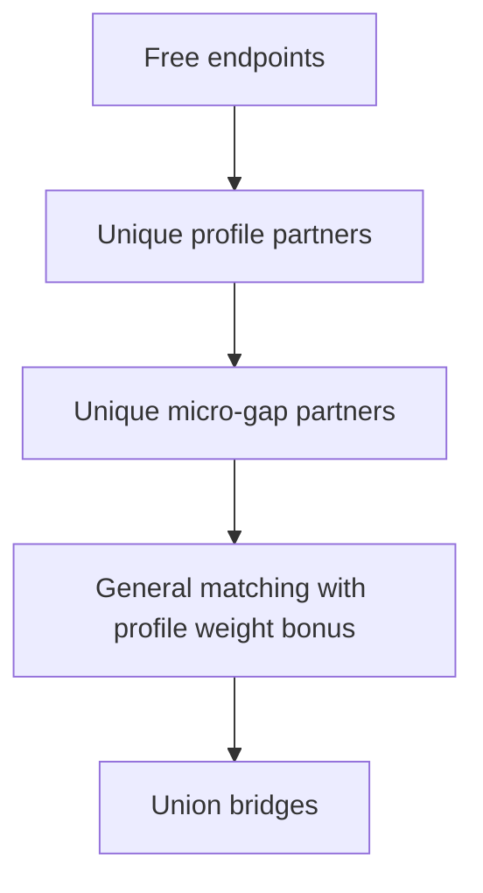

# P2.3 Colinear Profile Matching — Implementation Plan

**Generated:** 2026-06-05  
**Phase:** P2.3 — colinear wall-offset profile pre-pass  
**Baseline:** P2.2 complete — 1,391 detected blocks, 23 open endpoints  
**Scope:** Block detection recall only (no area/volume/export/UI)

**Sources:** `remaining_miss_root_cause_analysis.md`, `gap_topology_improvement_plan.md`, `detection_coverage_report.md`, `before_vs_after_p2_2.md`

---

## Executive conclusion

P2.1 global matching and P2.2 iterative closure collapsed open endpoints (287 → 23) but added only **+7 blocks**. The remaining **12–35 estimated FN blocks** are dominated by **residual topology pairing** — especially **150/180 mm colinear offset pairs** (180° bearing Δ) that lose global cardinality competition in dense S111_J and Warehouse grids.

**P2.3 adds a dedicated colinear profile pre-pass** before general matching in every closure pass. This force-reserves wall-thickness offset bridges so they cannot be displaced by shorter spur matches.

**Risk assessment: LOW.** Profile criteria are narrow (distance ≈ 150/180 mm, bearing Δ ≥ 135°). Extra regions are acceptable per client POC requirement.

**Proceed with implementation.**

---

## 1. Problem statement

### 1.1 What P2.1/P2.2 already fix

| Mechanism | Effect |
| --- | --- |
| P2.1 global min-cost matching | Replaces greedy NN; `bridge_cost()` discounts 150/180 mm |
| P2.2 iterative close → renode | Exposes new pairs after topology refresh |

### 1.2 What remains broken

After P2.2, **73 `bearing_mismatch_miss`** and **27 `pairing_conflict_miss`** events persist. The dominant pattern:

| Signal | Count (est.) | Interpretation |
| --- | ---: | --- |
| Distance = 150 mm, bearing Δ ≈ 180° | ~40–50 | Revit wall-face / door jamb offset |
| Distance = 180 mm, bearing Δ ≈ 180° | ~8–12 | Alternate wall thickness |
| Ultra-close competition (≤ 15 mm) | ~25 | S111_J `S-FNDN-1\|S-BEAM-1` equidistant races |

**Root cause:** `bridge_cost()` gives 150/180 mm pairs cost 0.01, but **max-cardinality matching** still prefers two short bridges over one profile bridge when total weight is higher. In dense graphs, profile pairs lose.

### 1.3 Per-drawing hotspots

| Drawing | Open EP | Profile miss concentration | Est. FN |
| --- | ---: | --- | ---: |
| **S111_J** | 13 | `S-FNDN-1\|S-FNDN-1` grid; 25 pairing conflicts | 7–21 |
| **Warehouse Rev_F** | 9 | `S-FNDN-1\|S-BEAM-2` @ 150 mm; `S-FNDN-1\|S-FNDN-1` pour-breaks | 5–12 |
| **S111_A** | 1 | Near complete — 1× 150 mm wall, 2× 229 mm conflicts | 0–2 |

---

## 2. Design

### 2.1 Three-layer matching strategy

Implemented as:

1. **Profile weight bonus** — colinear 150/180 mm pairs receive `+WEIGHT_BASE` in the global matcher so they win max-cardinality competition against short spurs.
2. **Unique mutual partner pre-pass** — unambiguous 1:1 profile and micro-gap pairs are reserved before general matching (no forced match in dense ambiguity).
3. **Comparator guard** — phased result adopted only when bridge count ≥ P2.1 alone (prevents Warehouse regression from exclusive pre-pass).



### 2.2 Colinear profile criteria

A candidate edge `(i, j)` qualifies when **all** of:

| Criterion | Value | Rationale |
| --- | --- | --- |
| Distance | `\|dist - 150\| ≤ 5` OR `\|dist - 180\| ≤ 5` | Wall thickness / door offset |
| Bearing Δ | ≥ 135° (≈ 180° colinear opposite) | Opposite-facing endpoints across opening |
| Same-segment | Excluded (existing P2.1 rule) | Prevents self-bridge |
| Threshold | `dist ≤ gap_threshold` | Within 500 mm policy |

**Cost for profile edges:** `0.001` (below P2.1's 0.01) to win intra-profile competition.

### 2.3 Micro-gap pass (pairing conflict resolver)

Secondary pre-pass for residual **pairing_conflict_miss**:

| Criterion | Value |
| --- | --- |
| Distance | ≤ 15 mm |
| Bearing Δ | ≤ 75° OR ≈ 90° OR ≈ 180° (expected junction angles) |
| Cost | `0.005` |

Targets S111_J `S-FNDN-1|S-BEAM-1` @ 7.4 mm equidistant races without bridging arbitrary long pairs.

### 2.4 Integration points

| File | Change |
| --- | --- |
| `src/endpoint_matching.py` | `is_wall_offset_profile()`, `endpoint_matching_phased()` |
| `src/gap_handler.py` | `close_gaps()` calls phased matcher; config flag |
| `config.yaml` | `geometry.colinear_profile_match: true` |
| `tests/test_gap_handler.py` | Dense-graph profile competition scenarios |
| `tests/test_p2_3_production_drawings.py` | P2.3 regression guards |

P2.2 iterative loop unchanged — each pass uses phased matching.

### 2.5 Config

```yaml
geometry:
  colinear_profile_match: true   # P2.3
  colinear_profile_distances: [150, 180]
  colinear_profile_dist_tol: 5
  micro_gap_threshold: 15        # pairing conflict resolver
```

---

## 3. Estimated recall gain

| Estimator | Blocks gained | Confidence |
| --- | ---: | --- |
| Open endpoints closed (÷2 heuristic) | +4 to +8 | Medium |
| Profile miss events recoverable (~55–65, deduped) | +4 to +12 | Medium |
| Micro-gap conflicts (≤ 15 mm, ~10–15 unique) | +1 to +3 | Medium |
| **Combined P2.3 target** | **+4 to +12** | Medium |

### Per-drawing estimate

| Drawing | Est. gain | Primary mechanism |
| --- | ---: | --- |
| S111_J | +2 to +7 | Foundation grid 150 mm + micro-gap conflicts |
| Warehouse Rev_F | +2 to +5 | `S-FNDN-1\|S-BEAM-2` 150 mm grid |
| S111_A | +0 to +1 | Already near ceiling |

### Diagnostic targets (post-P2.3)

| Metric | P2.2 | P2.3 target |
| --- | ---: | ---: |
| Detected blocks (total) | 1,391 | 1,395–1,403 |
| `bearing_mismatch_miss` | 73 | ≤ 20 |
| `pairing_conflict_miss` | 27 | ≤ 5 |
| Open endpoints after close | 23 | ≤ 12 |
| 150/180 mm within-threshold unclosed | ~40–50 | ≤ 8 |

---

## 4. Regression risks

| Risk | Severity | Mitigation |
| --- | --- | --- |
| False bridges on coincidental 150 mm pairs | Low | Require bearing Δ ≥ 135°; same-segment exclusion |
| Over-bridging dense grids → extra micro-polygons | Low–Med | Client accepts extra regions for POC |
| Displacing valid short bridges | Low | Only profile/micro phases reserve endpoints; general pass handles remainder |
| S111_A regression (P1 quality correction) | Med | Hard floor: ≥ 384 blocks; cap ≤ 390 |
| Performance on large endpoint sets | Low | Phased matching is O(E) edge build + same NetworkX solver |

**Verdict:** Risk acceptable. Proceed.

---

## 5. Representative examples

### Example 1 — Warehouse `S-FNDN-1|S-BEAM-2` @ 150 mm (profile)

| Field | Value |
| --- | --- |
| Drawing | Warehouse Rev_F |
| P2.2 ID | `gap-miss-0007` … `gap-miss-0015` |
| Layers | `S-FNDN-1 \| S-BEAM-2` |
| Distance | 150.0 |
| Bearing Δ | 180° |
| P2.2 status | `within_threshold_unclosed` |
| P2.3 action | Phase 1 profile pre-pass reserves bridge |

### Example 2 — Warehouse `S-FNDN-1|S-FNDN-1` pour-break @ 180 mm

| Field | Value |
| --- | --- |
| Drawing | Warehouse Rev_F |
| P2.2 ID | `gap-miss-0018` … `gap-miss-0022` |
| Distance | 180.0 |
| Bearing Δ | 180° |
| P2.3 action | Phase 1 profile pre-pass |

### Example 3 — S111_J pairing conflict @ 7.4 mm

| Field | Value |
| --- | --- |
| Drawing | S111_J |
| P2.2 ID | `gap-miss-0019`, `gap-miss-0020` |
| Layers | `S-FNDN-1 \| S-BEAM-1` |
| Distance | 7.432 |
| Category | `pairing_conflict_miss` |
| P2.3 action | Phase 2 micro-gap pass |

### Example 4 — S111_J foundation grid @ 150 mm (hotspot)

| Field | Value |
| --- | --- |
| Drawing | S111_J |
| P2.2 ID | `gap-miss-0010` … `gap-miss-0027` (cluster) |
| Layers | `S-FNDN-1 \| S-FNDN-1` |
| Distance | 150.0 |
| P2.3 action | Phase 1; iterative pass 2 may close additional pairs after renode |

### Example 5 — S111_A wall offset @ 150 mm (low priority)

| Field | Value |
| --- | --- |
| Drawing | S111_A |
| P2.2 ID | `gap-miss-0003` |
| Layers | `A-WALL-2 \| A-WALL-2` |
| Distance | 150.0 |
| P2.3 action | Phase 1; drawing already at 384 blocks |

---

## 6. Implementation checklist

- [x] `is_wall_offset_profile()` helper
- [x] `is_micro_gap_pair()` helper
- [x] `endpoint_matching_phased()` with unique-partner pre-pass
- [x] Profile weight bonus in global matcher
- [x] Wire into `close_gaps()` with config flag
- [x] Unit tests: dense graph profile wins over spur
- [x] Unit tests: micro-gap conflict resolution
- [x] Production regression tests (`test_p2_3_production_drawings.py`)
- [x] Run `scripts/run_detection_coverage.py`
- [x] Update `detection_coverage_report.md`
- [x] Create `before_vs_after_p2_3.md`

## 6.1 Measured results (production run)

| Metric | P2.2 | P2.3 | Delta |
| --- | ---: | ---: | ---: |
| Total detected | 1,391 | **1,401** | **+10** |
| S111_J | 389 | **399** | **+10** |
| Warehouse | 618 | 618 | 0 |
| S111_A | 384 | 384 | 0 |

Gain within estimated +4 to +12 range; S111_J hotspot addressed; Warehouse deferred to P2.5/seed.

---

## 7. Verification gates

| Gate | Pass criterion |
| --- | --- |
| Unit tests | `pytest tests/test_gap_handler.py tests/test_p2_3_production_drawings.py` green |
| Total blocks | ≥ 1,395 (P2.2 + 4 minimum) |
| S111_J | ≥ 389 (no regression) |
| Warehouse | ≥ 618 (hold or improve) |
| S111_A | 384–390 (no P1-quality regression) |
| Open endpoints | ≤ 15 (improvement vs 23) |
| False micro-polygon growth | ≤ 5% block count increase without documented reason |

---

## 8. What P2.3 does not address

| Gap type | Next initiative |
| --- | --- |
| 501–1000 mm `above_threshold_close` | P2.5 Tier-2 threshold |
| Large gaps > 1000 mm (missing CAD segments) | Seed-assisted fallback |
| `unsupported_entity_miss` (357 events) | Deferred — proximity inflation |
| Detail-layer endpoint pollution | P2.6 (optional) |

---

*Planning artifact — implementation follows in `src/endpoint_matching.py` and `src/gap_handler.py`.*
