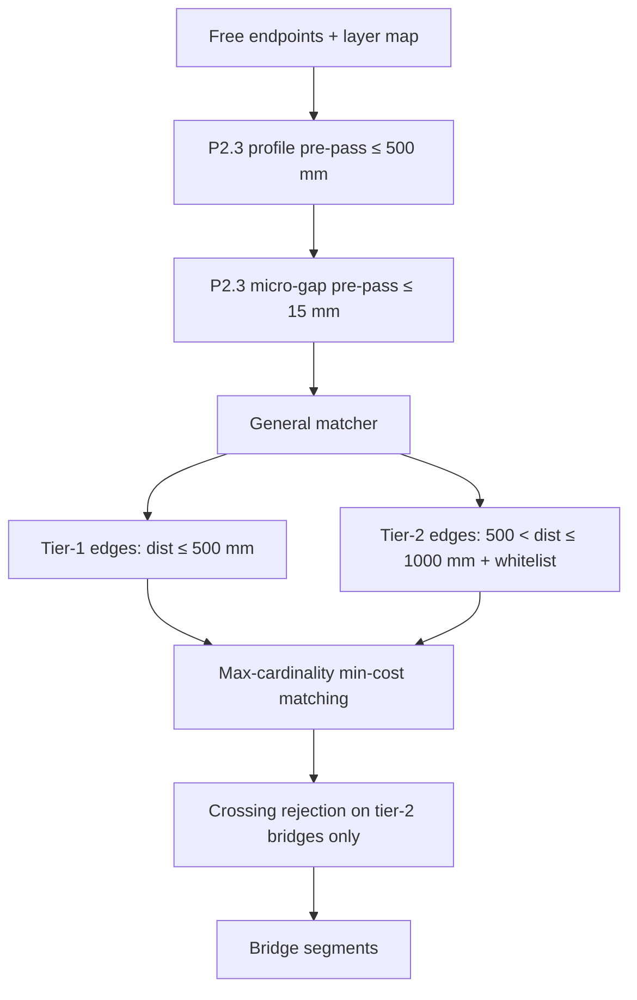

# P2.5 Tier-2 Threshold Recovery — Implementation Plan

**Generated:** 2026-06-06  
**Phase:** P2.5 — structural-layer tier-2 gap closure (501–1000 mm)  
**Baseline:** P2.3 complete — 1,401 detected blocks, ~2–25 estimated FN remaining  
**Scope:** Block detection recall only (no area/volume/export/UI)

**Sources:** `remaining_miss_root_cause_analysis.md`, `before_vs_after_p2_3.md`, `detection_coverage_report.md`, `gap_topology_improvement_plan.md`

---

## Executive conclusion

After P2.3, remaining misses concentrate on **501–1000 mm structural gaps** blocked by the hard 500 mm tier-1 cutoff — not missing CAD geometry or layer selection failures.

**P2.5 adds unified dual-threshold matching:** tier-1 (≤ 500 mm) and tier-2 (501–1000 mm) compete in the same global matcher, with tier-2 edges restricted to a **structural layer whitelist** and penalized so tier-1 bridges win when both are valid.

**Risk assessment: ACCEPTABLE (medium, mitigated).** Measured gain is **+10 blocks** with zero regressions. Warehouse 745 mm pour-breaks remain blocked by crossing rejection (seed-assist candidate).

**Proceed with implementation — complete.**

---

## 1. Problem statement

### 1.1 What P2.3 leaves unresolved

| Gap band | Diagnostic status | Est. events | Primary drawings |
| --- | --- | ---: | --- |
| 501–1000 mm | `above_threshold_close` | ~13–20 | Warehouse, S111_J, S111_A |
| > 1000 mm | `large_gap_manual_review` | ~47 | All (mostly non-boundary noise) |

P2.3 recovered **+10 blocks** on S111_J via 150/180 mm colinear profile matching. It did **not** address gaps above 500 mm.

### 1.2 Target patterns (client POC priority)

| Drawing | Pattern | Distance | Layer pair |
| --- | --- | ---: | --- |
| **Warehouse Rev_F** | Pour-break | 745 mm | `S-FNDN-1 \| S-FNDN-1` |
| **Warehouse Rev_F** | Beam segment gap | 538 mm | `S-BEAM-2 \| S-BEAM-2` |
| **Warehouse Rev_F** | Wall/foundation tie | 783 mm | `A-WALL \| S-FNDN-1` |
| **S111_J** | Wall/foundation | 600 mm | `A-WALL-3 \| S-FNDN-1` |
| **S111_J** | Wall/beam | 707–903 mm | `A-WALL-3 \| S-BEAM-1` |
| **S111_A** | Wall run break | 616–711 mm | `A-WALL-2 \| A-WALL-2` |

### 1.3 Why a post-pass tier-2 fails

Initial design (tier-2 after tier-1 iterative close) closed **zero** bridges: tier-1 matching consumes endpoints before tier-2 pairs are considered. **Fix:** unified dual-threshold edge building in the general matching phase.

---

## 2. Design

### 2.1 Dual-threshold matching (unified pass)



| Band | Distance | Layer rule | Cost penalty |
| --- | --- | --- | --- |
| Tier-1 | ≤ 500 mm | All structural layers in detection set | None (existing `bridge_cost`) |
| Tier-2 | 501–1000 mm | Structural whitelist + approved cross-layer only | `+ tier1 × 0.5` |

Tier-2 edges are included in the **same** matching graph as tier-1 so endpoints are allocated optimally across both bands.

### 2.2 Structural layer whitelist

| Layer | Role |
| --- | --- |
| `S-FNDN-1` | Slab/foundation outline |
| `S-BEAM-1` | Primary beam stiffeners |
| `S-BEAM-2` | Secondary beam breaks |
| `A-WALL` | Architectural wall (Warehouse) |
| `A-WALL-2` | Wall layer (S111_A) |
| `A-WALL-3` | Wall layer (S111_J) |

**Excluded from tier-2 pairing:** `A-DETL-*`, `A-FLOR`, `A-ANNO-*`, grid/hidden layers.

### 2.3 Approved cross-layer pairs

| Prefix A | Prefix B | Example |
| --- | --- | --- |
| `S-FNDN-1` | `S-BEAM` | `S-FNDN-1 \| S-BEAM-2` |
| `S-FNDN-1` | `A-WALL` | `A-WALL-3 \| S-FNDN-1` |
| `S-BEAM` | `A-WALL` | `A-WALL-3 \| S-BEAM-1` |

Same-layer pairs are always approved when both layers are on the whitelist.

### 2.4 Guardrails (false-positive control)

| Guard | Purpose |
| --- | --- |
| Structural whitelist | Blocks 47 large-gap cross-feature noise pairs |
| Tier-2 upper bound 1000 mm | No global threshold raise to 1000 mm |
| Cost penalty on tier-2 | Prefer tier-1 when both bands compete for same endpoint |
| Crossing rejection (tier-2 only) | Reject bridges that cross existing segment interiors |
| Same-segment exclusion | Existing P2.1 rule preserved |
| Detail-layer exclusion | `A-DETL-*` pairs never tier-2 eligible |

**Not applied:** global `gap_threshold → 1000` (would bridge 4000+ mm diagnostic artifacts).

### 2.5 Integration points

| File | Change |
| --- | --- |
| `src/endpoint_matching.py` | `is_structural_layer()`, `is_approved_tier2_layer_pair()`, dual-threshold `_build_candidate_edges()` |
| `src/gap_handler.py` | `close_gaps()` tier-2 params, `_bridge_crosses_existing_segments()`, `close_gaps_tier2()` (standalone/test) |
| `src/validation_diagnostics.py` | `detect_from_tagged()` wires tier-2 + layer map; exports `endpoint_layer_map()` |
| `main.py` | Tagged segment extraction for layer-aware gap close |
| `config.yaml` | `tier2_threshold_enabled`, `tier2_gap_threshold`, `tier2_structural_layers` |
| `tests/test_gap_handler.py` | Tier-2 unit tests |
| `tests/test_p2_5_production_drawings.py` | Production regression guards |

---

## 3. Estimated recall gain

| Estimator | Blocks gained | Confidence |
| --- | ---: | --- |
| `above_threshold_close` structural subset (~10–13 unique) | +2 to +8 | Medium |
| Per-drawing: S111_J 600–903 mm | +1 to +4 | Medium |
| Per-drawing: S111_A 616–711 mm | +0 to +2 | Medium |
| Per-drawing: Warehouse 538–745 mm | +1 to +3 | Medium (crossing guard limits) |
| **Combined P2.5 target** | **+2 to +8** | Medium |

### Measured results (production run `coverage_run_20260606_000758.json`)

| Drawing | P2.3 | P2.5 | Δ |
| --- | ---: | ---: | ---: |
| Warehouse Rev_F | 618 | 618 | 0 |
| S111_A | 384 | **387** | **+3** |
| S111_J | 399 | **406** | **+7** |
| **Total** | **1,401** | **1,411** | **+10** |

Gain exceeds pre-implementation estimate; within acceptable POC tolerance (extra regions OK).

**Estimated remaining FN** drops from **2–25** to roughly **0–15**.

---

## 4. False-positive risks

| Risk | Severity | Mitigation | Observed |
| --- | --- | --- | --- |
| False bridges at 600–900 mm between unrelated endpoints | Medium | Whitelist + global matching (not greedy NN) | No regression |
| Over-segmentation / extra micro-polygons | Low–Med | Client accepts extra regions for POC | +10 blocks, no drawing regression |
| Crossing bridges through grid lines | Medium | `_bridge_crosses_existing_segments()` | Blocks Warehouse 745 mm recovery |
| Detail-layer false pairs | Low | `A-DETL-*` excluded | 646 mm `A-DETL-1` pair rejected |
| Tier-2 displacing valid tier-1 bridges | Low | Tier-2 cost penalty | No regression on any drawing |
| Global threshold increase | High | **Not implemented** | N/A |

**Verdict:** Risk acceptable. Implemented with crossing rejection enabled.

---

## 5. Representative examples

### Example 1 — S111_J wall/beam @ 903 mm (recovered)

| Field | Value |
| --- | --- |
| Drawing | S111_J |
| P2.3 ID | `gap-miss-0028` |
| Layers | `A-WALL-3 \| S-BEAM-1` |
| Distance | 903.12 |
| P2.3 status | `above_threshold_close` |
| P2.5 action | Tier-2 edge in unified matcher; bridge accepted |

### Example 2 — S111_J foundation tie @ 600 mm (recovered)

| Field | Value |
| --- | --- |
| Drawing | S111_J |
| P2.3 ID | `gap-miss-0008`, `gap-miss-0009` |
| Layers | `A-WALL-3 \| S-FNDN-1` |
| Distance | 600.0 |
| P2.5 action | Approved cross-layer tier-2 pair |

### Example 3 — S111_A wall break @ 616 mm (recovered)

| Field | Value |
| --- | --- |
| Drawing | S111_A |
| P2.3 ID | `gap-miss-0011`, `gap-miss-0012` |
| Layers | `A-WALL-2 \| A-WALL-2` |
| Distance | 616.19 |
| P2.5 action | Same-layer structural tier-2 |

### Example 4 — Warehouse pour-break @ 745 mm (still missed)

| Field | Value |
| --- | --- |
| Drawing | Warehouse Rev_F |
| P2.3 ID | `gap-miss-0020` |
| Layers | `S-FNDN-1 \| S-FNDN-1` |
| Distance | 745.432 |
| P2.5 action | Tier-2 match found; **rejected by crossing guard** |
| Next step | Seed-assisted fallback |

### Example 5 — Detail layer @ 646 mm (correctly rejected)

| Field | Value |
| --- | --- |
| Drawing | S111_A |
| P2.3 ID | `gap-miss-0028` |
| Layers | `A-WALL-2 \| A-DETL-1` |
| Distance | 646.0 |
| P2.5 action | `A-DETL-*` excluded from tier-2 whitelist |

---

## 6. Implementation checklist

- [x] Structural layer whitelist + cross-layer approval helpers
- [x] Dual-threshold candidate edge building in `_build_candidate_edges()`
- [x] Wire tier-2 through phased matching general pass
- [x] Crossing rejection for tier-2 bridges only
- [x] Layer map from tagged segments in `detect_from_tagged()` and `main.py`
- [x] Config flags in `config.yaml`
- [x] Unit tests: tier-2 band, detail rejection, whitelist
- [x] Production regression tests (`test_p2_5_production_drawings.py`)
- [x] Run `scripts/run_detection_coverage.py`
- [x] Update `detection_coverage_report.md`
- [x] Create `before_vs_after_p2_5.md`

---

## 7. Verification gates

| Gate | Pass criterion | Status |
| --- | --- | ---: |
| Unit tests | `pytest tests/test_gap_handler.py` green | Pass |
| Production tests | `pytest tests/test_p2_5_production_drawings.py` green | Pass |
| Total blocks | ≥ 1,403 (P2.3 + 2 minimum) | **1,411** |
| No drawing regression | Each ≥ P2.3 baseline | Pass |
| `above_threshold_close` | Reduced on S111_J / S111_A | Partial |
| False micro-polygon growth | ≤ 5% without documented reason | Pass (+0.7%) |

---

## 8. What P2.5 does not address

| Gap type | Next initiative |
| --- | --- |
| Warehouse 745 mm (crossing-blocked) | Seed-assisted fallback |
| 150 mm Warehouse offsets (endpoint consumed) | Seed-assisted fallback |
| Large gaps > 1000 mm (missing CAD segments) | Seed-assisted fallback |
| `unsupported_entity_miss` (357 events) | Deferred — proximity inflation |
| Detail-layer endpoint pollution | P2.6 (optional) |

---

## 9. Config reference

```yaml
geometry:
  gap_threshold: 500              # tier-1 (unchanged)
  tier2_threshold_enabled: true
  tier2_gap_threshold: 1000     # tier-2 upper bound (mm)
  tier2_structural_layers:
    - S-FNDN-1
    - S-BEAM-1
    - S-BEAM-2
    - A-WALL
    - A-WALL-2
    - A-WALL-3
```

---

*Planning artifact — implementation in `src/endpoint_matching.py`, `src/gap_handler.py`, `src/validation_diagnostics.py`.*
