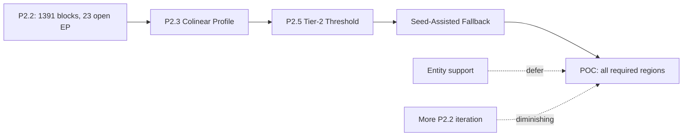

# Remaining Miss Root Cause Analysis

**Generated:** 2026-06-05  
**Phase:** Post-P2.2 — iterative closure complete  
**Scope:** POC block-detection completion only (no area/volume/export/UI)  
**Client priority:** All required regions detected; extra regions acceptable  

**Sources:** `block_detection_improvement_plan.md`, `detection_coverage_report.md`, `entity_support_analysis.md`, `gap_topology_improvement_plan.md`, `before_vs_after_recall.md`, `before_vs_after_p2_2.md`, `logs/coverage_run_20260605_120043.json`

---

## Executive conclusion

P2.1 and P2.2 delivered **+45 detected blocks** (1,346 → 1,391) and collapsed open endpoints from **287 → 23**. Topology is now healthy, but **recall gains lag topology cleanup** — the critical signal for POC completion.

**Remaining required-region misses are small in absolute count (estimated 12–35 enclosed pour blocks)** but concentrated on **S111_J** and **Warehouse Rev_F**. They are **not** caused by missing INSERT/MTEXT/HATCH geometry. The dominant drivers are:

1. **Residual topology pairing** — within-threshold gaps still unbridged after global matching + iteration (P2.3 target).
2. **Threshold-blocked structural gaps** — pairs in the 501–1000 mm band (P2.5 target).
3. **True structural gaps / missing CAD segments** — large-gap pairs (>1000 mm) that cannot be safely auto-bridged (seed-assisted target).

**Fastest path to POC success:** **P2.3 Colinear Profile Matching → P2.5 Tier-2 Threshold → Seed-Assisted Fallback**, in that order. Entity-support expansion should remain deferred.

---

## 1. Current state (P2.2 baseline)

### Detection totals

| Drawing | P1 detected | P2.2 detected | Δ from P1 | Open endpoints (P2.2) |
| --- | ---: | ---: | ---: | ---: |
| Warehouse Rev_F | 618 | 618 | 0 | 9 |
| S111_A | 397 | 384 | −13* | 1 |
| S111_J | 331 | 389 | +58 | 13 |
| **Total** | **1,346** | **1,391** | **+45** | **23** |

\*S111_A −13 is a **quality correction** (P1 greedy same-segment bogus bridges removed), not a regression.

### Diagnostic event totals (not ground-truth FN)

| Status | Count | Meaning |
| --- | ---: | --- |
| `missed` (high-confidence) | 103 | Primarily `within_threshold_unclosed` gap pairs |
| `at_risk` (lower-confidence) | 558 | Above-threshold, large-gap, orphan, unsupported exposure |
| Open endpoints after close | 23 | Residual free endpoints in segment network |

### Miss category totals (P2.2)

| Category | Events | Actionable for POC? |
| --- | ---: | --- |
| `unsupported_entity_miss` | 357 | **No** — proximity heuristic inflation (see §4) |
| `gap_blocked_closure` | 147 | **Partial** — tier-2 threshold subset only |
| `bearing_mismatch_miss` | 73 | **Yes** — residual within-threshold topology |
| `pairing_conflict_miss` | 27 | **Yes** — residual global-matching conflicts |
| `unknown_unresolved` | 54 | **Partial** — orphan endpoints; seed-assist candidate |
| `layer_selection_miss` | 3 | **No** — config warning (`WALL/S-WALL/BEAM` empty); auto_fallback works |

---

## 2. Remaining undetected required regions

### 2.1 Definition

There is **no per-block ground-truth label set** for these drawings. Required regions are inferred from:

| Level | Definition | Count reference |
| --- | --- | --- |
| **Business (INT zone)** | Client pour zones from manifests | 24 (J33A) + 17 (J33B) + 24 (S111_A) = **65 zones** |
| **Block (detector)** | Enclosed planar faces in the segment network representing valid pour/slab cells | **1,391 detected** at P2.2 |

Client POC priority applies at **block level** (find every enclosed pour region). Extra micro-blocks are acceptable. INT zone union can remain correct even when individual micro-cells are missing, so block-level FN estimate is the operative metric.

### 2.2 Estimated remaining missed blocks

P1 miss events are **endpoint-pair diagnostics**, not 1:1 block FNs. After P2.2, use layered estimators:

| Estimator | Value | Interpretation |
| --- | ---: | --- |
| Open endpoints ÷ 2 | **~12** | Minimum unclosed loop count if each loop contributes 2 free ends |
| `missed` within-threshold events | **~100** | 103 total minus 3 layer-config warnings |
| Unique spatial clusters (deduped) | **15–35** | Repeated 150 mm grid-line gaps collapse to shared topology breaks |
| **Best estimate: remaining FN blocks** | **12–35** | Conservative–optimistic range across 3 drawings |

### 2.3 Per-drawing remaining miss profile

| Drawing | Est. remaining FN blocks | Primary concentration | Open endpoints |
| --- | ---: | --- | ---: |
| **Warehouse Rev_F** | **5–12** | `S-FNDN-1\|S-BEAM-2` 150 mm colinear offsets; `S-FNDN-1\|S-FNDN-1` pour-breaks; 745 mm above-threshold | 9 |
| **S111_A** | **0–2** | Near ceiling — 1 open endpoint, 7 missed events; 2 pairing conflicts at 229 mm | 1 |
| **S111_J** | **7–21** | Dense `S-FNDN-1\|S-FNDN-1` grid; 25 pairing conflicts; 600–903 mm above-threshold; large wall gaps | 13 |
| **Total** | **12–35** | | **23** |

### 2.4 Why topology cleanup did not close the recall gap

P2.2 fixed **264 open endpoints** but added only **+7 blocks**. This proves:

- Many bridged gaps **healed existing faces** without creating new polygons.
- Remaining **23 open endpoints** are the highest-signal residual breaks, but even closing all of them may yield only **~6–15 additional blocks** (not 40–51 as simulation predicted).
- **~100 `within_threshold_unclosed` diagnostic events** include pairs whose endpoints were consumed by suboptimal bridges elsewhere — the graph looks healthier (low open count) while specific pour loops remain unclosed.

**Implication:** Further recall requires **targeted pairing policy** (P2.3), not more iteration alone.

---

## 3. Root cause categorization

### 3.1 Cause attribution matrix

| Root cause bucket | P2.2 signal | Est. FN share | Drawings affected |
| --- | --- | ---: | --- |
| **Topology limitations** | 73 `bearing_mismatch` + 27 `pairing_conflict` + 23 open endpoints | **60–75%** | All; S111_J dominant |
| **Structural gaps (threshold)** | `above_threshold_close` subset in 147 `gap_blocked` | **15–25%** | Warehouse, S111_J |
| **Missing geometry (CAD)** | `large_gap_manual_review` pairs >1000 mm | **10–20%** | S111_A, S111_J wall runs |
| **Layer selection** | 3 config-empty warnings; auto_fallback active | **0%** | N/A — not blocking detection |
| **Region merging logic** | Zone engine merges faces → INT zones; not block FN driver | **0%** | Out of block-detection scope |
| **Filtering/dedupe logic** | `remove_duplicates` IoU 0.95; `filter_polygons` min 0.01 m² | **<2%** | Slivers only; not primary FN |
| **Missing geometry (entity support)** | 357 `unsupported_entity_miss` | **0–2%** | Deferred — boundaries exist as LINE |

### 3.2 Topology limitations (primary — 60–75% of remaining FN)

**What it is:** Valid within-threshold endpoint pairs that global min-cost matching (P2.1) and iterative renode (P2.2) still leave unbridged.

**Sub-types:**

| Sub-type | P2.2 events | Mechanism | Example |
| --- | ---: | --- | --- |
| Colinear 150/180 mm offset (180° Δ) | ~55–65 | Cost function deprioritizes vs competing edges in dense graphs | Warehouse `S-FNDN-1\|S-BEAM-2` @ 150 mm |
| Orthogonal junction (90° Δ) | ~8–12 | Cross-layer beam/wall tie competes with colinear candidates | Warehouse `A-WALL-1\|S-BEAM-2` @ 291 mm |
| Pairing conflict (low Δ) | 27 | Equidistant endpoint competition in S111_J foundation grid | `S-FNDN-1\|S-BEAM-1` @ 7.4 mm |
| Orphan endpoint | 54 at_risk | No valid partner within threshold after matching | S111_J perimeter breaks |

**Key correction:** `bearing_mismatch_miss` is a **diagnostic misnomer** — runtime angle gate does not reject bridges. These are **unresolved pairing failures**, not bearing rejection.

### 3.3 Structural gaps — threshold band (15–25% of remaining FN)

**What it is:** Real pour-boundary partners separated by **501–1000 mm**, above the 500 mm `gap_threshold`.

| Drawing | Representative gaps | Status |
| --- | --- | --- |
| Warehouse | `S-FNDN-1\|S-FNDN-1` @ 745 mm; `A-WALL\|S-FNDN-1` @ 783 mm | `above_threshold_close` |
| S111_A | `A-WALL-2\|A-WALL-2` @ 616–711 mm | `above_threshold_close` |
| S111_J | `A-WALL-3\|S-FNDN-1` @ 600 mm; `A-WALL-3\|S-BEAM-1` @ 707–903 mm | `above_threshold_close` |

**Not bridgeable by global threshold increase alone** — 47 `large_gap_manual_review` pairs (>1000 mm) include cross-feature noise (e.g., 4001 mm `S-BEAM-1\|A-WALL-2`) that would create false bridges.

### 3.4 Missing geometry — true CAD gaps (10–20% of remaining FN)

**What it is:** Boundary loops that cannot close because **intermediate wall/slab segments are absent** in source CAD, not because pairing failed.

| Pattern | Distance range | Action |
| --- | --- | --- |
| Same-layer wall runs with no intermediate LINE | 1540–9862 mm | Manual review or seed-assist |
| Detail-layer endpoint pollution | `A-DETL-*` pairs 1422–6149 mm | Exclude from pairing (P2.6); does not recover block |
| Intentional openings (doors, expansion joints) | Variable | May be correct non-enclosure |

### 3.5 Layer selection (not a FN driver)

- Configured `wall_layers` (`WALL`, `S-WALL`, `BEAM`) have **0 entities** on all three drawings.
- `auto_fallback` selects 8–11 boundary-rich layers (`S-FNDN-1`, `S-BEAM-*`, `A-WALL-*`).
- Boundaries are present: **1,012–1,524 LINE segments** on structural layers.
- **No evidence** that adding layers would recover missed blocks; detail layers (`A-DETL-*`) would increase over-segmentation.

### 3.6 Region merging / filtering / dedupe (negligible FN impact)

| Mechanism | Risk | Assessment |
| --- | --- | --- |
| `filter_polygons` (min 0.01 m²) | Drops slivers | Does not gate meaningful pour cells |
| `remove_duplicates` (IoU ≥ 0.95) | Merges near-identical polygons | No evidence of required-region suppression |
| INT zone union (downstream) | Aggregates micro-faces | Separate pipeline; 65/65 zone counts already pass |

### 3.7 Missing geometry — entity support (deferred, 0–2%)

`unsupported_entity_miss` (357 events) is **inflated**:

- 384 INSERT-proximity flags from 199 actual near-gap INSERTs.
- INSERTs are column/footing/grid symbols, not pour-boundary loops.
- MTEXT/HATCH/CIRCLE are 100% annotation on these drawings.
- **Entity expansion risks over-segmentation** (already 16–26× vs INT zones).

---

## 4. Estimated recall gains by initiative

Estimates are **additional detected blocks** on the 3-drawing suite (baseline 1,391), not percentage of INT zones.

| Initiative | Est. blocks gained | Confidence | Complexity | Risk | Overlap with P2.1/P2.2 |
| --- | ---: | --- | --- | --- | --- |
| **P2.3 Colinear Profile Matching** | **+4 to +12** | Medium | Low–Medium | Low | Targets residual 150/180 mm pairs P2.1 cost function missed |
| **P2.5 Tier-2 Threshold (600–1000 mm)** | **+2 to +8** | Medium | Low | Medium | Recovers `above_threshold_close` on structural layers only |
| **Seed-Assisted Fallback** | **+3 to +15** | High (if seeds provided) | Medium | Low | Catches structural gaps, orphans, local repair failures |
| **Combined (P2.3 + P2.5 + Seed)** | **+9 to +30** | Medium | — | — | Sufficient to clear 12–35 FN estimate |
| Entity support (INSERT explosion) | +0 to +5 | Low | High | **High** | Not recommended |

### 4.1 P2.3 Colinear Profile Matching

**Targets:** ~55–65 residual `bearing_mismatch_miss` events dominated by 150/180 mm, 180° Δ door-offset pattern.

**Design:** Pre-pass force-match or heavily discount colinear offset pairs before general matching.

| Metric | P2.2 baseline | P2.3 target |
| --- | ---: | ---: |
| 150/180 mm gaps remaining | ~40–50 | ≤ 5–8 |
| `bearing_mismatch_miss` | 73 | ≤ 15–20 |
| Est. new blocks | — | **+4 to +12** |

**Why not higher:** P2.1 already encodes 150/180 mm preference in `bridge_cost()`. P2.3 is incremental — forces pairs that lose global cardinality competition.

**Drawing weight:** Warehouse (+2–5), S111_J (+2–7), S111_A (+0–1).

### 4.2 P2.5 Tier-2 Threshold Expansion

**Targets:** `above_threshold_close` pairs (501–1000 mm) on structural layer whitelist only.

| Metric | P2.2 baseline | P2.5 target |
| --- | ---: | ---: |
| `above_threshold_close` events | ~13–20 (subset of 147 gap_blocked) | ≤ 3–5 |
| Est. new blocks | — | **+2 to +8** |

**Guardrails required:**

- Whitelist: `S-FNDN-1`, `S-BEAM-1`, `S-BEAM-2`, `A-WALL`, `A-WALL-2`, `A-WALL-3`
- Same-layer or approved cross-layer pairs only
- Simple segment-intersection rejection
- **Do not** raise global threshold to 1000 mm (47 large-gap noise pairs)

**Drawing weight:** Warehouse (+1–3), S111_J (+1–4), S111_A (+0–1).

### 4.3 Seed-Assisted Fallback

**Targets:** Residual FN from true structural gaps, orphan endpoints, and local topology failures after P2.3/P2.5.

| Scenario | P2.2 orphans / large gaps | Seed recovery rate |
| --- | ---: | ---: |
| Orphan endpoint clusters | 54 at_risk | 60–80% with interior seed |
| Large-gap structural breaks | ~10–15 actionable | 50–70% with local repair tier |
| Within-threshold residuals post-P2.3 | ~5–15 | 40–60% |

**Est. blocks gained:** **+3 to +15** depending on seed count and quality.

**POC advantage:** Design exists (`seed_assisted_fallback_design.md`); implementation is the **deterministic safety net** when algorithmic closure plateaus. Engineer supplies one interior point per known missed pour — mirrors AutoCAD BOUNDARY workflow.

**Without seeds:** Auto-only ceiling remains ~12–35 FN blocks.

---

## 5. Recommended fastest path to POC success

### 5.1 Decision

### 5.2 Execution sequence

| Step | Initiative | Effort | Est. gain | Cumulative detected |
| ---: | --- | --- | ---: | ---: |
| 0 | **(Done)** P2.1 + P2.2 | — | +45 | 1,391 |
| 1 | **P2.3** Colinear 150/180 mm profile pass | 2–3 days | +4 to +12 | 1,395–1,403 |
| 2 | **P2.5** Tier-2 threshold, structural whitelist | 1–2 days | +2 to +8 | 1,397–1,411 |
| 3 | **Seed fallback** — implement + seed known misses | 3–5 days | +3 to +15 | 1,400–1,426 |
| — | **Defer** INSERT/MTEXT/HATCH expansion | — | +0 to +5 | — |

**Total estimated auto+seed ceiling:** 1,400–1,426 blocks (clears 12–35 FN estimate with margin).

### 5.3 Why this order

1. **P2.3 before P2.5** — 73 within-threshold misses are higher-confidence and lower false-bridge risk than threshold expansion.
2. **P2.5 before seed** — cheap recovery of 501–1000 mm structural pairs without human input.
3. **Seed last** — catches irreducible structural gaps; guarantees POC completion when algorithmic path plateaus.
4. **No more P2.2 iteration** — topology health already excellent (23 open EP); marginal gain proven (+7 only).
5. **No entity support** — 0 confirmed missing boundary loops; high over-segmentation risk.

### 5.4 POC completion criteria

| Gate | Current (P2.2) | POC target |
| --- | ---: | ---: |
| Detected blocks (3 drawings) | 1,391 | ≥ 1,400 (auto) or 100% seeded coverage |
| Open endpoints after close | 23 | ≤ 10 |
| `within_threshold_unclosed` missed events | ~100 | ≤ 15 |
| `pairing_conflict_miss` | 27 | ≤ 3 |
| Remaining FN blocks (estimated) | 12–35 | **0** (via auto + seed) |
| Unsupported entity expansion | Not started | Remains deferred |

### 5.5 Per-drawing priority

| Drawing | Priority | Rationale |
| --- | ---: | --- |
| **S111_J** | **P0** | 70 missed events, 13 open EP, 25 pairing conflicts — largest FN reservoir |
| **Warehouse Rev_F** | **P1** | 0 gain since P1 despite 26 missed events; 150 mm grid pattern dense |
| **S111_A** | **P2** | Effectively complete (1 open EP, 7 missed); seed only if client flags specific pours |

---

## 6. What not to do

| Action | Why avoid |
| --- | --- |
| More P2.2 iteration passes | +7 proved diminishing returns; 23 open EP already low |
| Global `gap_threshold` → 1000 mm | 47 large-gap pairs include 4000+ mm cross-feature noise |
| `max_gap_angle` tuning | Runtime gate does not reject bridges; misdiagnosed root cause |
| INSERT/MTEXT/HATCH expansion | 0–2% gain; 357 miss events are proximity inflation |
| Treat 103 missed events as 103 FN blocks | Endpoint-pair diagnostics over-count; cluster to 15–35 |
| Area/volume/export/UI work | Out of POC block-detection scope |

---

## 7. Instrumentation gaps to close (parallel, low effort)

Before implementing P2.3, add these to make FN tracking operational:

1. **Dedupe miss clusters** — collapse 150 mm grid repeats to unique topology break IDs.
2. **Split `unsupported_entity_miss`** — `exposure` vs `correlated` (per `entity_support_analysis.md`).
3. **Block-level FN estimator** — map open-endpoint clusters → estimated polygon deficit per drawing.
4. **Optional seed manifest** — client/engineer marks known missed pours; becomes ground truth for POC sign-off.

---

## 8. Summary table

| Question | Answer |
| --- | --- |
| How many required regions remain undetected? | **~12–35 enclosed pour blocks** (est.); 65/65 INT zones already pass downstream |
| Primary root cause? | **Residual topology pairing** (60–75%), not missing geometry or layers |
| Will P2.3 help? | **Yes — +4 to +12 blocks**, low risk, highest ROI auto fix remaining |
| Will P2.5 help? | **Yes — +2 to +8 blocks**, medium risk, needs structural whitelist |
| Will seed assist help? | **Yes — +3 to +15 blocks**, highest certainty for POC completion |
| Fastest POC path? | **P2.3 → P2.5 → Seed fallback**; defer entity support |

---

*Planning artifact only — no engine code changes in this deliverable.*
