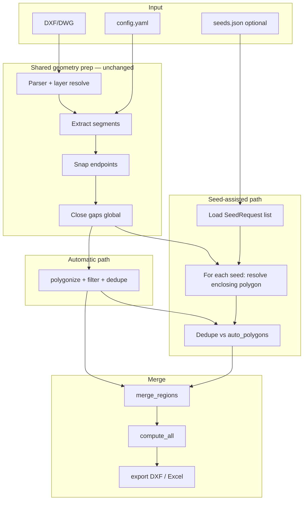
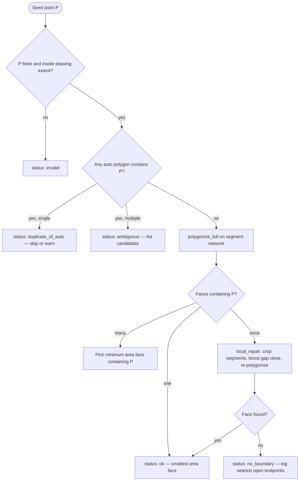

# Seed-Assisted Region Detection — Technical Design

**Version:** 1.0  
**Date:** June 1, 2026  
**Status:** Design (no GUI)  
**Related:** PRD v1.0, TRD v1.0, `src/detector.py`, `src/calculator.py`, `src/exporter.py`

---

## 1. Purpose

When automatic polygonization misses a valid room/slab (open gaps, layer mismatch, nested-face ambiguity, or deduplication side effects), the engineer can supply **one interior point** per missed region. The system resolves the **smallest enclosing boundary** that contains that point, then reuses the existing area/volume pipeline and report export.

This mirrors the manual AutoCAD workflow (“click inside → BOUNDARY → AREA”) while staying compatible with batch CLI and future GUI pickers.

---

## 2. Scope

| In scope | Out of scope (this phase) |
|----------|---------------------------|
| CLI / file-based seed input | Canvas click UI, DXF entity pick |
| Single point per missed region | Multi-point or polyline boundary sketch |
| Merge seed regions with auto-detected set | Re-running full drawing with different global `gap_threshold` |
| DXF + Excel/CSV report rows | DWG write-back to source file |
| Audit fields (`detection_method`, seed coords) | ML-based boundary inference |

---

## 3. Technical Design

### 3.1 New module: `src/seed_resolver.py`

Responsibility: given prepared wall segments + seed point(s), return one `Polygon` per seed.

| Function | Input | Output | Description |
|----------|-------|--------|-------------|
| `load_seeds(path)` | JSON/CSV/YAML path | `list[SeedRequest]` | Parse seeds for one drawing |
| `resolve_seed_region(seed, segments, config, auto_polygons?)` | seed + context | `SeedResolution` | Polygon + status + diagnostics |
| `resolve_all_seeds(seeds, ...)` | list | `list[SeedResolution]` | Batch; dedupe vs auto |
| `merge_regions(auto_polygons, seed_polygons, config)` | two lists | `list[Polygon]` | Union for `compute_all` |

### 3.2 Extended data models (`src/models.py`)

```python
@dataclass
class SeedRequest:
    drawing: str              # filename or stem match
    x: float                    # drawing units (same as DXF geometry)
    y: float
    label_hint: str | None = None   # optional "Slab A" for report
    id: str | None = None           # client reference

@dataclass
class SeedResolution:
    seed: SeedRequest
    polygon: Polygon | None
    status: Literal["ok", "ambiguous", "no_boundary", "outside_walls", "duplicate_of_auto"]
    message: str
    area_m2_drawing: float | None   # pre-scale, for debug

@dataclass
class RegionData:
    # existing fields ...
    detection_method: str = "auto"    # auto | seed_assisted
    seed_x: float | None = None
    seed_y: float | None = None
```

### 3.3 Pipeline integration (`main.py`)

After automatic `detect_regions()`:

```
segments = snap + close_gaps
auto_polygons = detect_regions(segments, config)

seeds = load_seeds(seed_file)  # optional; filtered by drawing name
seed_polygons = resolve_all_seeds(seeds, segments, config, auto_polygons)
all_polygons = merge_regions(auto_polygons, seed_polygons, config)

regions = compute_all(all_polygons, config, source_file)
export_results(doc, regions, paths, config)
```

**Labeling:** Seed-assisted regions append after auto regions (or interleave by area — configurable). Suggested default: `Room {n}` continues sequence; `detection_method` column distinguishes origin.

### 3.4 CLI (no GUI)

```bash
# Optional seeds file alongside batch run
python main.py input/plan.dwg --seeds missed_regions.json

# Dedicated subcommand (future-friendly for GUI backend)
python main.py add-seed input/plan.dwg --point 210590.3,201630.1 --append-to output/plan_results.xlsx
```

**Seed file example (`missed_regions.json`):**

```json
{
  "drawing": "6276.S111-WAREHOUSE SLAB PLAN-Rev_F.dwg",
  "seeds": [
    { "id": "miss-01", "x": 150484.6, "y": 180947.3, "label_hint": "Mezzanine slab" }
  ]
}
```

Coordinates are **model-space drawing units** (mm by default per `config.yaml`), not metres.

### 3.5 Configuration (`config.yaml` — new `seed_assist` block)

```yaml
seed_assist:
  enabled: true
  seeds_file: null              # path; overridden by --seeds
  strategy: smallest_face       # smallest_face | local_repair
  search_radius: 5000           # drawing units — local segment window
  local_gap_multiplier: 2.0       # for local_repair only
  dedupe_iou_threshold: 0.90    # vs auto polygons (slightly looser than global)
  allow_duplicate_seed: false   # same seed twice
  min_area_m2: 0.01             # inherit exhaustive default unless set
```

### 3.6 Report / export changes

| Artifact | Change |
|----------|--------|
| Excel/CSV | Columns: `Detection Method`, `Seed X`, `Seed Y` (optional `Client ID`) |
| DXF | Seed-assisted boundaries on `DETECTED_REGIONS`; optional `SEED_MARKERS` layer (POINT or small cross) |
| Logs | Per seed: status, area, whether merged or rejected as duplicate |
| Summary | Totals include seed-assisted regions; log count `auto=N, seed=M` |

---

## 4. Data Flow



**Per-seed resolution flow:**



---

## 5. Geometry Approach

### 5.1 Primary strategy: **smallest containing face** (recommended)

Uses the same wall segment network as automatic detection (post-snap, post–gap-close).

1. Build `MultiLineString` from segments (optionally **crop** to `search_radius` around seed for performance).
2. `noded = unary_union(multi)` then `polygonize(noded)` (or `polygonize_full` for diagnostics).
3. Collect all polygons where `polygon.contains(seed)` (use `covers` if seed may lie on wall — treat boundary as inside with tiny buffer: `polygon.buffer(ε).contains(seed)`).
4. If multiple faces match (nested rooms, columns), select **`argmin(area)`** — matches AutoCAD BOUNDARY “island detection” behavior for a single pick.
5. `normalize_polygon()` (existing) before calculator.

**Why smallest face:** A seed in a large warehouse bay must not snap to the exterior building shell if an interior wall loop also exists.

### 5.2 Fallback strategy: **local gap repair**

When no face contains the seed (typical when validation reports `orphan_endpoint` / `large_gap_manual_review` near the seed):

1. Select segments intersecting `seed.buffer(search_radius)`.
2. Run `close_gaps()` on subset with `gap_threshold × local_gap_multiplier` (cap with max absolute cap in config).
3. Re-polygonize subset; retry smallest-face selection.
4. Log every synthetic closing segment as `seed_local_gap` for audit (same pattern as global gap log).

Do **not** silently change global gap settings for the whole drawing.

### 5.3 Optional tertiary strategy: **ray cast boundary trace** (phase 2)

If local repair fails: cast rays at angular steps from seed, intersect wall segments, build polygon from hit points. Higher implementation cost; reserve for pathological gaps > repair cap.

### 5.4 Area and volume

No new formulas. Reuse `src/calculator.py`:

- `area_m2 = polygon.area × scale²`
- `volume_m3 = area_m2 × slab_thickness`
- Same PRD tolerance target (≤ 0.05% vs AutoCAD) when boundary matches.

### 5.5 Deduping against automatic results

Before merge, for each seed polygon `S`:

- If ∃ auto polygon `A` with `IoU(S, A) ≥ dedupe_iou_threshold` → **reject** seed (already detected); emit warning with matching `label`.
- If seed is inside auto polygon but area ≪ auto area (nested case) → **keep** seed as separate region (do not treat as duplicate).

### 5.6 Validation checks on resolved polygon

| Check | Action |
|-------|--------|
| Invalid/empty geometry | `status: no_boundary` |
| Area < `min_area_m2` | Warn; still export if user confirmed seed |
| Self-intersecting | `make_valid()` / `buffer(0)` once; fail if still invalid |
| Seed not in interior after repair | `status: outside_walls` |

---

## 6. Risks and Mitigations

| Risk | Impact | Likelihood | Mitigation |
|------|--------|------------|------------|
| **Nested faces** — seed picks wrong (courtyard vs room) | Wrong quantity | Medium | Default to smallest containing face; log all candidates when >1; optional `--seed-face largest` for exterior |
| **Seed on wall/grid** | Ambiguous containment | Medium | ε-buffer interior test; CLI warns if distance to nearest segment < `snap_tolerance` |
| **Open boundary near seed** | `no_boundary` | High (known on sample DWGs) | Local gap repair tier; surface nearest open endpoints in message; engineer widens gap or closes in CAD |
| **Duplicate with auto region** | Double-count in totals | Medium | IoU dedupe; default skip with warning |
| **Performance on huge drawings** | Slow seed pass | Low | Spatial index (STRtree) for segment crop; polygonize only local window |
| **Coordinate confusion** (mm vs m) | 10⁶× area error | Medium | Document seeds in drawing units; validate against drawing extents; reject if \|x\|,\|y\| look like metres on mm drawing |
| **Layer mismatch** | No walls near seed | Medium | Reuse same `resolve_wall_layers` as auto path; optional per-seed `layers` override in seed file |
| **Local repair over-closes** | Spurious extra regions | Low | Cap multiplier; log synthetic segments; never merge local repair back into global network |
| **Audit / compliance** | Disputed quantities | Medium | `detection_method`, seed coords, gap log linkage in Excel + run log |
| **Future GUI** | Rework API | Low | `SeedRequest` + `resolve_seed_region` API is UI-agnostic; GUI only supplies `(x,y)` |

---

## 7. Testing Strategy

| Test | Type | Pass condition |
|------|------|----------------|
| Unit: point inside known 10×10 m loop | unit | Area ≈ 100 m², `status=ok` |
| Unit: seed in nested rectangles | unit | Smaller inner area selected |
| Unit: seed matches existing auto polygon | unit | `duplicate_of_auto`, not merged twice |
| Unit: gap within local repair | unit | Face found after local tier only |
| Integration: synthetic DXF with intentional open door | integration | Auto misses; seed recovers correct area |
| Regression: full drawing + 0 seeds | integration | Identical output to current pipeline |
| Acceptance: missed region from acceptance report | manual | Seed area within 0.05% of AutoCAD |

---

## 8. Implementation Phases

| Phase | Deliverable |
|-------|-------------|
| **P1** | `SeedRequest`, `seed_resolver.py` (smallest-face only), merge + `compute_all`, CLI `--seeds` |
| **P2** | Local gap repair tier + diagnostics in logs |
| **P3** | Excel columns + DXF seed markers; `add-seed` subcommand |
| **P4** | GUI picker (calls same API) |

---

## 9. Success Criteria

- Engineer can recover **any** region that is geometrically closed in the wall segment network but missing from auto output, with one interior point.
- Recovered regions appear in **the same Excel/DXF export** as automatic regions, clearly marked `seed_assisted`.
- No change to automatic results when no seed file is provided.
- Failed resolutions produce actionable messages (open endpoints, ambiguous faces), not silent omission.
