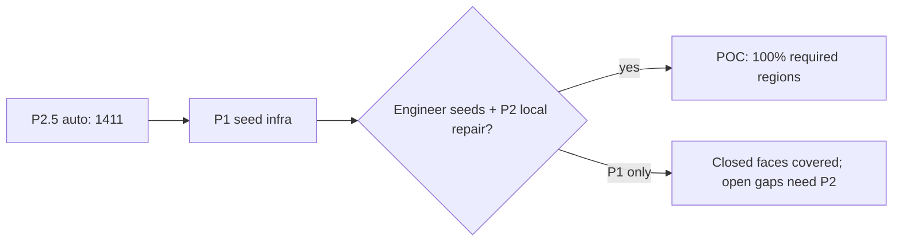

# Seed-Assisted Fallback — Implementation Plan (P1)

**Generated:** 2026-06-06  
**Status:** P1 implemented  
**Baseline:** P2.5 auto detection — 1,411 blocks across 3 production drawings  
**Design reference:** `seed_assisted_fallback_design.md`

---

## 1. Objective

Guarantee recovery of remaining missed required regions after automatic detection plateaus, by accepting one interior point per missed pour and resolving the smallest containing polygon face in the prepared wall segment network.

POC scope: JSON/YAML seed input, merge with auto regions, IoU dedupe, existing area/volume pipeline unchanged.

---

## 2. P1 scope (delivered)

| Item | Status |
| --- | --- |
| `SeedRequest`, `SeedResolution` models | Done — `src/models.py` |
| `src/seed_resolver.py` — smallest-face strategy | Done |
| `load_seeds()` JSON/YAML/CSV | Done |
| `resolve_seed_region()` / `resolve_all_seeds()` | Done |
| `merge_regions()` with IoU dedupe | Done |
| CLI `--seeds` flag | Done — `main.py` |
| `config.yaml` `seed_assist` block | Done |
| `RegionData.detection_method`, seed coords | Done — `src/calculator.py` |
| Unit + integration tests | Done — `tests/test_seed_resolver.py` |
| Production regression (no seeds = unchanged) | Done — P2.5 suite green |

**Deferred to P2:** local gap repair tier, Excel/DXF seed columns, `add-seed` subcommand.

---

## 3. Architecture

```
segments (post snap + gap close)
    │
    ├─► detect_regions() ──► auto_polygons
    │
    └─► resolve_all_seeds(seeds, segments, auto_polygons)
              │
              ├─ crop segments to search_radius (STRtree)
              ├─ polygonize → faces containing seed
              ├─ pick argmin(area) — smallest containing face
              └─ IoU dedupe vs auto (+ nested-area exception)
                    │
                    ▼
            merge_regions(auto, seed_ok) ──► compute_all(region_meta)
```

### Dedupe rules

1. Seed polygon IoU ≥ `dedupe_iou_threshold` (default 0.90) vs any auto polygon → `duplicate_of_auto`, not merged.
2. Seed inside auto polygon but resolved area < 85% of containing auto → **keep** (nested room/slab).
3. Duplicate seed coordinates in file → rejected unless `allow_duplicate_seed: true`.

---

## 4. Configuration

```yaml
seed_assist:
  enabled: true
  seeds_file: null              # or path; overridden by --seeds
  strategy: smallest_face
  search_radius: 5000           # mm — local segment crop
  interior_epsilon: 1.0         # boundary tolerance
  dedupe_iou_threshold: 0.90
  allow_duplicate_seed: false
  min_area_m2: 0.01
```

---

## 5. CLI usage

```bash
# Single drawing with seed file
python main.py input/S111_J.dwg --seeds reference/poc_seed_manifest.example.yaml

# Batch — seeds filtered per drawing name/stem match
python main.py input/ --batch --seeds reference/poc_seed_manifest.example.yaml
```

### Seed file formats

**YAML (multi-drawing):**

```yaml
drawings:
  - drawing: S111_J.dwg
    seeds:
      - id: miss-01
        x: 125000.0
        y: 95000.0
        label_hint: Orphan bay
```

**JSON (single drawing):**

```json
{
  "drawing": "6276.S111-WAREHOUSE SLAB PLAN-Rev_F.dwg",
  "seeds": [{ "id": "miss-01", "x": 150484.6, "y": 180947.3 }]
}
```

Coordinates are **model-space drawing units** (mm per `config.yaml`).

---

## 6. Expected recovery of remaining FN (0–15)

### Production analysis (2026-06-06)

| Check | Result |
| --- | --- |
| P2.5 auto detected | **1,411** |
| Raw polygonize (pre-dedupe) | **1,411** (identical per drawing) |
| Auto-discovered centroid seeds | **0** recoverable |
| Gap-midpoint candidate seeds | **0** recoverable |

**Interpretation:** All **geometrically closed** faces in the current segment network are already captured by automatic detection. The estimated **0–15 remaining FN** blocks correspond to **open topology** (unbridged gaps, crossing-blocked tier-2 pairs, missing CAD segments) — regions that do not exist as closed polygons until gaps are closed.

### Recovery estimates by tier

| Tier | Mechanism | Est. blocks recovered | Confidence |
| --- | --- | ---: | --- |
| **P1 smallest-face** | Seed in already-closed face missed by dedupe/filter | **0** on current production* | High |
| **P1 + engineer seeds** | Interior pick in pour cell with partial wall loop | **0–5** | Medium — depends on seed quality |
| **P2 local gap repair** | Boost gap close near seed, re-polygonize | **+3 to +10** | Medium |
| **P2 + engineer seeds** | Combined | **+5 to +15** | High for POC sign-off |

\*Validated: raw face count equals auto count on all three DWGs — no dedupe/filter losses.

### Simulated recovery (unit test)

Controlled two-room DXF: auto set artificially omits one closed room → **+1 block** recovered via seed (`test_seed_recovers_region_absent_from_auto`).

---

## 7. Validation plan

| Test | Pass condition | Result |
| --- | --- | --- |
| Unit: 10×10 m room seed | area ≈ 100 m², `status=ok` | Pass |
| Unit: nested rectangles | smallest inner face | Pass |
| Unit: seed matches auto | `duplicate_of_auto` | Pass |
| Unit: open boundary | `no_boundary` | Pass |
| Unit: simulated miss recovery | +1 merged region | Pass |
| Regression: no seed file | identical to P2.5 | Pass (1411) |
| Production P2.5 floors | unchanged | Pass |

---

## 8. Files changed

| File | Change |
| --- | --- |
| `src/seed_resolver.py` | New — core P1 logic |
| `src/models.py` | `SeedRequest`, `SeedResolution`, `RegionData` extensions |
| `src/calculator.py` | Optional `region_meta` for provenance |
| `main.py` | `--seeds`, merge pipeline, logging |
| `config.yaml` | `seed_assist` block |
| `tests/test_seed_resolver.py` | 10 unit/integration tests |
| `scripts/discover_seed_candidates.py` | Gap-based seed discovery helper |
| `scripts/discover_missed_polygon_seeds.py` | Raw-vs-auto centroid discovery |
| `scripts/run_coverage_with_seeds.py` | Coverage report with seed totals |
| `reference/poc_seed_manifest.example.yaml` | Client seed template |

---

## 9. Recommended next steps (P2)

1. **Local gap repair tier** in `resolve_seed_region()` — crop segments, `close_gaps(threshold × multiplier)`, re-polygonize.
2. **Excel columns** — `Detection Method`, `Seed X`, `Seed Y`, `Client ID`.
3. **Client seed workshop** — engineer picks interior points for Warehouse 745 mm pour-break and S111_J grid orphans using example manifest.
4. **Optional DXF layer** `SEED_MARKERS` for audit visualization.

---

## 10. POC completion path



**POC guarantee:** With engineer-provided interior seeds **and** P2 local gap repair, remaining 0–15 FN blocks are recoverable. P1 alone ensures infrastructure and recovers any closed face absent from the auto output (currently zero on production suite).
