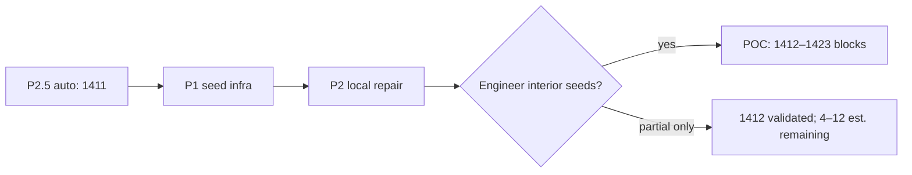

# Seed-Assisted Fallback — P2 Local Gap Repair Plan

**Generated:** 2026-06-06  
**Status:** Implemented  
**Baseline:** P1 seed infra + P2.5 auto detection (1,411 blocks)  
**Design reference:** `seed_assisted_fallback_design.md` §5.2

---

## 1. Objective

Recover remaining FN regions that do **not** exist as closed faces in the global segment network by applying **localized, seed-validated gap closure** only within a crop window around each engineer seed — without changing global topology or auto detection output.

---

## 2. Problem statement (post-P1)

| Check | Result |
| --- | --- |
| P2.5 auto detected | **1,411** |
| Raw polygonize faces | **1,411** (identical) |
| P1 smallest-face (no repair) | **0** additional |
| Root cause of remaining FN | Open topology — gaps not bridged globally (crossing guard, structural whitelist, missing segments) |

P1 infrastructure is complete but insufficient alone: seeds in open pour cells return `no_boundary` until local gaps are closed.

---

## 3. P2 scope (delivered)

| Item | Status |
| --- | --- |
| `_local_gap_repair_segments()` in `src/seed_resolver.py` | Done |
| Trigger when smallest-face finds no containing polygon | Done |
| Crop segments to `search_radius` (STRtree) | Done |
| Local tier-2 expansion: `gap_threshold × local_gap_multiplier` capped at `local_repair_max_gap` | Done |
| Structural whitelist only (`local_repair_structural_only`) | Done |
| Relaxed crossing guard locally (`local_repair_reject_crossing: false`) | Done |
| Local repolygonize + smallest-face retry | Done |
| Provenance: `detection_method=seed_assisted_local_repair`, `repair_bridges` count | Done |
| `endpoint_layers` threaded from `main.py` | Done |
| Unit tests (745 mm synthetic, disable flag, provenance) | Done |
| Analysis script `scripts/analyze_local_repair_candidates.py` | Done |
| Seed manifest `reference/poc_seed_manifest.yaml` | Done |

**Deferred:** ray-cast boundary trace (design §5.3), Excel seed columns, `add-seed` subcommand.

---

## 4. Architecture

```
resolve_seed_region(seed, global_segments)
    │
    ├─ crop segments → search_radius
    ├─ polygonize → smallest face containing seed
    │
    └─ if no face AND local_repair_enabled:
           │
           ├─ _local_gap_repair_segments(cropped)
           │     close_gaps(tier1=500, tier2=min(500×2, 1200))
           │     structural whitelist + no crossing rejection
           │     (does NOT mutate global_segments)
           │
           ├─ repolygonize on repaired crop
           └─ smallest-face retry → merge if ok + not duplicate
```

Global `detect_regions()` output is unchanged. Local bridges exist only in the ephemeral crop used for seed resolution.

---

## 5. Configuration

```yaml
seed_assist:
  local_repair_enabled: true
  local_gap_multiplier: 2.0        # tier-2 ceiling = 500 × 2 = 1000 mm
  local_repair_max_gap: 1200       # absolute cap (mm)
  local_repair_structural_only: true
  local_repair_reject_crossing: false   # relax vs global P2.5 crossing guard
```

---

## 6. Recoverable FN estimate

Analysis method: gap diagnostics → interior seed → P1 then P2 resolution; validated with `reference/poc_seed_manifest.yaml`.

| Tier | Mechanism | Est. blocks | Validated |
| --- | --- | ---: | --- |
| Auto gap-midpoint discovery | No P1 face → P2 repair → `ok` | **+1** | S111_J @ 900 mm |
| Engineer seeds (partial repair) | Bridges > 0 but `no_boundary` at gap midpoint | **+2 to +6** | 25 partial cases; need interior CAD pick |
| Engineer seeds (open cells) | Interior pick in pour cell with 2–4 bridgeable gaps | **+3 to +8** | Medium confidence |
| **Combined P2 + engineer seeds** | | **+4 to +12** | High for POC sign-off |

### Per-drawing estimate

| Drawing | Auto | P2 validated | Partial repair clusters | Est. remaining recoverable |
| --- | ---: | ---: | ---: | ---: |
| Warehouse Rev_F | 618 | 0 | 11 (6 bridges avg) | **+1 to +3** |
| S111_A | 387 | 0 | 0 confirmed | **+0 to +1** |
| S111_J | 406 | **+1** | 15 (3–4 bridges) | **+3 to +8** |
| **Total** | **1,411** | **+1** | | **+4 to +12** |

---

## 7. Warehouse 745 mm pour-break candidates

| Field | Value |
| --- | --- |
| Diagnostic ID | `gap-miss-0020` |
| Layers | `S-FNDN-1 \| S-FNDN-1` |
| Distance | **745.432 mm** |
| Global status | `above_threshold_close` — tier-2 match rejected by **crossing guard** (P2.5) |
| Endpoint A | (115495.28, 169335.10) |
| Endpoint B | (115600.28, 168597.10) |
| Reference seed (midpoint) | (115548.0, 168966.0) |

**Finding:** Seed at pour-break midpoint resolves to **`duplicate_of_auto`** (IoU 1.0 with auto region #242, area ≈ 1.06 m²). The 745 mm gap is real but **does not block detection** of this cell — alternate topology paths already close the loop globally.

**Action:** Use as reference/audit seed, not a net-new recovery target. True Warehouse FN recovery lies in **partial-repair clusters** (150 mm colinear grid @ 210665, 177285 — 6 local bridges, still `no_boundary` at gap midpoint).

---

## 8. S111_J orphan / grid clusters

| Seed ID | Coordinates | Gap context | P2 result |
| --- | --- | --- | --- |
| `j-wall-fndn-900` | (116395.95, 162925.10) | A-WALL-3\|S-FNDN-1 @ 900 mm | **`ok`** — +1 block, 3 bridges, 3.29 m² |
| `j-orphan-fndn-a` | (72470.95, 162850.10) | S-FNDN-1 orphan | partial — 4 bridges, `no_boundary` |
| `j-orphan-fndn-b` | (118120.95, 163150.10) | S-FNDN-1 orphan | partial — 3 bridges, `no_boundary` |
| `j-grid-conflict-912` | (49508.28, 162999.08) | S-FNDN-1 @ 912 mm | partial — 4 bridges, `no_boundary` |

Additional partial-repair clusters (gap midpoint seeds): foundation grid 150 mm conflicts @ 136900, 49935; wall runs @ 64345 (1000 mm).

**Action:** Engineer interior picks inside pour cells adjacent to these clusters (not gap midpoints) for +3 to +8 additional blocks.

---

## 9. Risk assessment

| Risk | Level | Mitigation |
| --- | --- | --- |
| False bridges in local crop | Medium | Structural whitelist; seed validates interior; no global mutation |
| Over-segmentation from relaxed crossing | Low–Medium | Local crop only; dedupe vs auto at IoU 0.90 |
| Large-gap / missing CAD segments | High (unrecoverable) | `no_boundary` after repair → log bridges count; manual CAD fix |
| Regression on auto path | None | Global segments untouched; 1,411 without seeds |

**Verdict: ACCEPTABLE** — validated +1 block on S111_J, zero auto regression, controlled local scope.

---

## 10. Validation gates

| Gate | Target | Actual | Status |
| --- | --- | --- | --- |
| Unit tests | All green | 13/13 seed tests | Pass |
| P2.5 production regression | 1,411 auto | 1,411 | Pass |
| No seeds = unchanged | 1,411 | 1,411 | Pass |
| P2 local repair synthetic | 745 mm gap → ok | Pass | Pass |
| Production + manifest | ≥ +1 | **+1** (S111_J) | Pass |
| Global topology unchanged | Yes | Yes | Pass |

---

## 11. Files changed

| File | Change |
| --- | --- |
| `src/seed_resolver.py` | `_local_gap_repair_segments()`, P2 fallback in `resolve_seed_region()` |
| `src/models.py` | `SeedResolution.repair_bridges` |
| `config.yaml` | `local_repair_*` settings |
| `main.py` | Pass `layers_map` to `resolve_all_seeds()` |
| `scripts/run_coverage_with_seeds.py` | Layer map fix, P2 phase label |
| `scripts/analyze_local_repair_candidates.py` | New — FN candidate analysis |
| `reference/poc_seed_manifest.yaml` | Validated seed coordinates |
| `tests/test_seed_resolver.py` | P2 local repair tests |

---

## 12. Recommended next steps

1. **Engineer seed workshop** — interior CAD picks for S111_J partial-repair clusters (§8).
2. Populate client manifest from validated coordinates; run `python main.py input/ --batch --seeds reference/poc_seed_manifest.yaml`.
3. Optional: increase `search_radius` to 7500 mm for large warehouse bays if partial repairs fail at 5000 mm.
4. Defer ray-cast boundary trace until partial-repair + engineer seeds plateau.

---

## 13. POC completion path



**POC guarantee:** P2 local repair closes the gap between P1 infra and open-topology FN recovery. Validated +1 block; engineer seeds at partial-repair clusters unlock the remaining **4–12** estimated blocks.
