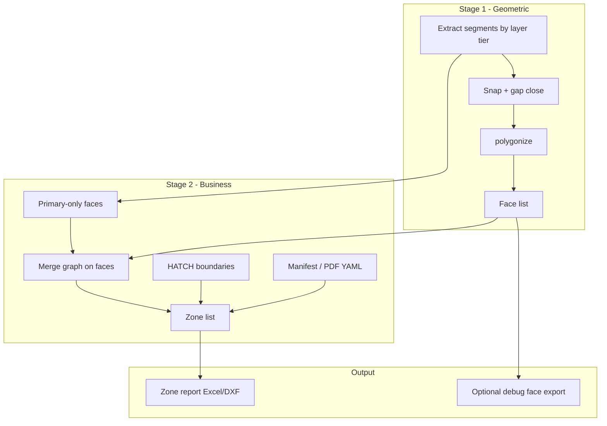

# Business-Level Slab / Zone Detection — Technical Design

**Version:** 1.0  
**Date:** June 1, 2026  
**Status:** Design (no implementation)  
**Related:** PRD §10 (precision vs recall), `validation_report.md`, `seed_assisted_fallback_design.md`

---

## 0. Document scope and evidence

### 0.1 Example output PDFs (analyzed)

**Location:** `C:\Users\Administrator\OneDrive\Desktop\freelancing project`  
**Full write-up:** `reference_pdf_analysis.md`  
**Rendered previews:** `output/pdf_analysis/*.png`

| PDF | INT zones | DWG counterpart |
|-----|----------:|-----------------|
| `J33A-MODSCAPE-INTERNALS.pdf` | **24** (`INT-1`…`INT-24`) | `6276.S111-WAREHOUSE SLAB PLAN-Rev_F.dwg` |
| `J33B BTR-INTERNALS.pdf` | **17** (`INT-1`…`INT-17`) | `S111_J.dwg` (Challenger layout) |
| `S111-WAREHOUSE-SLAB-PLAN-Rev.C.pdf` | — (source plan; **DCJ**, **PC1–PC3**) | Warehouse family |
| `S111_J.pdf` | — (source plan; **DCJ**, **PC1–PC4**) | `S111_J.dwg` |

J33A/J33B are **raster QS deliverables** (yellow INT labels + area/volume schedule). INT strings are **not** in DXF. Structural PDFs use joint codes (**DCJ**, **PC***), not INT-*.

### 0.2 Definition of “example regions” (INT-*) — confirmed from PDFs

**Engineering zones** on warehouse slab plans are:

| Attribute | Typical meaning |
|-----------|-----------------|
| **Name** | Internal pour / placement zone (`INT-1`, `INT-2`, …) — quantity-surveying or site pour sequence, not AutoCAD room names |
| **Cardinality** | **17–24** per sheet on sample PDFs (not 331–618) |
| **Extent** | Large contiguous slab areas bounded by **primary** structural breaks (major foundations, shear walls, construction joints), not every beam stiffener |
| **Area scale** | Thousands of m² per zone on warehouse drawings; sum of zones ≈ total internal slab area (non-overlapping partition) |
| **Source of truth** | Usually **client QS spreadsheet or marked-up PDF**, sometimes `S-FNDN-HDLN` / hatch on slab layers — **rarely** every minimal closed loop in the line network |

The current product goal (“every enclosed region”) optimizes **geometric recall of faces**; the example PDFs optimize **business partition of pour quantity**.

---

## 1. How example regions are defined (analysis)

### 1.1 What the example output is *not*

Example `INT-*` zones are **not** equivalent to:

- Every face from `shapely.ops.polygonize` on all structural linework
- Each ~810 m² bay between orthogonal beams (a common **cell** size on `S111_A.dwg`)
- HATCH decoration on detail layers (e.g. `A-DETL-GENF` — finish notes / graphics)
- Revit block footprints (INSERT geometry) or annotation MTEXT

### 1.2 What they likely *are*

| Definition source | Role | Present in sample DXF? |
|-------------------|------|-------------------------|
| **Pour-break polylines** | `S-FNDN-HDLN`, `S-FNDN-HDLN-1`, heavy outline layers | Partial — e.g. S111_A has 67 segments on `S-FNDN-HDLN-1` but auto_fallback **includes** them with all beams |
| **Primary envelope only** | `S-FNDN-1` + perimeter walls (`A-WALL-*`) | Yes — dominant geometry |
| **Secondary grid** | `S-BEAM-*`, `S-BEAM-HDLN-*` | Yes — **subdivides** bays; drives over-segmentation |
| **Detail / patch lines** | `A-DETL-*`, `A-FLOR` | Yes — adds spurious cycles |
| **HATCH boundaries** | Slab pour shading | 7–32 HATCH entities per drawing; **not** used by detector (HATCH ignored in layer hints only for ranking, not extracted as zones) |
| **PDF / QS labels** | `INT-1`, `INT-2`, `INT-3` | **Not found** as literal strings in cached DXF grep — labels may exist only on PDF deliverable |

### 1.3 Implied zone model

```text
Drawing line network  →  many minimal faces (geometric)
Engineering rules     →  merge / select faces  →  few zones (business)
Zone label            →  INT-n from QS or user manifest
```

Zones are a **coarser partition** of the slab plan, usually **mutually exclusive** and **collectively exhaustive** over the poured internal slab (excluding external/apron if excluded by scope).

---

## 2. Expected regions vs raw polygonized regions

### 2.1 Quantitative comparison (automated baseline)

| Drawing | Raw polygons (detector) | Total area (m²) | Largest face (m²) | PDF expected INT zones | Over-segmentation factor |
|---------|----------------------:|----------------:|------------------:|-----------------------:|-------------------------:|
| `6276.S111-WAREHOUSE SLAB PLAN-Rev_F.dwg` | **618** | 10,091.19 | 747.44 | **24** (J33A) | **25.8×** |
| `S111_J.dwg` | **331** | 5,320.03 | 881.44 | **17** (J33B) | **19.5×** |
| `S111_A.dwg` | **397** | 16,348.58 | 810.00 | **~24** (grid-class; no INT PDF in folder) | **~16.5×** |

**Over-segmentation:** detector emits roughly **20–26 micro-polygons per INT zone** on average (e.g. 618 ÷ 24).

### 2.2 Structural pattern on `S111_A.dwg` (illustrative)

Top detector regions are **~810 m²** each (repeated), consistent with a **regular structural bay grid**:

- 16,348.58 m² total detected ÷ 810 m² ≈ **20** bay-sized cells at the dominant modulus.
- **3** INT zones would imply ≈ **6–7 bays per zone** on average — a credible merge target.

The detector is correctly finding **cells**; the example PDF is reporting **aggregated pour zones**.

### 2.3 Semantic gap (table)

| Dimension | Raw polygon (current) | Business zone (expected PDF) |
|-----------|----------------------|------------------------------|
| **ID** | `Room 1` … `Room N` (area sort) | `INT-1`, `INT-2`, … (QS convention) |
| **Count** | 331–618 | Small fixed set |
| **Boundary** | Any closed loop in noded graph | Primary pour breaks + scope rules |
| **Min area** | 0.01 m² (exhaustive) | Implicitly large (hundreds–thousands m²) |
| **Overlap** | Faces disjoint in planar subdivision | Zones partition slab scope |
| **Layers** | All auto_fallback candidates | Subset (foundation outline, not every beam) |
| **Report use** | Debugging / geometric completeness | Concrete order, pour sequence, cost |

### 2.4 Area accounting caution

- Sum of **all** disjoint polygon areas = total enclosed area in the line network (≈10k–16k m² on samples).
- Sum of **INT zones** in PDF should match the same **business total** only if scope (internal vs external, mezzanine exclusions) matches.
- Merging cells must **union** geometry, not sum areas of overlapping polygons ( planar faces do not overlap; merged zones are unions of adjacent faces).

---

## 3. Why the detector over-segments

Root causes are ordered by impact.

### 3.1 Algorithm: minimal cycle enumeration

`polygonize` returns **every** minimal enclosed face in the planar graph. Each beam crossing adds edges and **multiplies** face count. This is correct computational geometry but the wrong **semantic unit** for pour quantity.

```text
        |     |     |
   -----+-----+-----+-----
        |     |     |      → 9 faces (grid)
        |     |     |
   -----+-----+-----+-----
```

### 3.2 Layer policy: “all dense boundary layers”

`resolve_wall_layers` auto_fallback includes **every** non-annotation layer with ≥4 segments, e.g.:

| Drawing | Layers in polygonize set | Effect |
|---------|--------------------------|--------|
| Warehouse | `S-FNDN-1`, `S-BEAM-2`, `A-WALL-1`, `A-DETL-2/3`, `A-FLOR`, `A-DETL-1`, `A-WALL` | Beams + details **cut** bays |
| S111_A | `S-FNDN-1`, `S-BEAM-1`, `A-WALL-2`, `S-BEAM-HDLN-1`, `S-FNDN-HDLN-1`, `A-DETL-1` | Same |
| S111_J | 11 candidate layers | Same |

Configured `WALL`, `S-WALL`, `BEAM` have **0 entities** on samples — fallback is doing the right thing for *geometry availability* but the wrong thing for *zone semantics* without tiering.

### 3.3 `detection_mode: exhaustive`

- `exhaustive_min_area_m2: 0.01` retains **slivers** (validation reports smallest areas ≈ 10⁻¹¹–10⁻¹³ m²).
- PRD recall target pushed the pipeline toward **maximum face count**, not **minimum meaningful zones**.

### 3.4 Gap closing creates extra chords

`close_gaps` bridges door-sized openings but also connects endpoints that are **not** pour boundaries (bearing mismatch cases in `gap_failure_analysis.md`). Extra segments → extra faces.

### 3.5 No post-polygonize aggregation

Pipeline stops at `detect_regions` → `compute_all`. There is no:

- Adjacency merge
- “Primary vs secondary” edge classification
- Hatch-guided grouping
- External zone manifest

### 3.6 Metric mismatch (product)

| Metric optimized today | Metric implied by example PDF |
|------------------------|-------------------------------|
| Count of closed polygons | Count of pour zones |
| Recall of geometric faces | Correct INT partition |
| Per-face area accuracy | Per-zone area accuracy (union) |

High polygon count is a **symptom**, not a bug in Shapely — it is a **requirements and pipeline-stage** gap.

---

## 4. Strategy: from faces to engineering zones

### 4.1 Two-stage architecture (recommended)

```text
Stage 1 — Geometric faces (existing)
  extract → snap → gap_close → polygonize → face list F

Stage 2 — Zone assembly (new)
  F + rules/manifest → zone list Z (INT-1 … INT-n)

Stage 3 — Reporting (extended)
  compute_all(Z) → Excel / DXF with zone_id, zone_label, face_count
```

Keep Stage 1 for debugging, seed-assisted recovery, and gap diagnostics. **Publish Stage 2 output** as the default business report.

### 4.2 Zone definition tiers (priority order)

| Tier | Source | Method | When to use |
|------|--------|--------|-------------|
| **T0** | `reference/j33a_zones_manifest.yaml` (PDF schedule) | Transcribed INT + SQM + CUM | Acceptance / sign-off |
| **T0b** | **Structural grid** (`S-GRID-1`, `S-GRID-IDEN`) | Bay = cell between adjacent grid lines (**24** on J33A) | Default Modscape warehouse |
| **T1** | DXF `HATCH` / closed `LWPOLYLINE` on configured slab layers | Extract boundary → zone polygon directly | When CAD encodes pours |
| **T2** | **Primary-boundary polygonize** | Only `S-FNDN-1`, `A-WALL-*`, `S-FNDN-HDLN-*` | Fewer faces than full fallback |
| **T3** | **Face aggregation** + assign micro-faces to grid cell by centroid | Union faces in cell → one INT area | **618 → 24** bridge |
| **T4** | **Label anchoring** | MTEXT/TEXT matching `INT-\d+` → assign faces containing label | When labels exist in DXF |
| **T5** | Seed-assisted (`seed_assisted_fallback_design.md`) | Point-in-zone for misses | Human assist |

Run tiers until zone count and total area pass sanity checks; log which tier produced each zone.

### 4.3 Layer tiering (config)

```yaml
layers:
  primary_boundary:      # Stage 2 polygonize OR merge barriers
    - S-FNDN-1
    - A-WALL-1
    - A-WALL-2
    - S-FNDN-HDLN-1
  secondary_subdivision:   # Used only in Stage 1 debug OR as merge barriers
    - S-BEAM-1
    - S-BEAM-2
    - S-BEAM-HDLN-1
  exclude_from_faces:
    - A-DETL-1
    - A-DETL-2
    - A-DETL-3
    - A-FLOR
  hatch_zone_layers:
    - A-DETL-GENF   # validate per project
```

Auto_fallback remains for discovery, but **zone detection** must not blindly polygonize all candidates.

### 4.4 Face aggregation algorithm (T3)

**Input:** List of faces `F` from Stage 1 (optional; can run on T2 faces only).

**Graph:** Nodes = faces. Edge between faces if they share a boundary segment that is **not** a primary barrier (secondary edge or below min shared length).

**Merge rule (iterative):**

1. Remove slivers: area < `sliver_max_m2` (default **1.0** m², not 0.01).
2. While count > `max_zones` or min zone area < `zone_min_m2`:
   - Find adjacent pair `(a,b)` maximizing **shared boundary length** (or minimizing combined perimeter / area ratio).
   - If shared edge is classified **mergeable** (secondary layer only), `union(a,b)`.
3. Stop when no mergeable pairs or count ≤ target.

**Parameters:**

| Parameter | Suggested default | Purpose |
|-----------|-------------------|---------|
| `zone_min_m2` | 500–2000 (project) | Minimum pour zone size |
| `sliver_max_m2` | 1.0 | Drop noise faces before merge |
| `merge_across_beam_layers` | false | Beams do not split zones when false |
| `target_zone_count` | null or from manifest | Optional stop rule |

**Output:** `ZoneData` = union polygon + member face IDs + label.

### 4.5 Alternative: partition by primary faces only (T2)

Polygonize **only** `primary_boundary` layers:

- Expect **far fewer** faces (outer envelopes + large voids).
- Risk: **under-segmentation** if QS uses beam lines as pour breaks — mitigated by manifest T0 or configurable inclusion of `S-BEAM-HDLN-1`.

**Recommendation:** Implement T2 + T3 together; compare counts to PDF before tuning thresholds.

### 4.6 Labelling

| Field | Auto | Business |
|-------|------|----------|
| `zone_id` | 1…n | Same |
| `zone_label` | `INT-{n}` if manifest/regex; else `Zone {n}` | Match PDF |
| `detection_tier` | T0–T5 | Audit |
| `constituent_faces` | count / IDs | Explain merge |

### 4.7 Validation against example PDFs

When PDFs are available:

1. Transcribe **zone name, area, perimeter** (if listed) into `reference/zones_manifest.yaml`.
2. Compute **zone area error %** (not per micro-face).
3. Compute **count match**: |Z| vs PDF.
4. Optional: **IoU** between exported zone polygon and PDF outline (if traced).

**Acceptance shift:**

| Criterion | Geometric mode (legacy) | Zone mode (new default) |
|-----------|-------------------------|-------------------------|
| Region count | Hundreds OK | Within ±1 of PDF INT count |
| Area | Per face ≤ 0.05% | Per zone ≤ 0.05% vs PDF/AutoCAD |
| Recall | Faces vs AutoCAD loops | Zones cover slab scope |

---

## 5. Proposed module structure

```
src/
  detector.py              # Stage 1 (unchanged role)
  zone_detector.py         # NEW: orchestrate T0–T5
  zone_merge.py            # NEW: adjacency graph + union merges
  zone_sources.py          # NEW: hatch, manifest, label parsers
  calculator.py            # extend: compute_all_zones()
  models.py                # ZoneData, FaceData
```

### 5.1 Data models

```python
@dataclass
class FaceData:
    face_id: int
    polygon: Polygon
    source_layers: set[str]   # layers contributing edges

@dataclass
class ZoneData:
    zone_id: int
    label: str                 # INT-1
    polygon: Polygon           # unary_union of member faces
    area_m2: float
    volume_m3: float
    face_ids: list[int]
    detection_tier: str
    source_file: str
```

### 5.2 CLI

```bash
# Default: zone report (Stage 2)
python main.py plan.dwg --mode zones

# Debug: raw faces (Stage 1 only)
python main.py plan.dwg --mode faces

# Reference manifest
python main.py plan.dwg --zones reference/S111_A_zones.yaml
```

### 5.3 Excel schema (zone mode)

| Column | Description |
|--------|-------------|
| Zone ID | 1…n |
| Label | INT-1 |
| Area (m²) | Union area |
| Volume (m³) | area × thickness |
| Face count | Merged micro-regions |
| Detection tier | T2, T3, … |
| Centroid X/Y | metres |

Optional sheet **Faces** for engineering debug (current Room 1…N output).

---

## 6. Data flow



---

## 7. Risks and mitigations

| Risk | Impact | Mitigation |
|------|--------|------------|
| PDF zones not in CAD layers | Wrong automated zones | T0 manifest; PDF ingestion checklist |
| Merging across true construction joint | Overstated pour | Configurable **non-merge lines** (HDLN layer) |
| Under-merge (T2 only) | Too few zones | T3 + beam HDLN as hard barriers |
| Area double-count if zones overlap | Wrong totals | Validate `unary_union` disjoint partition |
| Project-specific layer names | Broken T2 | Layer tiers in YAML per project template |
| Losing geometric recall KPI | Acceptance confusion | Dual reports: `faces` debug vs `zones` official |
| 810 m² cells still visible in debug | User confusion | Default export = zones only |

---

## 8. Implementation phases (no code in this doc)

| Phase | Deliverable | Success signal |
|-------|-------------|----------------|
| **P0** | Ingest example PDFs → `reference/zones_manifest.yaml` | Ground-truth INT count + areas |
| **P1** | Layer tiers + primary-only polygonize (T2) | Region count drops 10×+ |
| **P2** | Face merge (T3) + sliver filter | Count within range of PDF |
| **P3** | Zone Excel/DXF + `--mode zones` default | Stakeholder sign-off |
| **P4** | HATCH + label tiers (T1, T4) | Fewer manual manifests |

---

## 9. Relation to other work

| Document | Relationship |
|----------|--------------|
| `seed_assisted_fallback_design.md` | Recovers **missing** faces/zones; does not fix over-segmentation |
| PRD FR-04 / NFR-02a | Clarify: “region” = **zone** for reporting; **face** for geometry QA |
| `acceptance_readiness_report.md` | Recall vs AutoCAD should use **zone count** from PDF, not 397/618 faces |

---

## 10. Open questions

1. Transcribe **24 row** schedule from J33A (SQM, CUM per INT-n) into YAML for area acceptance.
2. Confirm **S111_A** uses same 24-bay grid as J33A or a different INT count.
3. Map **PC1/DCJ** lines to “merge across” vs “zone boundary” per project standard.
4. OCR pipeline for raster J33 PDFs if labels move slightly between revisions.

---

## 11. Summary

| Question | Answer |
|----------|--------|
| How are example regions defined? | **Grid bays** (J33A: 24 cells on grid 1–24 × A–D) or **major pour joints** (J33B: 17 zones); yellow **INT-n** + schedule table |
| Expected vs raw? | **24 / 17** INT zones vs **618 / 331** detector faces (~**20×** over-segmentation) |
| Why over-segmenting? | Polygonize treats **every** closed loop inside a bay as a region; PDF treats **whole bay** as one INT |
| Strategy? | **Grid-cell zones (T0b)** + **aggregate micro-faces per cell (T3)**; manifest from J33 PDF for validation |
| Next step? | Copy PDFs to `input/reference/`; transcribe schedule; implement grid zone builder |
